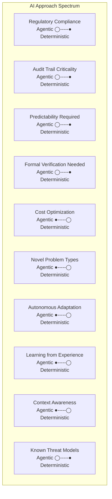

# Shortlisted Debate Topics Research: Agentic vs Deterministic AI

**Purpose:** Slide deck preparation for 6-topic debate series (1 slide per topic)  
**Format:** Left panel (Agentic) | Right panel (Deterministic)  
**Date:** February 13, 2026

**The Core Distinction:**
- **Agentic AI Workflow**: Give AI a goal → Let AI determine its own path to achieve it
- **Deterministic AI Workflow**: Give AI a goal + prescribed steps → AI follows controlled path

---

---

## TOPIC 1: INFORMATION PROCESSING
### Document Processing, Summarization, Analysis, Report Generation

### AGENTIC AI PERSPECTIVE

**Slide Bullet Points:**
- Autonomously discovers patterns, relationships, and insights without predefined rules
- Adapts analysis approach based on document characteristics and context
- Generates novel insights and non-obvious connections across documents
- Determines what's important to extract vs. what can be omitted
- Creates customized summaries tailored to implicit user intent

**Talking Points:**

**Strong Arguments (3):**

1. **Insight Discovery at Scale**
   - *Point:* Agentic AI can identify non-obvious correlations that predetermined extraction rules would miss
   - *Rationale:* Complex financial documents often contain implicit relationships between regulations, risk factors, and strategic elements. Humans can't manually define all possible extraction patterns. Agentic systems learn what matters through autonomous exploration.

2. **Adaptive to New Document Types**
   - *Point:* No training or reconfiguration needed when processing new document formats
   - *Rationale:* In fast-moving industries (fintech, healthcare), new document types appear constantly. Agentic systems adjust autonomously; deterministic systems require new rule definitions and testing.

3. **Contextual Intelligence**
   - *Point:* Understands intent and audience needs, producing summaries tailored to specific readers
   - *Rationale:* Executive summary ≠ technical summary ≠ compliance report. Agentic systems reason about user context; deterministic systems apply same rules regardless.

**Real Examples/Use Cases:**
- **Investment Research**: A fund manager uploads 50 research reports, earnings transcripts, and regulatory filings. Agentic AI autonomously identifies the 3-4 key themes across all documents that determine investment thesis—patterns the fund manager hadn't explicitly looked for.
- **Healthcare Documentation**: Hospital receives discharge summaries in 15 different formats from partner clinics. Agentic system learns each format autonomously and extracts consistent structured data without manual rule definition.
- **Legal Document Processing**: Law firm processes acquisition documents. Agentic AI identifies potential compliance gaps by recognizing patterns in regulatory language that weren't in predefined extraction templates.

---

### DETERMINISTIC AI PERSPECTIVE

**Slide Bullet Points:**
- Follows explicit extraction rules and predefined schemas
- Produces consistent, auditable, reproducible results
- Transparent about what's being extracted and why
- Compliance-friendly with clear documentation trails
- Predictable performance with no hidden extraction surprises

**Talking Points:**

**Strong Arguments (3):**

1. **Regulatory Auditability**
   - *Point:* Every extraction decision can be traced to explicit rules, meeting compliance and regulatory requirements
   - *Rationale:* Financial, healthcare, and legal domains require audit trails showing exactly why data was extracted and processed. Regulators need to verify deterministic logic; agentic "reasoning" is less defensible in audits.

2. **Guaranteed Consistency**
   - *Point:* Same document, same processing rules, same output every single time
   - *Rationale:* Financial reporting requires identical processing of transactions across thousands of documents. One inconsistency in 10,000 reports could mean missed compliance violations or audit failures. Deterministic guarantees this doesn't happen.

3. **Performance Predictability**
   - *Point:* Processing time, cost, and accuracy are known, measurable, and contractable
   - *Rationale:* Batch processing large document volumes requires budget certainty. Deterministic systems have predictable costs; agentic systems might require more processing to "explore" and discover patterns.

**Real Examples/Use Cases:**
- **Bank Compliance Processing**: A bank processes 1 million mortgage documents annually. Deterministic extraction ensures every document processed identically, with clear documentation for regulatory inspection. Compliance teams can verify rules are correct once, then trust output forever.
- **Insurance Claims Processing**: Insurance company processes thousands of claims daily. Deterministic rules ensure consistent claim classification, predefined validation catches missing information before manual review, reducing rework by 40%.
- **Financial Statement Consolidation**: Multi-national corporation consolidates financial statements from 50 subsidiaries. Deterministic extraction ensures accounting consistency across all locations, with transparent audit trails for external auditors.

---

---

## TOPIC 2: GOVERNANCE
### Accountability, Ownership, Compliance

### AGENTIC AI PERSPECTIVE

**Slide Bullet Points:**
- AI systems develop context-aware governance decisions
- Adapts compliance approach based on risk assessment
- Balances competing governance requirements autonomously
- Learns organizational governance culture and norms
- Makes nuanced tradeoffs between frameworks with transparency about reasoning

**Talking Points:**

**Strong Arguments (3):**

1. **Context-Aware Compliance**
   - *Point:* Different contexts require different compliance approaches; agentic systems adapt reasoning based on specific situations
   - *Rationale:* A $1M transaction requires different rigor than $10K. A startup's governance looks different than enterprise. Agentic systems reason about proportional governance; deterministic systems apply same rules everywhere.

2. **Governance Innovation**
   - *Point:* Agentic systems can identify better governance patterns by analyzing why current rules fail
   - *Rationale:* Compliance frameworks are written by people with constraints. Agentic systems analyzing 10,000 edge cases can discover where governance rules create friction, enabling process improvement.

3. **Accountability Through Reasoning Transparency**
   - *Point:* Agentic systems can articulate why specific governance decisions were made, creating accountability through explainability
   - *Rationale:* "The board made this decision" is accountability. "The AI followed rule 3.7(b)" isn't governance; "The AI evaluated 5 frameworks and chose Y for these specific business reasons" creates accountability.

**Real Examples/Use Cases:**
- **FinTech Regulatory Response**: A fintech company operates across 12 countries with different regulations. Agentic system evaluates each market's specific requirements and adapts governance policies, rather than applying one-size-fits-all compliance across all markets.
- **Investment Committee Governance**: Portfolio managers present investments to committee. Agentic system evaluates whether company passes multiple governance frameworks (ESG, risk appetite, regulatory restrictions) and articulates which frameworks apply and why.
- **Crisis Governance**: During market turmoil, agentic system autonomously adjusts risk governance policies based on market conditions—tightening controls when volatility spikes, relaxing when markets normalize—maintaining consistent risk profiles.

---

### DETERMINISTIC AI PERSPECTIVE

**Slide Bullet Points:**
- Clear, explicit governance rules with documented ownership
- Accountability through transparent rule-following
- Regulatory compliance through proven policy frameworks
- Predictable governance outcomes with no exceptions
- Audit trails showing exact governance decision paths

**Talking Points:**

**Strong Arguments (3):**

1. **Regulatory Defensibility**
   - *Point:* Deterministic governance policies withstand regulatory scrutiny because every decision traces to explicit, approved policies
   - *Rationale:* Regulators ask: "Why did you approve this and reject that?" Deterministic answer: "Policy 4.2 explicitly requires X." Agentic answer: "The system reasoned that..." regulators view with suspicion.

2. **Clear Ownership and Accountability**
   - *Point:* When governance decisions fail, accountability is clear: either the rule was wrong or implementation failed
   - *Rationale:* "The policy was clear, the system executed it correctly" is testifiable. "The AI made an autonomous judgment" creates finger-pointing about whose judgment was wrong.

3. **Consistent Stakeholder Trust**
   - *Point:* Employees, partners, and auditors trust consistent rule-application more than "intelligent judgment"
   - *Rationale:* If everyone knows the governance rules, they plan accordingly and trust outcomes. Agentic systems create uncertainty about what decisions might happen.

**Real Examples/Use Cases:**
- **Large Enterprise Compliance**: Fortune 500 company operates across regulated divisions. Deterministic governance policies ensure every business unit applies identical funding approval rules, preventing compliance violations and enabling corporate audit teams to verify policy adherence.
- **Securities Trading Desk Governance**: Investment firm implements strict deterministic trading governance—explicit pre-trade limits, position monitoring rules, and escalation procedures. Clear ownership allows trading desk to operate efficiently within known constraints.
- **Healthcare Privacy Governance**: Hospital implements HIPAA compliance through deterministic policies: exactly what staff can access, when audit logs trigger escalation, how patient data is handled. Clear rules maintain compliance and patient trust.

---

---

## TOPIC 3: AI SAFETY & TRUST & EXPLAINABILITY
### AI Alignment

### AGENTIC AI PERSPECTIVE

**Slide Bullet Points:**
- Transparency through explicit reasoning articulation about decisions
- Trust built on demonstrated beneficial autonomy track record
- Safety achieved through goal alignment and value learning
- Explainability through natural language reasoning about tradeoffs
- Alignment verified through behavioral observation and outcome measurement

**Talking Points:**

**Strong Arguments (3):**

1. **Explainability Through Reasoning**
   - *Point:* Agentic systems can articulate their reasoning about why they chose specific actions, creating understandable explanations
   - *Rationale:* Deterministic systems are black boxes too: "Why did this rule trigger?" "Because condition X matched." Agentic systems can explain: "I evaluated 5 options and chose this because..." Natural language reasoning is more meaningful than rule traces.

2. **Value Alignment Over Rule Compliance**
   - *Point:* Agentic systems can learn and pursue actual organizational values rather than surface-level rule compliance
   - *Rationale:* Rules often create perverse incentives. Agentic systems aligned with true values (like "maximize customer benefit" not "minimize processing time") make decisions humans actually want. Deterministic rule-followers might optimize for wrong metrics.

3. **Continuous Learning Safety**
   - *Point:* Agentic systems improve safety through accumulated experience, learning which actions create better outcomes
   - *Rationale:* As agentic systems operate autonomously, they learn patterns that improve decisions over time. Deterministic systems never improve beyond their initial specification.

**Real Examples/Use Cases:**
- **Lending Decision Transparency**: Agentic lending system explains to loan applicant: "You were approved because credit history shows recovery from past difficulties, current employment is stable, and debt-to-income ratio is acceptable. The risk assessment showed you have demonstrated reliability." Applicant understands and trusts decision.
- **Medical Diagnosis Collaboration**: Agentic diagnostic AI explains to physician: "Given these symptoms and lab results, I've evaluated 12 possible diagnoses. I'm recommending these 3 for further investigation because they explain 85% of findings. I'm deprioritizing 9 others because..." Physician trusts reasoning and can evaluate independently.
- **Investment Portfolio Rebalancing**: Agentic portfolio assistant explains to client: "I'm recommending increased tech exposure because valuations have normalized relative to historical patterns AND interest rate environment has shifted to favor growth. I explicitly avoided the value sector because regulatory headwinds haven't resolved." Client understands strategic reasoning.

---

### DETERMINISTIC AI PERSPECTIVE

**Slide Bullet Points:**
- Safety through verifiable, testable decision logic
- Trust through proven, audited rule sets
- Explainability through transparent rule documentation
- Aligned with human oversight at every step
- No hidden reasoning—every decision path is knowable and testable

**Talking Points:**

**Strong Arguments (3):**

1. **Verifiable Safety**
   - *Point:* Deterministic systems can be formally verified—mathematically proven to behave safely under all conditions
   - *Rationale:* Critical systems (aviation, medical devices, financial trading) require formal verification. You can't formally verify "the system reasoned X is safe"; you can verify "IF condition A and B and C THEN safe behavior Z."

2. **Alignment Through Explicit Constraints**
   - *Point:* Safety constraints are hard-coded and impossible to bypass, ensuring actual alignment with safety requirements
   - *Rationale:* No matter what circumstances arise, deterministic constraints guarantee safe behavior. Agentic systems might "reason" around safety constraints if they conflict with other goals.

3. **Explainability Through Documentation**
   - *Point:* Every decision path is documented, making explanations verifiable and auditable
   - *Rationale:* If an agentic system "explains" why it made a decision, how do you verify the explanation is honest? With deterministic systems, you verify the rule documentation and trust the system executed correctly.

**Real Examples/Use Cases:**
- **Autonomous Vehicle Safety**: Self-driving car uses deterministic safety rules: "IF obstacle detected AND speed > X, THEN emergency braking." No reasoning, no learning from accidents—guaranteed safe behavior regardless of novel situations.
- **Medication Dispensing System**: Hospital pharmacy system uses deterministic rules: "IF patient allergic to penicillin AND prescribed penicillin, THEN alert pharmacist." No exceptions possible. Proven to prevent medication errors for 20 years across thousands of hospitals.
- **Financial Trade Limits**: Trading system implements deterministic constraints: "IF daily loss exceeds threshold, THEN halt all trading." No AI reasoning about whether losses were "acceptable" in context. Hard constraints prevent catastrophic trading losses.

---

---

## TOPIC 4: AGENTS ON DIFFERENT SDLC WORKFLOWS
### Implementation, Code Review, QA, Support, Operations, Release Management, Site Reliability Engineering

### AGENTIC AI PERSPECTIVE

**Slide Bullet Points:**
- Agents autonomously navigate multiple SDLC workflows based on context
- Adaptive decision-making about which workflow step is appropriate
- Cross-phase optimization (e.g., implementing code review feedback during development)
- Self-correcting through feedback incorporating across SDLC phases
- Autonomous decision about escalation vs. autonomous resolution

**Talking Points:**

**Strong Arguments (3):**

1. **Context-Aware Phase Decisions**
   - *Point:* Agentic agents understand which SDLC phase is appropriate and navigate independently based on work context
   - *Rationale:* A junior developer posts code: agentic agent might autonomously run tests, catch a bug, suggest fix, implement refactoring. Deterministic agents need explicit instruction for each phase: "run tests," then "review code," then "suggest refactoring."

2. **Cross-Phase Optimization**
   - *Point:* Agentic agents optimize across SDLC phases holistically rather than optimizing each phase independently
   - *Rationale:* Deterministic QA finds bug after release. Agentic agent could have caught equivalent issue during code review by analyzing implementation patterns. Agentic systems learn which issues slip through which phases and prevent them earlier.

3. **Autonomous Escalation Intelligence**
   - *Point:* Agentic agents assess complexity and autonomously decide: "I can handle this" vs. "this needs human judgment"
   - *Rationale:* For simple bugs—autonomously fix. For architectural issues—escalate to architect. Deterministic agents follow fixed workflows regardless of issue complexity.

**Real Examples/Use Cases:**
- **Feature Development Pipeline**: Developer pushes feature branch. Agentic agent autonomously: runs unit tests, reviews code against patterns, sets up integration test environment, catches missing edge case handling, implements fix, runs tests again, approves for code review, only then notifies human reviewers. Reduces human review burden from 4 hours to 30 minutes.
- **Incident Response Orchestration**: Production incident detected. Agentic agent autonomously: gathers logs, analyzes symptoms, deploys diagnostic queries, identifies root cause correlation, suggests rollback vs. hotfix alternatives, awaits human decision. By the time on-call engineer wakes up, agent has 3 clear options vs. 30 minutes of investigation.
- **Release Management**: Feature ready for production. Agentic agent orchestrates: validates deployment prerequisites, creates canary deployment, monitors metrics, rolls out gradually, performs post-deployment verification. Adjusts rollout speed based on metric trends. Only escalates if unexpected patterns emerge.

---

### DETERMINISTIC AI PERSPECTIVE

**Slide Bullet Points:**
- Clear SDLC process at each phase with defined inputs/outputs
- Explicit handoffs between development, testing, review, deployment
- Predictable outcomes with clear phase gates
- Auditable record of every SDLC phase decision
- Specialization at each phase with domain-specific rules

**Talking Points:**

**Strong Arguments (3):**

1. **Process Compliance and Auditability**
   - *Point:* Deterministic SDLC workflows ensure every phase completes correctly with verifiable documentation
   - *Rationale:* Regulated industries (finance, healthcare, defense) require SDLC compliance proof: implementation completed, code reviewed, tested, approved. Agentic skipping phases is a compliance risk.

2. **Specialization Excellence**
   - *Point:* Each SDLC phase uses specialized deterministic logic optimized for that specific phase
   - *Rationale:* Code review agent has deep patterns for security/efficiency. QA agent has test creation expertise. Release agent has deployment risk knowledge. Specialization beats generalization.

3. **Predictable Resource Planning**
   - *Point:* SDLC phase durations are predictable, enabling reliable project planning
   - *Rationale:* Deterministic workflows mean code review always takes 2-4 hours, testing always covers 95% threshold. Project managers can plan release dates confidently.

**Real Examples/Use Cases:**
- **Regulated Fintech Development**: Financial software requires SDLC compliance documentation. Deterministic workflow ensures: development → code review → security scan → integration test → compliance check → production deployment. Every phase documented, every phase verified, audit trail complete.
- **Healthcare IT Implementation**: Hospital deploying new system requires validated SDLC. Deterministic approach: specification phase, implementation approval, testing validation, deployment verification. Each phase sign-off prevents regulatory violations.
- **Enterprise DevOps Pipeline**: Large corporation maintains GitFlow with explicit workflow stages. Deterministic agents enforce: feature branches → pull request review → staging deployment → UAT verification → production release. Clear phase gates prevent premature releases.

---

---

## TOPIC 5: SECURITY
### Control vs. Autonomy

### AGENTIC AI PERSPECTIVE

**Slide Bullet Points:**
- Adaptive threat detection by analyzing anomalous patterns beyond predefined signatures
- Autonomous response to emerging threats by reasoning about appropriate countermeasures
- Self-learning security posture that improves as threats evolve
- Context-aware risk decisions balancing security vs. business functionality
- Proactive threat hunting by exploring system behaviors for vulnerabilities

**Talking Points:**

**Strong Arguments (3):**

1. **Zero-Day Threat Detection**
   - *Point:* Agentic security systems detect novel attack patterns by recognizing anomalies that differ from baseline, not by matching prewritten signatures
   - *Rationale:* Zero-day attacks by definition have no existing signature. deterministic signature-matching can't detect them. Agentic systems recognize: "this pattern is statistically unlike normal behavior" and escalate.

2. **Adaptive Threat Response**
   - *Point:* Agentic systems autonomously adapt security posture to emerging threats without waiting for rule definition
   - *Rationale:* New attack technique discovered. Deterministic systems require security team to write rules and deploy. Agentic system autonomously increases monitoring, triggers additional verification, implements proportional countermeasures within minutes.

3. **Context-Aware Security vs. Usability**
   - *Point:* Agentic systems balance security and business needs intelligently rather than applying same controls everywhere
   - *Rationale:* High-risk transaction gets additional verification. Low-risk transaction proceeds faster. Deterministic systems either accept all transactions at same threshold or require manual exceptions.

**Real Examples/Use Cases:**
- **APT Detection and Response**: Sophisticated attacker gradually explores trading system to evade detection. Agentic security detects unusual login patterns, explores internal database queries, notices correlation between activities across phases. Proactively isolates compromised account before data theft.
- **DDoS Mitigation**: Agentic system detects emerging DDoS pattern that doesn't match known attack signatures. Analyzes traffic patterns, recognizes statistical anomaly, autonomously adjusts traffic filtering rules within seconds. Deterministic system waits 30 minutes for security team to manually respond.
- **Insider Threat Recognition**: Finance employee's access suddenly changes: accessing systems never used before, querying data outside usual patterns. Agentic system recognizes behavioral deviation, cross-references with recent job change, autonomously increases audit oversight without raising false alarm.

---

### DETERMINISTIC AI PERSPECTIVE

**Slide Bullet Points:**
- Security through explicit predefined controls and rules
- Verifiable compliance with known attack prevention methods
- Consistent policy enforcement with no exceptions
- Transparent security reasoning with clear audit trails
- Hardened constraints that guarantee security guarantees regardless of novel situations

**Talking Points:**

**Strong Arguments (3):**

1. **Formally Verifiable Security**
   - *Point:* Deterministic security systems can be mathematically proven to prevent specific attack classes
   - *Rationale:* You can formally verify: "IF this constraint is enforced, THEN this attack is impossible." Agentic systems claim to detect attacks, but you can't prove they'll detect all variants.

2. **Regulatory Compliance Certainty**
   - *Point:* Deterministic security controls satisfy regulatory requirements through predictable, documented rule enforcement
   - *Rationale:* Regulators require evidence of specific controls: encryption, access logging, authentication verification. Deterministic implementation satisfies auditors. "Agentic threat detection" doesn't satisfy compliance checkboxes.

3. **Predictable Threat Model Coverage**
   - *Point:* Deterministic security addresses defined threat models comprehensively and provably
   - *Rationale:* You identify threats during threat modeling, design controls to prevent each. Deterministic implementation guarantees coverage for those threats. Agentic systems might miss threats outside the model.

**Real Examples/Use Cases:**
- **PCI DSS Compliance**: Payment processor implements deterministic security: encryption standards, access logging requirements, authentication verification. Proven controls meet regulatory requirements year after year. Compliance audit verifies rules are followed.
- **High-Security Trading Floor**: Investment bank implements deterministic network segmentation: trading systems isolated from internet, all data flows monitored at defined checkpoints, no exceptions allowed. Hostile nation-state cannot compromise systems because architecture prevents certain attack vectors entirely.
- **Healthcare Data Protection**: Hospital implements HIPAA-compliant deterministic controls: role-based access, encryption keys managed by HSM, audit logs automatically escalated, mandatory access justification. Proven controls prevent data breaches through mechanical enforcement.

---

---

## TOPIC 6: OPERATIONAL RELIABILITY AND COST
### How Reliable, Consistency, Testability

### AGENTIC AI PERSPECTIVE

**Slide Bullet Points:**
- Adaptive reliability optimization balancing cost with uptime based on business needs
- Self-healing systems that recover from failures autonomously
- Learning cost-optimized infrastructure patterns through operational experience
- Consistency achieved through autonomous monitoring and corrective action
- Testability through continuous behavioral validation in production

**Talking Points:**

**Strong Arguments (3):**

1. **Economic Optimization**
   - *Point:* Agentic systems autonomously optimize cost-to-reliability tradeoffs, running expensive redundancy when business-critical, reducing costs when acceptable
   - *Rationale:* Every business has peak periods (99.99% uptime required) and slow periods (99.9% acceptable). Agentic systems autonomously scale infrastructure costs. Deterministic systems maintain same infrastructure 24/7.

2. **Autonomous Failure Recovery**
   - *Point:* Agentic systems detect failures and autonomously implement recovery without human intervention
   - *Rationale:* Database connection pool exhausted. Deterministic system pages on-call engineer at 3am. Agentic system autonomously recycles connections, scales pool, routes traffic, alerts human if still failing. MTTR drops from 30 minutes to 90 seconds.

3. **Continuous Learning Reliability**
   - *Point:* Agentic systems learn reliability patterns over time and proactively prevent failures based on predictive analysis
   - *Rationale:* System experiences occasional failures when CPU utilization exceeds 75%. Deterministic alerts at 90%. Agentic system learns pattern, prevents failure by scaling at 70%, never causing incident.

**Real Examples/Use Cases:**
- **Multi-Region Deployment Optimization**: Trading system operates globally. Agentic infrastructure agent analyzes traffic patterns, costs, latency across regions, autonomously rebalances deployment. During Asia peak hours, scales Asia region, reduces Europe. Reduces infrastructure costs 30% while maintaining SLAs.
- **Automated Incident Recovery**: Payment processing system experiences database replica lag. Deterministic monitoring alerts incident team at 2am, manual mitigation takes 45 minutes. Agentic system detects lag pattern, autonomously throttles write traffic, routes reads to backup, recovers within 3 minutes unsupervised.
- **Cost-Optimized Caching**: E-commerce platform experiences traffic spikes during sales. Agentic system learns which data to cache based on access patterns and profit impact. For high-margin products, maintains aggressive caching (higher cost). Low-margin products use standard caching (lower cost). Automated optimization captures margin differences.

---

### DETERMINISTIC AI PERSPECTIVE

**Slide Bullet Points:**
- Reliability through proven, tested infrastructure patterns
- Consistent service levels with predictable SLA achievement
- Testability through reproducible test scenarios and predictable outcomes
- Cost predictability with contractable infrastructure spending
- Transparent reliability through documented design guarantees

**Talking Points:**

**Strong Arguments (3):**

1. **Proven Reliability Architecture**
   - *Point:* Deterministic infrastructure uses battle-tested patterns (load balancing, database replication, circuit breakers) with proven reliability track records
   - *Rationale:* These patterns have thousands of companies operating them successfully. Novel agentic approaches might optimize costs but create unknown reliability risks.

2. **Contractable SLA Guarantees**
   - *Point:* Deterministic infrastructure enables predictable SLA commitments because reliability is known and verifiable
   - *Rationale:* Can commit to 99.99% uptime because infrastructure is proven. Agentic systems cost more to verify before committing SLAs.

3. **Testability and Validation**
   - *Point:* Deterministic systems are thoroughly testable through chaos engineering and failure scenario simulation
   - *Rationale:* Can reproduce specific failure scenarios and verify recovery. Agentic systems' behavior varies, making reproducible testing harder.

**Real Examples/Use Cases:**
- **Large Bank Infrastructure**: Major bank operates deterministic infrastructure with 20-year proven pattern. Load balancers, database replication, backup systems. Achieves 99.999% uptime through established practices. Cost is predictable, reliability is proven, SLAs are confident.
- **AWS Global Infrastructure**: Amazon's proven deterministic architecture pattern deployed globally. Predictable geography-based distribution, consistent monitoring, established rollback procedures. Customers confidently commit to SLAs.
- **Healthcare System Operations**: Hospital runs deterministic backup and disaster recovery architecture certified under HIPAA. Annual testing validates recovery procedures. Proven pattern ensures patient data continuity, satisfies regulatory requirements.

---

---

## APPENDIX: SYNTHESIS NOTES

### Cross-Topic Patterns

**Agentic Advantages:**
- Adaptation and learning (improves over time)
- Context awareness (understands nuance)
- Autonomy (faster response, fewer handoffs)
- Holistic optimization (across phases/domains)

**Deterministic Advantages:**
- Auditability and compliance (regulatory requirements)
- Verifiability and formal assurance (mathematical proof)
- Predictability and planning (cost, timing, outcomes)
- Specialization and excellence (domain-specific optimization)

### Decision Framework for Choosing Approach

| Criterion | Agentic Better | Deterministic Better |
|-----------|---|---|
| **Regulatory Compliance** | ❌ | ✅ |
| **Audit Trail Criticality** | ❌ | ✅ |
| **Predictability Required** | ❌ | ✅ |
| **Formal Verification Needed** | ❌ | ✅ |
| **Cost Optimization** | ✅ | ❌ |
| **Novel Problem Types** | ✅ | ❌ |
| **Autonomous Adaptation** | ✅ | ❌ |
| **Learning from Experience** | ✅ | ❌ |
| **Context Awareness** | ✅ | ❌ |
| **Known Threat Models** | ❌ | ✅ |

### Hybrid Approach Opportunities

Most enterprise systems benefit from hybrid models:
- **Deterministic core** with hard safety constraints (regulatory compliance, security bounds)
- **Agentic layer** for optimization, learning, and context adaptation within deterministic bounds
- Example: Deterministic access controls with agentic anomaly detection

---

## SPECTRUM VISUALIZATION

Instead of binary choices, here's a visual spectrum showing the continuum from fully Agentic (left) to fully Deterministic (right) for each criterion. The position indicates the recommended approach based on the analysis.

**Legend:**
- ● = Recommended position on the spectrum
- ◯ = Opposite end
- The dashes represent the continuum between approaches
