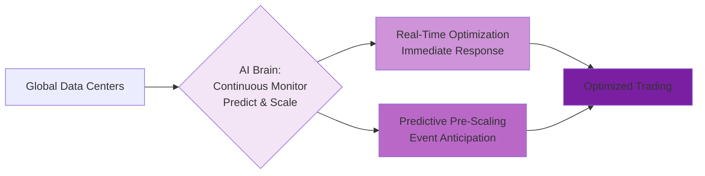
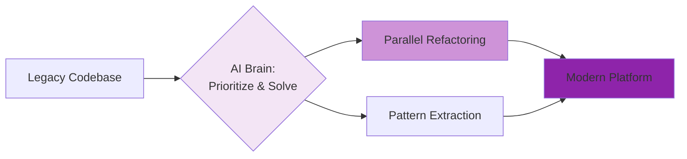

# Debate Slide Preparation: Agentic vs Deterministic AI
## Event Day

**Format:** 3 slides per topic (A: Use Case & Deterministic Approach, B: Agentic AI Approach, C: Battle Arguments)  
**Date:** March 5, 2026

---

# TOPIC 2: OPERATIONAL RELIABILITY AND COST
## Use Case: Trading Infrastructure Cost Optimization

---

## TOPIC 2 - SLIDE A: Use Case & Deterministic Approach

### Narrative

Managing global trading infrastructure is expensive. The **Deterministic AI** approach prioritizes predictability via **Goal + Prescribed Scaling Rules + Budget Constraints**. AI is given the goal (maintain high uptime within budget) plus prescribed steps: monitor demand on prescribed schedule, apply prescribed scaling tiers, enforce budget limits, execute prescribed failover procedures.

1. **AI Monitors Demand on Prescribed Schedule and Applies Prescribed Scaling Tiers**: AI monitors demand across all regions at regular prescribed intervals (not continuously). At each check, AI evaluates demand against prescribed thresholds and scales to prescribed capacity levels: High demand → Full capacity, Medium demand → Moderate capacity, Low demand → Reduced capacity, Off-Market → Minimal capacity. AI follows prescribed tier rules and scheduled monitoring intervals, not continuous real-time optimization.
2. **AI Enforces Prescribed Budget Limits with Exception Rules**: AI applies prescribed budget constraint: daily infrastructure cost must not exceed approved budget ceiling. AI follows prescribed budget management rules: "IF approaching budget limit AND demand is Low/Off-Market THEN scale down to next lower tier." "IF approaching budget limit AND demand is High THEN maintain current tier, trigger budget alert to operations team per prescribed escalation procedure." "IF budget limit reached AND demand is Critical THEN maintain minimum required capacity, escalate to executive approval per prescribed emergency protocol." Budget predictability through prescribed spending caps with prescribed exception handling.
3. **AI Executes Prescribed Failover Procedures**: AI enforces prescribed redundancy configuration—when scaling down, AI maintains prescribed minimum redundancy (multiple regions at full capacity). AI applies prescribed routing tables and load balancer rules per tier.
4. **AI Applies Prescribed Threshold Logic**: AI uses prescribed decision rules evaluated at regular intervals: "IF demand increases significantly since last check THEN scale up one tier (if budget allows)." "IF demand stable below threshold for multiple consecutive checks THEN scale down one tier." AI follows prescribed timing and threshold formulas, not predictive learning.

**Key Advantage:** Predictable cost savings with guaranteed reliability AND guaranteed budget compliance; AI-executed prescribed tiers with scheduled monitoring provide auditability, regulatory certainty, and financial predictability.
**Risk:** Prescribed monitoring intervals mean AI reacts slower than continuous monitoring; AI might miss rapid demand spikes between checks or scale too conservatively due to scheduled evaluation windows.

### Simplified Process Diagram (Deterministic)

**Diagram Narrative:** This diagram illustrates the Deterministic AI approach to trading infrastructure cost optimization. It emphasizes scheduled, predictable monitoring and tier-based scaling across `Global Data Centers` to ensure `Reliable Trading` with guaranteed service levels and budget compliance.

*   **A[\"Global Data Centers\"]**: Represents the distributed trading infrastructure spanning multiple geographical locations.
*   **B[\"AI: Scheduled Monitoring Regular Intervals\"]**: AI monitors demand on a prescribed schedule at regular intervals (not continuously). At each checkpoint, AI evaluates current demand against prescribed thresholds.
*   **C[\"AI: Tier-Based Scaling Prescribed Rules\"]**: AI executes prescribed scaling tier rules based on scheduled monitoring results: High demand → Full capacity, Medium demand → Moderate capacity, Low demand → Reduced capacity, Off-Market → Minimal capacity. AI follows prescribed thresholds evaluated at scheduled intervals.
*   **D[\"AI: Budget Enforcement Comprehensive Rules\"]**: AI enforces prescribed budget constraint with comprehensive rules: daily cost must not exceed approved ceiling. AI applies prescribed budget management rules based on demand context - scale down when demand is low, maintain capacity and alert operations when demand is high, escalate to emergency protocol when demand is critical. AI executes multiple prescribed rules to handle different budget scenarios.
*   **E[\"Reliable Trading\"]**: The ultimate goal, achieved through AI executing prescribed threshold-based rules on scheduled intervals with budget caps, balancing stability, cost, and financial predictability through predetermined tiers.

---

## TOPIC 2 - SLIDE B: Agentic AI Approach

### Narrative

In contrast, the **Agentic AI** approach is given a **Goal: High Uptime + Minimized Cost**. It uses autonomous reasoning to dynamically reconfigure infrastructure based on predicted and real-time demand.

1. **Predictive Scaling**: Learns market schedules to pre-provision capacity before news spikes.
2. **Dynamic Optimization**: Scales to minimal capacity during off-market hours for massive savings.
3. **Autonomous Failover**: Detects region failures and re-routes workloads without human scripts.

**Key Advantage:** Drastic reduction in operational expenses while maintaining high performance.
**Risk:** Orchestration complexity; dynamic changes are harder to audit than static configurations.

### Simplified Process Diagram (Agentic)

**Diagram Narrative:** This diagram illustrates the Agentic AI approach to trading infrastructure cost optimization. Here, the AI acts as an intelligent `AI Brain` that continuously monitors in real-time, learns, predicts, and dynamically adjusts resources across `Global Data Centers` to achieve `Optimized Trading`.

*   **A[\"Global Data Centers\"]**: Represents the distributed trading infrastructure spanning multiple geographical locations.
*   **B{\"AI Brain: Continuous Monitor Predict & Scale\"}**: This central node signifies the Agentic AI's core capability to continuously monitor in real-time (not on scheduled intervals), autonomously analyze historical and real-time data, predict demand spikes, and determine optimal scaling strategies without prescribed rules.
*   **C[\"Real-Time Optimization Immediate Response\"]**: Shows the AI's ability to respond immediately to demand changes—scaling down during off-market hours for cost savings, scaling up within moments when demand increases, with no scheduled delay.
*   **D[\"Predictive Pre-Scaling Event Anticipation\"]**: Illustrates the AI's proactive intelligence in anticipating major market announcements or events and pre-provisioning resources well in advance to prevent latency or performance issues during demand surges.
*   **E[\"Optimized Trading\"]**: The ultimate outcome, where high uptime and performance are maintained, but with drastically reduced operational costs due to the continuous, dynamic, and intelligent management of resources.

---

## TOPIC 2 - SLIDE C: Battle Arguments

| **BATTLE** | **DETERMINISTIC AI** | **AGENTIC AI** |
|---|---|---|
| **Reliability** | **ARGUES: Scheduled Monitoring + Comprehensive Rules = Predictable Behavior**    "We use demand data intelligently—through comprehensive prescribed rules on a prescribed schedule. Our AI monitors demand at regular intervals and applies predetermined tiers with extensive rule coverage: scaling rules, budget management rules, failover rules, emergency protocols. When markets crash, our AI doesn't improvise or predict—it follows comprehensive prescribed logic tested in every scenario, evaluated at predictable intervals. Regulators can audit our complete rule set AND our monitoring schedule. That's reliability you can bank on, literally." | **COUNTERS: Real-Time Adaptation**    "But your scheduled intervals create reaction lag. Markets don't wait for your next monitoring checkpoint. We adapt continuously in real-time—when demand spikes, we respond immediately, not at the next scheduled check. When patterns emerge, we learn and optimize instantly. Your comprehensive rules are impressive on paper, but they're always reacting to yesterday's data. We're adapting to this second's reality." |
| **Guarantees** | **COUNTERS: Comprehensive Rule Coverage + Auditable Logic**    "But legal certainty wins deals. When clearing partners and regulators demand guarantees, we show them our complete prescribed rule library: scaling tiers, budget management with demand-aware exceptions, failover procedures, emergency escalation protocols. Every scenario covered by documented rules: 'IF budget limit approaching AND demand low THEN scale down. IF budget limit AND demand high THEN alert operations. IF budget critical AND demand critical THEN emergency protocol.' No black-box predictions, no autonomous optimization—just AI executing comprehensive documented rules. That's what contracts are built on." | **ARGUES: Predictive Intelligence**    "But your rules are always reactive, no matter how comprehensive. Fed announcement happens? Your AI waits for the next scheduled check, evaluates rules, then reacts—by then traders are already experiencing latency. We predict the announcement impact and pre-scale well in advance. Your thousand rules can't match one intelligent prediction. You're building a bigger rulebook while we're staying ahead of the curve." |
| **Testing** | **ARGUES: Complete Rule Validation on Predictable Schedule**    "Chaos engineering perfection. We can test every rule in our comprehensive library at prescribed intervals: simulate low demand + budget limit, verify AI scales down per rule. Simulate high demand + budget limit, verify AI alerts operations per rule. Simulate critical demand + budget critical, verify AI executes emergency protocol per rule. Every scenario, every rule, every scheduled checkpoint is testable and repeatable. You can't test autonomous real-time predictions—they're different every time." | **COUNTERS: Continuous Learning**    "But your testing validates yesterday's rules against yesterday's scenarios. We learn continuously from real operational patterns. Our AI discovered early warning signals that predict demand surges well before they happen—patterns your prescribed rules never anticipated. We test in production, learn in real-time, and improve continuously. Your comprehensive rulebook is frozen in time. We're evolving every day." |
| **Transparency** | **COUNTERS: Complete Rule Documentation + Budget Certainty**    "But when your CFO asks about infrastructure costs, we show them the complete prescribed rule library: tier definitions, budget management rules with demand-aware logic, emergency protocols. AI spent significant time in Medium tier, moderate time in Low, some time in High, minimal time Off-Market. Total: within budget, never exceeded ceiling. Every decision traceable to a specific documented rule. Your board wants comprehensive documentation and certainty, not 'the AI learned patterns and optimized.' That's how enterprises actually operate." | **ARGUES: Intelligent Optimization**    "But your comprehensive rules still operate on coarse tiers. You're stuck at reduced capacity when actual demand is much lower—wasting significant resources because your prescribed rules can't optimize granularly. We scale continuously to exact demand plus intelligent buffer based on learned patterns. Your rule library is impressive, but it's still approximation. We deliver precision. Your CFO wants savings, not documentation." |

---

# TOPIC 4: AGENTS ON DIFFERENT SDLC WORKFLOWS  
## Use Case: Legacy Trading Platform Code Modernization

---

## TOPIC 4 - SLIDE A: Use Case & Deterministic Approach

### Narrative

An investment bank must modernize a massive legacy trading platform (Java upgrade, microservices, 24/7 uptime). The **Deterministic AI** approach follows a **Goal + Prescribed Methodology**. It executes a rigid, sequential refactoring plan (Analyze → Plan → Refactor → Test → Deploy) module-by-module.

1. **Step-by-Step Execution**: AI follows a fixed 5-phase sequence identical for all code.
2. **Prescribed Pattern Matching**: Applies standard refactoring templates to every class.
3. **Verifiable Audit Trail**: Logs every change against the approved methodology.

**Key Advantage:** Regulatory compliance is straightforward because the process is predictable and uniform.
**Risk:** Fixed, extended timeline; critical logic is blocked by low-risk code refactoring.

### Simplified Process Diagram (Deterministic)

**Diagram Narrative:** This diagram illustrates the rigid, sequential nature of a Deterministic AI workflow for code modernization. Starting from the `Legacy Codebase`, the AI proceeds through distinct, ordered phases to transform the system into a `Modern Platform`.

*   **A[\"Legacy Codebase\"]**: Represents the existing large, complex, and technically indebted trading platform.
*   **B[\"1. Scan & Catalog\"]**: The first step where the AI meticulously scans the entire codebase, identifying dependencies and cataloging all components based on a predefined methodology.
*   **C[\"2. Sequential Refactor\"]**: The core refactoring phase, where the AI systematically refactors modules one by one, strictly adhering to a prescribed order and refactoring patterns.
*   **D[\"3. Template Testing\"]**: After each refactoring step, the AI applies comprehensive tests based on predefined templates to ensure correctness and adherence to quality standards.
*   **E[\"Modern Platform\"]**: The final state, where the legacy platform has been transformed into a scalable, maintainable, and secure modern system, achieved through a controlled and auditable process.

---

## TOPIC 4 - SLIDE B: Agentic AI Approach

### Narrative

In contrast, the **Agentic AI** approach is given a **Goal only (No prescribed methodology)**. It autonomously determines the most efficient path to modernization based on real-world constraints and code criticality.

1. **Autonomous Prioritization**: Identifies and modernizes high-impact trading logic first.
2. **Intelligent Pattern Detection**: Recognizes duplication across modules to refactor once and share.
3. **Parallel Orchestration**: Runs multiple refactoring and testing streams simultaneously where safe.

**Key Advantage:** Rapid delivery of business value; critical features are unblocked significantly sooner.
**Risk:** Variable methodology makes uniform quality audits more complex to verify.

### Simplified Process Diagram (Agentic)

**Diagram Narrative:** This diagram depicts the dynamic and autonomous nature of an Agentic AI workflow for code modernization. The AI, acting as a central intelligent agent, assesses the `Legacy Codebase` and independently determines the most efficient path to a `Modern Platform`.

*   **A[\"Legacy Codebase\"]**: Represents the existing large, complex, and technically indebted trading platform.
*   **B{\"AI Brain: Prioritize & Solve\"}**: This central node signifies the Agentic AI's core capability to autonomously analyze the codebase, prioritize critical sections, and devise optimal refactoring strategies.
*   **C[\"Parallel Refactoring\"]**: Illustrates the AI's ability to identify independent code modules and initiate parallel refactoring efforts, significantly accelerating the modernization process.
*   **D[\"Pattern Extraction\"]**: Shows the AI's intelligence in detecting recurring code patterns (e.g., duplicated code) and extracting them into reusable components, which are then applied across the codebase.
*   **E[\"Modern Platform\"]**: The desired outcome, a fully modernized, scalable, and maintainable platform, achieved through the Agentic AI's dynamic and context-aware approach.

---

## TOPIC 4 - SLIDE C: Battle Arguments

| **BATTLE** | **DETERMINISTIC AI** | **AGENTIC AI** |
|---|---|---|
| **Compliance** | **ARGUES: Uniform Methodology = Audit-Ready**    "Regulators demand proof, not promises. Our uniform methodology means every single line of code was refactored using the exact same approved patterns. When auditors ask 'How do you ensure quality?' we show them the rulebook we followed religiously. That's defensible. That's compliance." | **COUNTERS: Risk-Based Intelligence**    "But compliance isn't about treating a critical trading engine the same as a low-risk admin report. That's bureaucracy, not intelligence. We apply maximum rigor where billions of dollars flow and streamline where risk is minimal. Regulators care about outcomes—zero trading failures—not whether you followed a template designed for average code." |
| **Accountability** | **COUNTERS: Stakeholder Certainty**    "But speed without predictability destroys trust. Our CTO can tell the board: 'Modernization takes exactly this long, every module gets equal treatment.' Stakeholders can plan feature roadmaps, budget cycles, and resource allocation around a fixed timeline. That certainty is worth the wait." | **ARGUES: Speed to Market**    "While you're spending years refactoring low-priority code, your competitors are shipping new algorithmic trading features and capturing market share. We modernize critical systems in months, not years. The business doesn't care about your perfect audit trail when they're losing to faster rivals." |
| **Predictability** | **ARGUES: Crystal Clear Audit Trail**    "When something breaks, you need to know why. With our approach, if a refactored module fails, the audit trail is crystal clear: either we deviated from the methodology, or the methodology itself has a gap. Either way, accountability is absolute. No guessing, no finger-pointing—just facts." | **COUNTERS: Intelligent Pattern Recognition**    "But your 'predictability' is predictably wasteful. We discovered hundreds of duplicate classes—copy-paste technical debt everywhere. Your template would refactor each one individually over months. We extracted a shared library and refactored them all simultaneously in weeks. That's not a shortcut—that's intelligence your rigid process would never discover." |
| **Reliability** | **COUNTERS: Proven Methodology**    "But when billions are on the line, you don't experiment. Our methodology has been battle-tested across hundreds of enterprise migrations. Every pattern, every sequence, every checkpoint has been validated in production. Your 'intelligence' is untested creativity applied to mission-critical systems. That's not innovation—that's gambling with shareholder value." | **ARGUES: Real-Time Adaptation**    "While you're following your playbook, we're adapting to reality. We discovered a critical dependency chain your static analysis missed entirely. Your sequential plan would have broken production. We dynamically reordered the refactoring to preserve system integrity. Your 'proven methodology' can't handle what it's never seen before." |

---