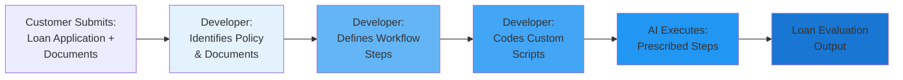
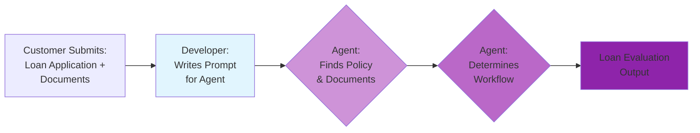
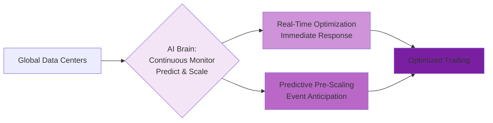
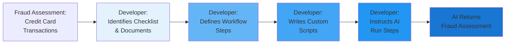
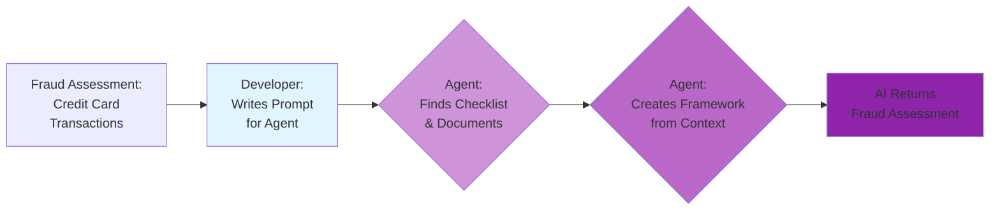
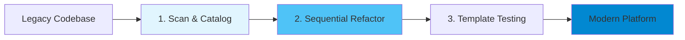
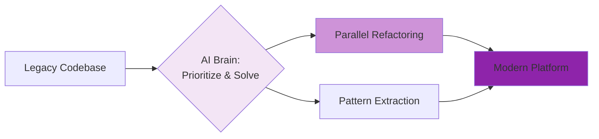

# Debate Slide Preparation: Agentic vs Deterministic AI
## Event Day

**Format:** 3 slides per topic (A: Use Case & Deterministic Approach, B: Agentic AI Approach, C: Battle Arguments)  
**Date:** March 5, 2026

---

# TOPIC 1: INFORMATION PROCESSING
## Use Case: Using AI to make the loan assessment process more efficient

---

## TOPIC 1 - SLIDE A: Use Case & Deterministic Approach

### Narrative

A bank needs to process loan applications efficiently while maintaining regulatory compliance. The **Deterministic AI** approach follows **Goal + Prescribed Workflow Steps**. AI is given the goal (assess loan eligibility) plus prescribed steps: identify relevant policy documents, run workflow steps in defined order, execute custom scripts as needed, return standardized evaluations.

1. **Developer Identifies Relevant Policy and Documents**: Developer analyzes loan assessment requirements and identifies which policies and documents AI must process. Developer defines the specific documents AI should extract data from.
2. **Developer Defines Step-by-Step Workflow**: Developer creates explicit workflow sequence AI must follow: document verification → income calculation → credit score check → debt-to-income ratio → risk assessment → approval decision. AI executes each step in prescribed order.
3. **Developer May Need to Code Some Specifics**: For complex business rules or edge cases, developer writes custom scripts that AI executes at specific workflow points. AI runs these scripts as instructed without deviation.
4. **AI Returns Loan Evaluations**: AI processes applications following the prescribed workflow, returning standardized loan evaluations. Evaluations are verified by business users against known test cases.

**Key Advantage:** Consistent, auditable results with clear regulatory compliance trail; every decision traceable to specific policy rules.
**Risk:** Rigid workflow may not adapt to unusual applications; requires developer intervention for new scenarios.

### Simplified Process Diagram (Deterministic)

**Diagram Narrative:** This diagram illustrates the Deterministic AI approach to loan assessment. The developer prescribes every step, and AI executes the defined workflow to produce consistent, auditable loan evaluations.

*   **A["Customer Submits: Loan Application + Documents"]**: Customer provides loan application form and supporting documents (income statements, credit reports, etc.).
*   **B["Developer: Identifies Policy & Documents"]**: Developer determines which lending policies apply and which documents AI must process for this loan type.
*   **C["Developer: Defines Workflow Steps"]**: Developer creates explicit step-by-step workflow that AI must follow in prescribed order.
*   **D["Developer: Codes Custom Scripts"]**: Developer writes custom code for complex business rules or calculations that AI will execute at specific points.
*   **E["AI Executes: Prescribed Steps"]**: AI follows the prescribed workflow, running custom scripts as instructed, processing documents according to defined rules.
*   **F["Loan Evaluation Output"]**: AI returns standardized loan evaluation that business users verify for accuracy and compliance.

---

## TOPIC 1 - SLIDE B: Agentic AI Approach

### Narrative

In contrast, the **Agentic AI** approach is given a **Goal Only: Assess Loan Eligibility**. It autonomously determines the workflow based on understanding lending policies and document context.

1. **Developer Writes Prompt for Agent to Assess Loan Eligibility**: Developer provides high-level goal: "Assess this loan application for eligibility based on our lending policies." No step-by-step workflow prescribed.
2. **Agent Automatically Finds Relevant Policy and Documents**: AI autonomously searches policy database, identifies applicable lending criteria, and locates relevant documents within the application package.
3. **Agent Automatically Determines Workflow**: AI reasons about the optimal assessment sequence based on document availability, policy requirements, and application complexity. May process steps in different order for different applications.
4. **Outcome Similar but Process Very Different**: AI produces loan evaluation similar to deterministic approach, but the path taken varies by application. AI adapts workflow to each unique situation.

**Key Advantage:** Handles unusual applications intelligently; adapts to new scenarios without developer intervention; discovers insights from document patterns.
**Risk:** Variable workflow makes audit trail more complex; harder to predict exact processing path; requires trust in AI reasoning.

### Simplified Process Diagram (Agentic)

**Diagram Narrative:** This diagram illustrates the Agentic AI approach to loan assessment. The developer provides only the goal, and AI autonomously determines how to assess the loan based on policies and document context.

*   **A["Customer Submits: Loan Application + Documents"]**: Customer provides loan application form and supporting documents.
*   **B["Developer: Writes Prompt for Agent"]**: Developer provides high-level instruction: "Assess loan eligibility based on our policies." No workflow steps prescribed.
*   **C{"Agent: Finds Policy & Documents"}**: AI autonomously searches for applicable lending policies and identifies relevant documents within the submission.
*   **D{"Agent: Determines Workflow"}**: AI reasons about optimal assessment approach based on application characteristics, adapting workflow to each unique case.
*   **E["Loan Evaluation Output"]**: AI produces loan evaluation with similar outcome to deterministic approach, but through dynamically determined process.

---

## TOPIC 1 - SLIDE C: Battle Arguments

| **BATTLE** | **DETERMINISTIC AI** | **AGENTIC AI** |
|---|---|---|
| **Standard Reporting Formats Multiple Document Types** | **COUNTERS: No Surprises, Consistent**    "But we process high volumes of loans with zero surprises. Same documents, same workflow, same output format every time. Our business users know exactly what to expect. Operations teams can plan capacity precisely. That consistency is what enables scale." | **ARGUES: Dynamically Take Changes Into Account**    "When regulations change mid-quarter or a self-employed applicant submits tax returns instead of W-2s, we adapt immediately. New fair lending rule drops? We understand the policy intent and adjust. Your team spends weeks recoding workflows while we're already compliant. We reason about document equivalence your templates never anticipated." |
| **Regulatory Audit** | **ARGUES: Almost Perfect Trace of Simple Logic**    "When regulators audit our loan decisions, we show them the exact workflow every application followed. Step 1: document verification. Step 2: income calculation. Step 3: credit check. Every decision traces to a specific rule in our documented workflow. No surprises, no black boxes. That's what passes regulatory scrutiny." | **COUNTERS: Complex Explanation of Reasoning**    "But your 'simple logic' creates rigid workflows that break with real-world variations. When we explain our reasoning—'Tax Schedule C shows income similar to W-2 wages, applicant has consistent savings pattern'—we provide richer context than your step-by-step trace. Regulators care about fair outcomes, not just documented steps." |
| **Understanding Context** | **COUNTERS: Stricter Control Over What AI Learns**    "But we control exactly what AI considers. Income verification uses only approved document types. Credit decisions follow only specified criteria. No hidden factors, no unexplained reasoning. When fair lending audits happen, we prove AI used only legally permissible factors. Your 'context understanding' is a compliance risk." | **ARGUES: Can Learn From Wide Variety of Sources**    "Your strict control means missed opportunities. We discovered that applicants with irregular income patterns but consistent savings actually have lower default rates than your model predicts. We learn from broader context while respecting compliance boundaries. Your rules are frozen in yesterday's assumptions." |

---

# TOPIC 2: OPERATIONAL RELIABILITY AND COST
## Use Case: Trading Infrastructure Cost Optimization

---

## TOPIC 2 - SLIDE A: Use Case & Deterministic Approach

### Narrative

Managing global trading infrastructure is expensive. The **Deterministic AI** approach prioritizes predictability via **Goal + Prescribed Scaling Rules + Budget Constraints**. AI is given the goal (maintain high uptime within budget) plus prescribed steps: monitor demand on prescribed schedule, apply prescribed scaling tiers, enforce budget limits, execute prescribed failover procedures.

1. **AI Monitors Demand on Prescribed Schedule and Applies Prescribed Scaling Tiers**: AI monitors demand across all regions at regular prescribed intervals (not continuously). At each check, AI evaluates demand against prescribed thresholds and scales to prescribed capacity levels: High demand → Full capacity, Medium demand → Moderate capacity, Low demand → Reduced capacity, Off-Market → Minimal capacity. AI follows prescribed tier rules and scheduled monitoring intervals, not continuous real-time optimization.
2. **AI Enforces Prescribed Budget Limits with Exception Rules**: AI applies prescribed budget constraint: daily infrastructure cost must not exceed approved budget ceiling. AI follows prescribed budget management rules: "IF approaching budget limit AND demand is Low/Off-Market THEN scale down to next lower tier." "IF approaching budget limit AND demand is High THEN maintain current tier, trigger budget alert to operations team per prescribed escalation procedure." "IF budget limit reached AND demand is Critical THEN maintain minimum required capacity, escalate to executive approval per prescribed emergency protocol." Budget predictability through prescribed spending caps with prescribed exception handling.
3. **AI Executes Prescribed Failover Procedures**: AI enforces prescribed redundancy configuration—when scaling down, AI maintains prescribed minimum redundancy (multiple regions at full capacity). AI applies prescribed routing tables and load balancer rules per tier.
4. **AI Applies Prescribed Threshold Logic**: AI uses prescribed decision rules evaluated at regular intervals: "IF demand increases significantly since last check THEN scale up one tier (if budget allows)." "IF demand stable below threshold for multiple consecutive checks THEN scale down one tier." AI follows prescribed timing and threshold formulas, not predictive learning.

**Key Advantage:** Predictable cost savings with guaranteed reliability AND guaranteed budget compliance; AI-executed prescribed tiers with scheduled monitoring provide auditability, regulatory certainty, and financial predictability.
**Risk:** Prescribed monitoring intervals mean AI reacts slower than continuous monitoring; AI might miss rapid demand spikes between checks or scale too conservatively due to scheduled evaluation windows.

### Simplified Process Diagram (Deterministic)

**Diagram Narrative:** This diagram illustrates the Deterministic AI approach to trading infrastructure cost optimization. It emphasizes scheduled, predictable monitoring and tier-based scaling across `Global Data Centers` to ensure `Reliable Trading` with guaranteed service levels and budget compliance.

*   **A[\"Global Data Centers\"]**: Represents the distributed trading infrastructure spanning multiple geographical locations.
*   **B[\"AI: Scheduled Monitoring Regular Intervals\"]**: AI monitors demand on a prescribed schedule at regular intervals (not continuously). At each checkpoint, AI evaluates current demand against prescribed thresholds.
*   **C[\"AI: Tier-Based Scaling Prescribed Rules\"]**: AI executes prescribed scaling tier rules based on scheduled monitoring results: High demand → Full capacity, Medium demand → Moderate capacity, Low demand → Reduced capacity, Off-Market → Minimal capacity. AI follows prescribed thresholds evaluated at scheduled intervals.
*   **D[\"AI: Budget Enforcement Comprehensive Rules\"]**: AI enforces prescribed budget constraint with comprehensive rules: daily cost must not exceed approved ceiling. AI applies prescribed budget management rules based on demand context - scale down when demand is low, maintain capacity and alert operations when demand is high, escalate to emergency protocol when demand is critical. AI executes multiple prescribed rules to handle different budget scenarios.
*   **E[\"Reliable Trading\"]**: The ultimate goal, achieved through AI executing prescribed threshold-based rules on scheduled intervals with budget caps, balancing stability, cost, and financial predictability through predetermined tiers.

---

## TOPIC 2 - SLIDE B: Agentic AI Approach

### Narrative

In contrast, the **Agentic AI** approach is given a **Goal: High Uptime + Minimized Cost**. It uses autonomous reasoning to dynamically reconfigure infrastructure based on predicted and real-time demand.

1. **Predictive Scaling**: Learns market schedules to pre-provision capacity before news spikes.
2. **Dynamic Optimization**: Scales to minimal capacity during off-market hours for massive savings.
3. **Autonomous Failover**: Detects region failures and re-routes workloads without human scripts.

**Key Advantage:** Drastic reduction in operational expenses while maintaining high performance.
**Risk:** Orchestration complexity; dynamic changes are harder to audit than static configurations.

### Simplified Process Diagram (Agentic)

**Diagram Narrative:** This diagram illustrates the Agentic AI approach to trading infrastructure cost optimization. Here, the AI acts as an intelligent `AI Brain` that continuously monitors in real-time, learns, predicts, and dynamically adjusts resources across `Global Data Centers` to achieve `Optimized Trading`.

*   **A[\"Global Data Centers\"]**: Represents the distributed trading infrastructure spanning multiple geographical locations.
*   **B{\"AI Brain: Continuous Monitor Predict & Scale\"}**: This central node signifies the Agentic AI's core capability to continuously monitor in real-time (not on scheduled intervals), autonomously analyze historical and real-time data, predict demand spikes, and determine optimal scaling strategies without prescribed rules.
*   **C[\"Real-Time Optimization Immediate Response\"]**: Shows the AI's ability to respond immediately to demand changes—scaling down during off-market hours for cost savings, scaling up within moments when demand increases, with no scheduled delay.
*   **D[\"Predictive Pre-Scaling Event Anticipation\"]**: Illustrates the AI's proactive intelligence in anticipating major market announcements or events and pre-provisioning resources well in advance to prevent latency or performance issues during demand surges.
*   **E[\"Optimized Trading\"]**: The ultimate outcome, where high uptime and performance are maintained, but with drastically reduced operational costs due to the continuous, dynamic, and intelligent management of resources.

---

## TOPIC 2 - SLIDE C: Battle Arguments

| **BATTLE** | **DETERMINISTIC AI** | **AGENTIC AI** |
|---|---|---|
| **Reliability** | **ARGUES: Scheduled Monitoring + Comprehensive Rules = Predictable Behavior**    "We use demand data intelligently—through comprehensive prescribed rules on a prescribed schedule. Our AI monitors demand at regular intervals and applies predetermined tiers with extensive rule coverage: scaling rules, budget management rules, failover rules, emergency protocols. When markets crash, our AI doesn't improvise or predict—it follows comprehensive prescribed logic tested in every scenario, evaluated at predictable intervals. Regulators can audit our complete rule set AND our monitoring schedule. That's reliability you can bank on, literally." | **COUNTERS: Real-Time Adaptation**    "But your scheduled intervals create reaction lag. Markets don't wait for your next monitoring checkpoint. We adapt continuously in real-time—when demand spikes, we respond immediately, not at the next scheduled check. When patterns emerge, we learn and optimize instantly. Your comprehensive rules are impressive on paper, but they're always reacting to yesterday's data. We're adapting to this second's reality." |
| **Guarantees** | **COUNTERS: Comprehensive Rule Coverage + Auditable Logic**    "But legal certainty wins deals. When clearing partners and regulators demand guarantees, we show them our complete prescribed rule library: scaling tiers, budget management with demand-aware exceptions, failover procedures, emergency escalation protocols. Every scenario covered by documented rules: 'IF budget limit approaching AND demand low THEN scale down. IF budget limit AND demand high THEN alert operations. IF budget critical AND demand critical THEN emergency protocol.' No black-box predictions, no autonomous optimization—just AI executing comprehensive documented rules. That's what contracts are built on." | **ARGUES: Predictive Intelligence**    "But your rules are always reactive, no matter how comprehensive. Fed announcement happens? Your AI waits for the next scheduled check, evaluates rules, then reacts—by then traders are already experiencing latency. We predict the announcement impact and pre-scale well in advance. Your thousand rules can't match one intelligent prediction. You're building a bigger rulebook while we're staying ahead of the curve." |
| **Testing** | **ARGUES: Complete Rule Validation on Predictable Schedule**    "Chaos engineering perfection. We can test every rule in our comprehensive library at prescribed intervals: simulate low demand + budget limit, verify AI scales down per rule. Simulate high demand + budget limit, verify AI alerts operations per rule. Simulate critical demand + budget critical, verify AI executes emergency protocol per rule. Every scenario, every rule, every scheduled checkpoint is testable and repeatable. You can't test autonomous real-time predictions—they're different every time." | **COUNTERS: Continuous Learning**    "But your testing validates yesterday's rules against yesterday's scenarios. We learn continuously from real operational patterns. Our AI discovered early warning signals that predict demand surges well before they happen—patterns your prescribed rules never anticipated. We test in production, learn in real-time, and improve continuously. Your comprehensive rulebook is frozen in time. We're evolving every day." |

---
# TOPIC 3: SECURITY & FRAUD DETECTION
## Use Case: Using AI to make the Fraud assessment process more efficient

---

## TOPIC 3 - SLIDE A: Use Case & Deterministic Approach

### Narrative

A financial institution needs to detect fraudulent credit card transactions in real-time. The **Deterministic AI** approach follows **Goal + Prescribed Detection Rules**. AI is given the goal (identify fraud) plus prescribed steps: identify relevant fraud detection checklist and documents, define step-by-step workflow, write custom scripts as needed, run workflow steps.

1. **Developer Identifies Relevant Fraud Detection Checklist and Documents**: Developer analyzes fraud detection requirements and identifies which fraud patterns and transaction data AI must examine. Developer defines the specific indicators AI should check.
2. **Developer Defines Step-by-Step Workflow**: Developer creates explicit workflow sequence AI must follow: transaction amount verification → merchant category check → geographic location analysis → velocity checks → known fraud pattern matching → risk scoring. AI executes each step in prescribed order.
3. **Developer Writes Custom Scripts as Needed**: For complex fraud scenarios or edge cases, developer writes custom detection scripts that AI executes at specific workflow points. AI runs these scripts as instructed without deviation.
4. **Developer Instructs AI to Run Steps in the Workflow**: AI processes transactions following the prescribed workflow, running custom scripts as needed. AI returns fraud assessments verified by business users against known fraud cases.

**Key Advantage:** Consistent, auditable fraud detection with clear compliance trail; every decision traceable to specific detection rules; will always detect identified patterns.
**Risk:** Rigid workflow may miss novel fraud patterns; requires developer intervention for new fraud techniques.

### Simplified Process Diagram (Deterministic)

**Diagram Narrative:** This diagram illustrates the Deterministic AI approach to fraud detection. The developer prescribes every detection step, and AI executes the defined workflow to produce consistent, auditable fraud assessments.

*   **A["Fraud Assessment: Credit Card Transactions"]**: Credit card transactions requiring fraud assessment in real-time.
*   **B["Developer: Identifies Checklist & Documents"]**: Developer determines which fraud indicators apply and which transaction data AI must examine.
*   **C["Developer: Defines Workflow Steps"]**: Developer creates explicit step-by-step fraud detection workflow that AI must follow in prescribed order.
*   **D["Developer: Writes Custom Scripts"]**: Developer writes custom code for complex fraud patterns or detection logic that AI will execute at specific points.
*   **E["Developer: Instructs AI Run Steps"]**: Developer instructs AI to execute the prescribed workflow, running custom scripts as defined.
*   **F["AI Returns Fraud Assessment"]**: AI returns standardized fraud assessment that business users verify for accuracy and effectiveness.

---

## TOPIC 3 - SLIDE B: Agentic AI Approach

### Narrative

In contrast, the **Agentic AI** approach is given a **Goal Only: Assess Fraud Risk**. It autonomously determines the detection approach based on understanding fraud patterns and transaction context.

1. **Developer Writes Prompt for Agent to Assess Fraud**: Developer provides high-level goal: "Assess this transaction for fraud risk based on our fraud detection framework." No step-by-step workflow prescribed.
2. **Agent Automatically Finds Relevant Checklist and Documents**: AI autonomously searches fraud pattern database, identifies applicable detection criteria, and locates relevant transaction data and historical patterns.
3. **Agent Creates Fraud Framework from Context Provided**: AI reasons about the optimal detection approach based on transaction characteristics, merchant patterns, and customer behavior. Adapts framework to each unique transaction context.
4. **Agent Runs Steps in Framework**: AI executes its self-determined fraud detection framework, dynamically adjusting analysis depth based on risk indicators discovered during assessment.

**Key Advantage:** Detects novel fraud patterns; adapts to emerging fraud techniques without developer intervention; dynamically learns new patterns and identifies patterns humans may not even know of.
**Risk:** Variable detection approach makes audit trail more complex; reason needs to be inferred; harder to predict exact detection path.

### Simplified Process Diagram (Agentic)

**Diagram Narrative:** This diagram illustrates the Agentic AI approach to fraud detection. The developer provides only the goal, and AI autonomously determines how to assess fraud based on patterns and transaction context.

*   **A["Fraud Assessment: Credit Card Transactions"]**: Credit card transactions requiring fraud assessment in real-time.
*   **B["Developer: Writes Prompt for Agent"]**: Developer provides high-level instruction: "Assess fraud risk based on our framework." No workflow steps prescribed.
*   **C{"Agent: Finds Checklist & Documents"}**: AI autonomously searches for applicable fraud patterns and identifies relevant transaction data and behavioral indicators.
*   **D{"Agent: Creates Framework from Context"}**: AI reasons about optimal detection approach based on transaction characteristics, creating adaptive framework for each assessment.
*   **E["AI Returns Fraud Assessment"]**: AI produces fraud assessment with similar outcome to deterministic approach, but through dynamically determined process.

---

## TOPIC 3 - SLIDE C: Battle Arguments

| **BATTLE** | **DETERMINISTIC AI** | **AGENTIC AI** |
|---|---|---|
| **Different Attack Patterns** | **COUNTERS: Will Always Detect Identified Patterns**    "But we guarantee detection of all known fraud patterns. Every high-value card-not-present transaction triggers verification. Every geographic anomaly gets flagged. Our fraud analysts know exactly which rules fired. When regulators audit, we prove every known fraud type is covered. That's defensible fraud prevention." | **ARGUES: Dynamically Learns New Patterns**    "Your 'identified patterns' are yesterday's fraud. Criminals evolve faster than your rule updates. We detected a new synthetic identity pattern by correlating application timing, device fingerprints, and behavioral anomalies—signals your rules never connected. We identify patterns humans may not even know of. By the time you code new rules, fraudsters have moved on." |
| **Auditor Trail** | **ARGUES: Full Step-by-Step Tracking and Reasoning**    "When a fraud case goes to court, we provide complete audit trails. Rule 47: transaction amount exceeded threshold. Rule 52: merchant category flagged. Rule 63: velocity check failed. Every decision documented, every step traceable. Legal teams can defend our decisions because the logic is explicit and documented." | **COUNTERS: Reason Needs to Be Inferred**    "But your 'full tracking' misses the why. We explain: 'Transaction pattern matches emerging fraud ring—unusual purchase sequence, device switching, and merchant hopping in rapid succession.' Your rules fired independently without connecting the story. Investigators need context, not just rule numbers. Our reasoning helps catch the entire fraud network." |
| **Real-Time Explanation and Threat Response** | **COUNTERS: Clear Real-Time Explanation and Accountability**    "But when customers call about declined transactions, we give instant explanations: 'Transaction declined due to geographic anomaly—card used in two countries within one hour.' Clear, immediate, defensible. Your 'inferred reasoning' means support staff can't explain decisions. Customers demand accountability, not AI mysteries." | **ARGUES: Adaptive Threat Response Especially Against Other Agents**    "Your clear explanations work until fraudsters use AI to probe your rules. They test small transactions to map your thresholds, then exploit gaps. We adapt in real-time—when we detect systematic probing, we adjust our detection strategy dynamically. Your static rules are reverse-engineered. We're playing chess while you're following a script." |

---

# TOPIC 4: AGENTS ON DIFFERENT SDLC WORKFLOWS  
## Use Case: Legacy Trading Platform Code Modernization

---

## TOPIC 4 - SLIDE A: Use Case & Deterministic Approach

### Narrative

An investment bank must modernize a massive legacy trading platform (Java upgrade, microservices, 24/7 uptime). The **Deterministic AI** approach follows a **Goal + Prescribed Methodology**. It executes a rigid, sequential refactoring plan (Analyze → Plan → Refactor → Test → Deploy) module-by-module.

1. **Step-by-Step Execution**: AI follows a fixed 5-phase sequence identical for all code.
2. **Prescribed Pattern Matching**: Applies standard refactoring templates to every class.
3. **Verifiable Audit Trail**: Logs every change against the approved methodology.

**Key Advantage:** Regulatory compliance is straightforward because the process is predictable and uniform.
**Risk:** Fixed, extended timeline; critical logic is blocked by low-risk code refactoring.

### Simplified Process Diagram (Deterministic)

**Diagram Narrative:** This diagram illustrates the rigid, sequential nature of a Deterministic AI workflow for code modernization. Starting from the `Legacy Codebase`, the AI proceeds through distinct, ordered phases to transform the system into a `Modern Platform`.

*   **A[\"Legacy Codebase\"]**: Represents the existing large, complex, and technically indebted trading platform.
*   **B[\"1. Scan & Catalog\"]**: The first step where the AI meticulously scans the entire codebase, identifying dependencies and cataloging all components based on a predefined methodology.
*   **C[\"2. Sequential Refactor\"]**: The core refactoring phase, where the AI systematically refactors modules one by one, strictly adhering to a prescribed order and refactoring patterns.
*   **D[\"3. Template Testing\"]**: After each refactoring step, the AI applies comprehensive tests based on predefined templates to ensure correctness and adherence to quality standards.
*   **E[\"Modern Platform\"]**: The final state, where the legacy platform has been transformed into a scalable, maintainable, and secure modern system, achieved through a controlled and auditable process.

---

## TOPIC 4 - SLIDE B: Agentic AI Approach

### Narrative

In contrast, the **Agentic AI** approach is given a **Goal only (No prescribed methodology)**. It autonomously determines the most efficient path to modernization based on real-world constraints and code criticality.

1. **Autonomous Prioritization**: Identifies and modernizes high-impact trading logic first.
2. **Intelligent Pattern Detection**: Recognizes duplication across modules to refactor once and share.
3. **Parallel Orchestration**: Runs multiple refactoring and testing streams simultaneously where safe.

**Key Advantage:** Rapid delivery of business value; critical features are unblocked significantly sooner.
**Risk:** Variable methodology makes uniform quality audits more complex to verify.

### Simplified Process Diagram (Agentic)

**Diagram Narrative:** This diagram depicts the dynamic and autonomous nature of an Agentic AI workflow for code modernization. The AI, acting as a central intelligent agent, assesses the `Legacy Codebase` and independently determines the most efficient path to a `Modern Platform`.

*   **A[\"Legacy Codebase\"]**: Represents the existing large, complex, and technically indebted trading platform.
*   **B{\"AI Brain: Prioritize & Solve\"}**: This central node signifies the Agentic AI's core capability to autonomously analyze the codebase, prioritize critical sections, and devise optimal refactoring strategies.
*   **C[\"Parallel Refactoring\"]**: Illustrates the AI's ability to identify independent code modules and initiate parallel refactoring efforts, significantly accelerating the modernization process.
*   **D[\"Pattern Extraction\"]**: Shows the AI's intelligence in detecting recurring code patterns (e.g., duplicated code) and extracting them into reusable components, which are then applied across the codebase.
*   **E[\"Modern Platform\"]**: The desired outcome, a fully modernized, scalable, and maintainable platform, achieved through the Agentic AI's dynamic and context-aware approach.

---

## TOPIC 4 - SLIDE C: Battle Arguments

| **BATTLE** | **DETERMINISTIC AI** | **AGENTIC AI** |
|---|---|---|
| **Compliance** | **ARGUES: Uniform Methodology = Repeatable**    "Regulators demand proof, not promises. Our uniform methodology means every single line of code was refactored using the exact same approved patterns. When auditors ask 'How do you ensure quality?' we show them the rulebook we followed religiously. That's defensible. That's compliance." | **COUNTERS: Risk-Based Intelligence**    "But compliance isn't about treating a critical trading engine the same as a low-risk admin report. That's bureaucracy, not intelligence. We apply maximum rigor where billions of dollars flow and streamline where risk is minimal. Regulators care about outcomes—zero trading failures—not whether you followed a template designed for average code." |
| **Predictability** | **COUNTERS: Crystal Clear Audit Trail**    "But when something breaks, you need to know why. With our approach, if a refactored module fails, the audit trail is crystal clear: either we deviated from the methodology, or the methodology itself has a gap. Either way, accountability is absolute. No guessing, no finger-pointing—just facts." | **ARGUES: Intelligent Pattern Recognition**    "Your 'predictability' is predictably wasteful. We discovered hundreds of duplicate classes—copy-paste technical debt everywhere. Your template would refactor each one individually over months. We extracted a shared library and refactored them all simultaneously in weeks. That's not a shortcut—that's intelligence your rigid process would never discover." |
| **Reliability** | **ARGUES: More Reliable Methodology**    "When billions are on the line, you don't experiment. Our methodology has been battle-tested across hundreds of enterprise migrations. Every pattern, every sequence, every checkpoint has been validated in production. Your 'intelligence' is untested creativity applied to mission-critical systems. That's not innovation—that's gambling with shareholder value." | **COUNTERS: Real-Time Adaptation**    "But while you're following your playbook, we're adapting to reality. We discovered a critical dependency chain your static analysis missed entirely. Your sequential plan would have broken production. We dynamically reordered the refactoring to preserve system integrity. Your 'proven methodology' can't handle what it's never seen before." |
| **Operational Cost and Token Efficiency** | **ARGUES: Lower Token Consumption and Predictable Costs**    "Our prescribed methodology means minimal token usage per refactoring task. AI executes predefined patterns without exploratory analysis or autonomous decision-making. We process each module with consistent, predictable API costs. Finance teams can forecast migration expenses accurately. When modernizing massive codebases, token efficiency translates to substantial cost savings and predictable project budgets." | **COUNTERS: Intelligence Worth the Investment**    "But your 'savings' come at the cost of speed and intelligence. Yes, we use more tokens for pattern detection and dependency analysis, but we deliver business value months earlier. One quarter of accelerated time-to-market pays for the entire migration. We optimize where it matters—delivering critical features faster—not penny-pinching on token costs while your sequential approach blocks revenue-generating capabilities." |

---