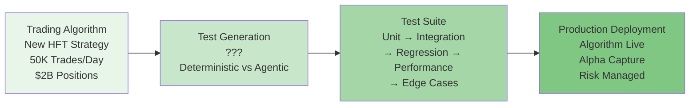
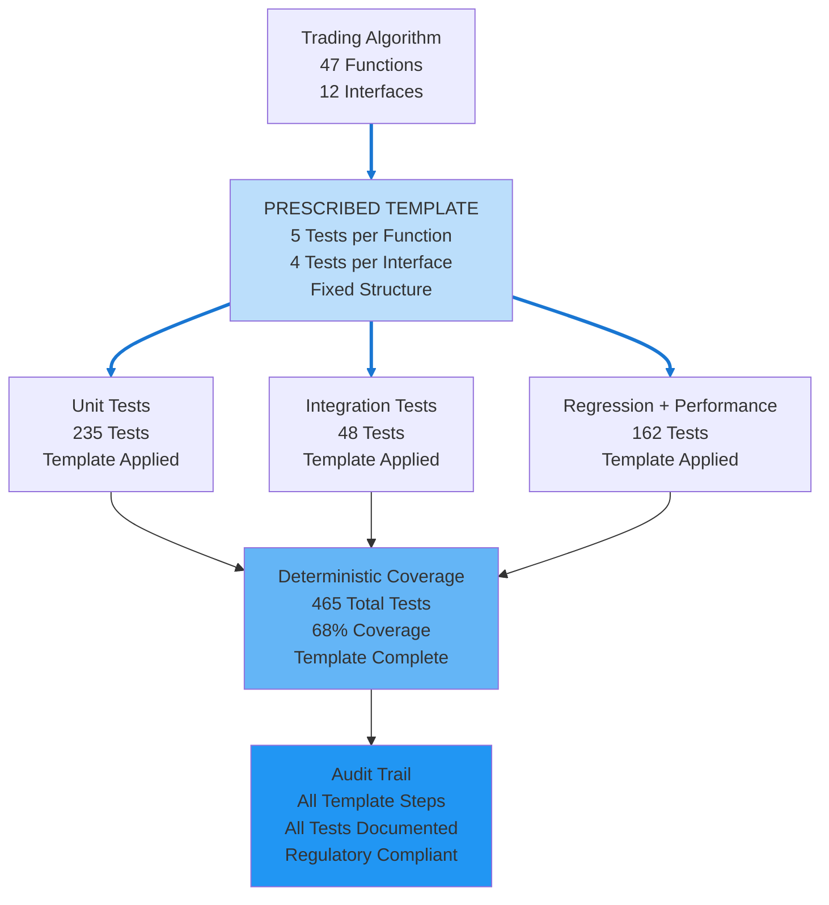
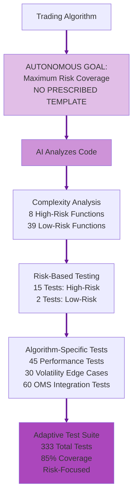
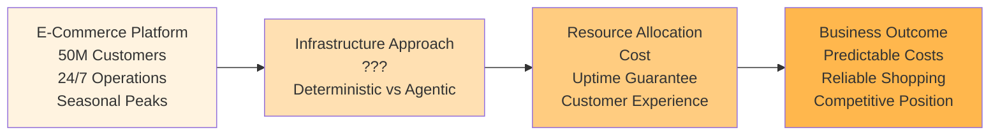
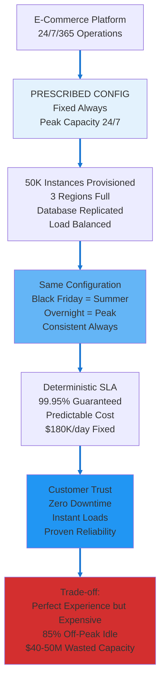
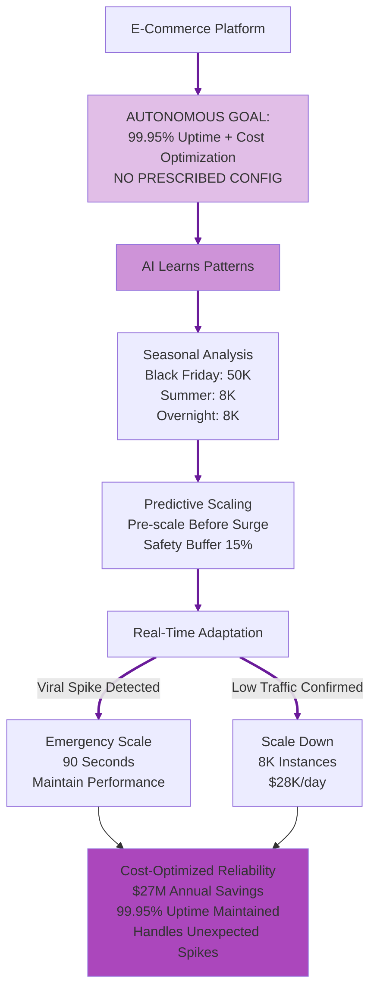

# Debate Slide Preparation: Agentic vs Deterministic AI
## Alternative Use Case Set 02

**Purpose:** Alternative use cases for Topics 4 & 6  
**Format:** 4 slides per topic (A: Introduction, B: Deterministic AI Approach, C: Agentic AI Approach, D: Strong Arguments Comparison)  
**Date:** February 20, 2026

---

# TOPIC 4: AGENTS ON DIFFERENT SDLC WORKFLOWS  
## Use Case: Trading Algorithm Test Suite Generation

---

## TOPIC 4 - SLIDE A: Introduction & Use Case

### Narrative

An investment bank's quantitative trading team develops a new high-frequency trading algorithm for equity markets. The algorithm executes 50,000+ trades daily, managing $2B in positions. Before production deployment, the algorithm requires comprehensive test coverage:
- Unit Tests: Individual function validation (pricing calculations, order routing logic)
- Integration Tests: System interaction validation (market data feeds, order management systems)
- Regression Tests: Ensure new changes don't break existing functionality
- Performance Tests: Latency requirements (<5ms order execution)
- Edge Case Tests: Market volatility scenarios, circuit breakers, flash crashes

Current approach: Senior developers manually write test cases following a 47-page test template. Process takes 3-4 weeks. Test coverage averages 65-70% because developers focus on obvious scenarios, miss edge cases.

The challenge: Regulatory requirements (MiFID II, SEC) demand comprehensive testing with audit trails. But competitive pressure rewards speed—faster deployment means earlier alpha capture. Manual test writing is slow and incomplete.

**The Question:** Should test generation follow prescribed templates (deterministic) or allow AI to autonomously determine test coverage (agentic)?

### Diagram

---

## TOPIC 4 - SLIDE B: Deterministic AI Approach

### Narrative

A Deterministic AI approach gives the AI **goal + prescribed test template**. The bank specifies: "Generate test suite following this exact template: (1) Unit Tests per this structure (test each function, 5 test cases minimum per function), (2) Integration Tests per this checklist (test each system interface, happy path + 3 error scenarios), (3) Regression Tests (re-run all historical test cases), (4) Performance Tests (latency benchmarks per specification), (5) Edge Cases (test 20 predefined market scenarios). Follow template exactly."

The system:

1. **AI executes prescribed test template** - AI analyzes algorithm code → AI identifies 47 functions → AI generates 5 unit tests per function (235 unit tests total) following prescribed template. AI identifies 12 system interfaces → AI generates 4 integration tests per interface (48 integration tests). AI follows template rigidly.
2. **AI applies deterministic test criteria** - AI gives each function identical test structure: (1) valid input test, (2) null input test, (3) boundary value test, (4) invalid input test, (5) exception handling test. AI applies same 5-test pattern for all 47 functions per prescribed rules.
3. **AI creates verifiable test coverage** - AI generates template-prescribed tests: 235 unit tests + 48 integration tests + 150 regression tests + 12 performance tests + 20 edge case tests = 465 total tests. Coverage: 68% (template-defined). Audit trail shows: "AI satisfied all template requirements."
4. **AI ensures consistent test quality** - AI running twice on same algorithm produces identical test suites. Prescribed template eliminates AI's subjective judgment about which tests matter.

**Key advantage:** Regulatory compliance straightforward. Auditors verify: "AI followed approved template, all 465 tests documented, coverage meets 65% minimum requirement." AI-powered but repeatable, auditable process.

**Risk:** Template-driven AI misses algorithm-specific risks. High-frequency trading algorithm has unique latency risks, market microstructure edge cases. AI constrained by template covers generic scenarios, misses critical algorithm-specific failure modes.

### Diagram

---

## TOPIC 4 - SLIDE C: Agentic AI Approach

### Narrative

An Agentic AI approach gives the AI only **goal, no prescribed template**. The bank specifies: "Generate comprehensive test suite for this trading algorithm. Achieve maximum risk coverage. Determine your own testing strategy."

The system:

1. **Autonomously determines test strategy** - Analyzes algorithm code complexity: identifies 8 high-complexity functions (nested conditionals, market data dependencies) and 39 low-complexity functions (simple calculations). Generates 15 tests for high-complexity functions, 2 tests for low-complexity functions. Total: 198 tests (vs template's 235).
2. **Discovers algorithm-specific risks** - Identifies that algorithm has latency-sensitive order routing logic. Generates 45 performance tests focused on order execution timing under various market conditions. Template only specified 12 generic performance tests.
3. **Adaptive edge case generation** - Analyzes historical market data: discovers algorithm vulnerable to specific volatility patterns (rapid price reversals in illiquid stocks). Generates 30 edge case tests targeting this vulnerability. Template's 20 edge cases were generic scenarios.
4. **Contextual test prioritization** - Realizes integration with Order Management System is critical path. Generates 60 integration tests for OMS interface (vs template's 4). Reduces tests for low-risk data warehouse interface to 2 (vs template's 4).

**Key advantage:** 85% code coverage (vs template's 68%) with fewer total tests (333 vs 465). Tests focus on actual algorithm risks, not generic template scenarios. Discovers vulnerabilities template would miss.

**Risk:** Test suite structure varies by algorithm. Two developers testing similar algorithms produce different test suites. Harder to audit—regulators ask: "Why did algorithm A get 333 tests but algorithm B got 287 tests?"

### Diagram

---

## TOPIC 4 - SLIDE D: Strong Arguments Comparison

### Deterministic AI Arguments (LEFT) | Agentic AI Arguments (RIGHT)

| **DETERMINISTIC AI** | **AGENTIC AI** |
|---|---|
| **Regulatory Defensibility** | **Context-Aware Testing** |
| AI follows prescribed test template uniformly. Regulators ask: "How do you ensure comprehensive testing?" Deterministic answer: "All algorithms tested via approved 47-page template. Template guarantees 465 tests minimum, 65% coverage minimum. Process identical for all algorithms." MiFID II compliance satisfied through uniform prescribed template. **In use case:** Regulatory audit verifies trading algorithm followed approved test template, all 465 tests documented, coverage meets requirements—compliance proven through prescribed methodology. | Different algorithms have different risk profiles. High-frequency algorithm with 50K trades/day requires different test depth than low-frequency algorithm with 100 trades/day. Agentic system evaluates algorithm complexity and generates proportional test coverage. **In use case:** HFT algorithm gets 333 tests focused on latency and market microstructure risks (85% coverage). Low-frequency algorithm gets 120 tests focused on calculation accuracy (78% coverage). Testing effort matches actual risk. |
| **Clear Accountability** | **Superior Risk Detection** |
| AI executes prescribed template rigidly. When algorithm fails in production, accountability clear: either template was skipped, or template inadequate. QA team tested algorithm identically to all others using documented template. If template inadequate, process surfaces it uniformly. **In use case:** If algorithm causes trading loss, audit trail shows: "QA completed all 465 template tests at timestamp X. Failure indicates template gap, not process deviation." Clear accountability from rigid prescribed template. | Template generates 465 tests, 68% coverage, misses critical volatility edge case. Algorithm loses $3M in flash crash. Agentic system analyzing algorithm code discovers latency-sensitive order routing logic, generates 45 performance tests targeting this risk, catches vulnerability before production. **In use case:** Agentic testing identifies algorithm fails when market volatility exceeds 3 standard deviations—scenario not in template's 20 generic edge cases. Prevents production failure. |
| **Consistent Stakeholder Trust** | **Development Velocity** |
| AI follows identical prescribed template for every algorithm. Developers know: all algorithms require 465 tests, 3-4 week timeline, 65% coverage minimum. Timeline predictable. Project planning certain. Stakeholders trust consistent process. **In use case:** Project manager tells business: "Algorithm testing takes exactly 3 weeks, every time. Plan production deployment accordingly." Predictability creates trust even if timeline longer than competitors. | Deterministic template: 465 tests, 3-4 weeks, 68% coverage. Agentic approach: 333 tests, 1.5 weeks, 85% coverage. Development velocity 2x faster with better risk detection. **In use case:** Bank deploys trading algorithm 2 weeks earlier than competitors, captures alpha during market opportunity window. Agentic testing focuses effort on actual risks, eliminates template overhead for low-risk code paths. |

---

---

# TOPIC 6: OPERATIONAL RELIABILITY AND COST
## Use Case: E-Commerce Cloud Infrastructure Scaling

---

## TOPIC 6 - SLIDE A: Introduction & Use Case

### Narrative

A major e-commerce retailer operates cloud infrastructure serving 50 million customers. Infrastructure cost: $180K/day ($65.7M/year). This supports website, mobile apps, payment processing, inventory management, and order fulfillment systems.

Load patterns are highly seasonal and cyclical:
- **Holiday Season (Nov-Dec):** Peak load (90-100% capacity) - Black Friday hits 120% with emergency scaling
- **Back-to-School (Aug-Sep):** High load (70-80% capacity)
- **Regular Season (Jan-Jul):** Medium load (40-50% capacity)
- **Overnight Hours (2am-6am):** Low load (15-20% capacity)

Current approach: Provision for peak holiday load 24/7/365, maintaining full redundancy everywhere, guaranteeing 99.95% uptime even during lowest-usage periods.

Cost inefficiency: During regular season overnight hours, 85% of infrastructure sits idle. But customer expectations (instant page loads, zero downtime) and competitive pressure (Amazon never goes down) make cost optimization risky.

**The Question:** Should infrastructure be provisioned deterministically (peak capacity 24/7 with uptime guarantees) or optimized agentically (scale based on predicted demand with cost savings)?

### Diagram

---

## TOPIC 6 - SLIDE B: Deterministic AI Approach

### Narrative

A Deterministic AI approach gives the AI **goal + prescribed infrastructure configuration**. The retailer specifies: "Maintain cloud infrastructure configured as follows: (1) Provision for Black Friday peak load 24/7/365, (2) Maintain full database replication across 3 regions, (3) Deploy identical load balancers and auto-scaling groups, (4) Redundancy: if 1 region fails, 2 remain. Keep this exact configuration permanently."

The system:

1. **AI executes prescribed infrastructure configuration** - AI maintains 50,000 compute instances provisioned globally 24/7 (Black Friday peak: 45,000 + 10% headroom) per prescribed rules. AI applies same configuration every hour, every day. Holiday peak = summer overnight = identical AI-managed capacity.
2. **AI applies deterministic SLA commitment** - AI keeps infrastructure constant → uptime guaranteed at 99.95%. Can contractually commit to customers: "AI ensures website available 24/7, instant page loads guaranteed." Commitment backed by AI following fixed prescribed configuration.
3. **AI provides verifiable architecture** - "Our AI-managed infrastructure: 3 regions, full replication, auto-scaling configured but AI never triggers it (always at max per prescribed rules). This AI-executed config has proven 99.95% uptime for 8 years." AI operations auditable and battle-tested.
4. **AI eliminates dynamic complexity** - AI applies same prescribed infrastructure rules for Black Friday (efficient) and summer overnight (massively over-provisioned but predictable). AI has no scaling autonomy, no dynamic decision risk. AI-executed configuration stable and proven.

**Key advantage:** Customer experience perfect—zero slowdowns, zero outages. Competitive positioning strong—"We never go down." Brand reputation protected.

**Risk:** Infrastructure massively underutilized 10 months/year. Summer overnight (85% idle) costs same $180K/day as Black Friday peak. $40-50M/year in wasted capacity—competitive disadvantage vs cost-optimized competitors who invest savings in lower prices.

### Diagram

---

## TOPIC 6 - SLIDE C: Agentic AI Approach

### Narrative

An Agentic AI approach gives the AI only **goal, no prescribed configuration**. The retailer specifies: "Maintain 99.95% uptime while optimizing infrastructure costs. Use all available data—determine your own scaling strategy."

The system:

1. **Autonomously determines optimal scaling** - Learns seasonal patterns: Black Friday needs 50K instances, summer overnight needs 8K instances. Scales dynamically based on predicted load + 15% safety buffer.
2. **Predictive capacity planning** - Analyzes historical data: "Last 3 years, Black Friday traffic spiked 2 hours earlier than expected." Pre-scales infrastructure 3 hours before predicted surge, avoiding emergency scaling.
3. **Real-time adaptive scaling** - Unexpected viral product (TikTok trend drives 300% traffic spike): agentic system detects anomaly, scales infrastructure in 90 seconds, maintains performance. Deterministic system would crash (not provisioned for 300% spike).
4. **Cost-performance optimization** - Summer overnight: scales down to 8K instances ($28K/day instead of $180K). Saves $152K/day × 180 days = $27M/year. Reinvests savings in lower prices, winning market share.

**Key advantage:** $27M annual savings while maintaining 99.95% uptime. Handles unexpected spikes better than fixed capacity. Competitive pricing advantage.

**Risk:** Scaling predictions could be wrong. If Black Friday traffic spikes 4 hours early (not 2), system might scale too late, causing slowdowns. Customer experience depends on AI prediction accuracy.

### Diagram

---

## TOPIC 6 - SLIDE D: Strong Arguments Comparison

### Deterministic AI Arguments (LEFT) | Agentic AI Arguments (RIGHT)

| **DETERMINISTIC AI** | **AGENTIC AI** |
|---|---|
| **Guaranteed Customer Experience** | **Cost Efficiency at Scale** |
| Infrastructure provisioned for worst-case scenario 24/7. Black Friday peak capacity maintained year-round. Customer experience perfect: zero slowdowns, instant page loads, zero outages. Brand reputation protected—"We never go down" is competitive differentiator. **In use case:** Customer shopping at 3am in July gets same instant performance as Black Friday shopper. 99.95% uptime guaranteed through massive over-provisioning. Customer trust absolute because infrastructure never varies. | Deterministic approach: $180K/day × 365 = $65.7M/year. Agentic approach: $180K/day × 60 days (peak) + $28K/day × 305 days (off-peak) = $19.3M/year. Savings: $46.4M annually while maintaining 99.95% uptime. **In use case:** Reinvest $46M savings into lower prices (5% price reduction), winning 8% market share from competitors. Or invest in better product features, faster shipping, improved customer service. |
| **Operational Simplicity** | **Adaptive Resilience** |
| Fixed infrastructure means zero scaling complexity. No algorithms predicting load. No auto-scaling logic to debug. No risk of scaling failures. Operations team manages static configuration—simple, proven, reliable. **In use case:** When Black Friday arrives, zero operational stress. Infrastructure already provisioned. No emergency scaling, no prediction algorithms, no dynamic decisions. Operations team sleeps well because configuration never changes. | Unexpected events: TikTok influencer mentions product, traffic spikes 300% in 10 minutes. Deterministic infrastructure: provisioned for 120% peak (Black Friday), crashes at 300% spike. Agentic infrastructure: detects anomaly, scales to 300% in 90 seconds, maintains performance. **In use case:** Viral product moment becomes revenue opportunity (not outage disaster). Agentic system handles unknowns better than fixed capacity handles unexpected spikes. |
| **Predictable Financial Planning** | **Competitive Cost Structure** |
| CFO knows exact infrastructure cost: $65.7M/year, every year. No variance, no surprises. Budget planning simple. Investors see predictable cost structure. Financial forecasting accurate. **In use case:** Annual budget: $65.7M infrastructure cost, locked in. No quarterly variance. Board presentation simple: "Infrastructure costs stable and predictable year-over-year." Financial certainty valued by investors and executives. | Competitors using agentic scaling: $19M infrastructure cost. This retailer using deterministic: $66M infrastructure cost. Competitor has $47M cost advantage to invest in lower prices, better marketing, faster shipping. **In use case:** Competitor offers 5% lower prices (funded by infrastructure savings), wins market share. Deterministic retailer loses customers despite perfect uptime because price-sensitive shoppers choose cheaper competitor. |

---
