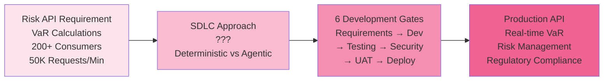
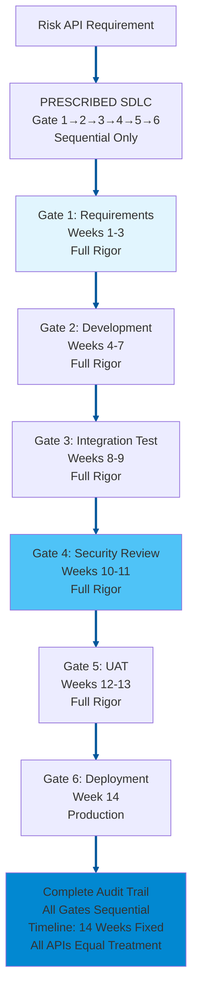
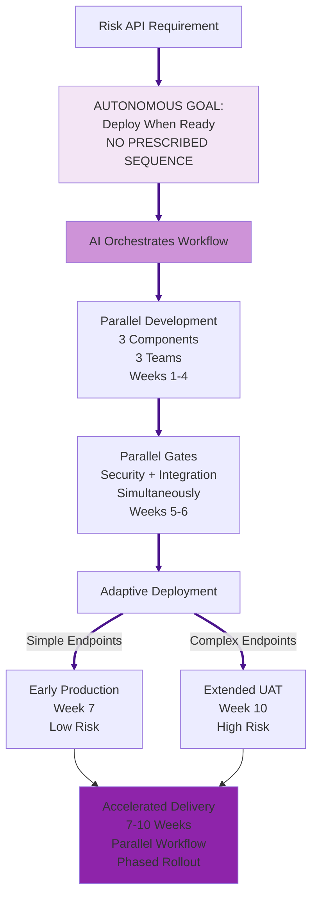
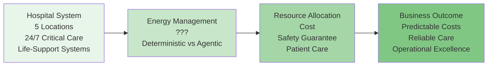
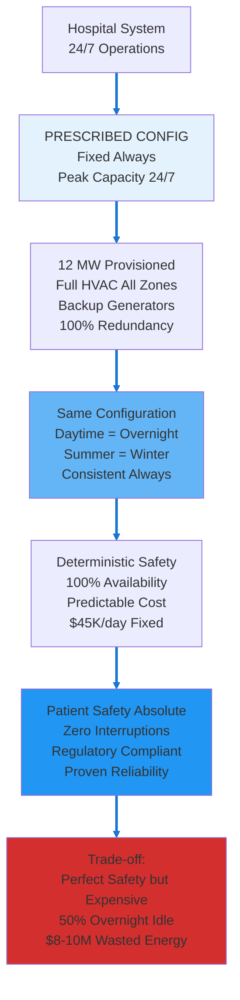
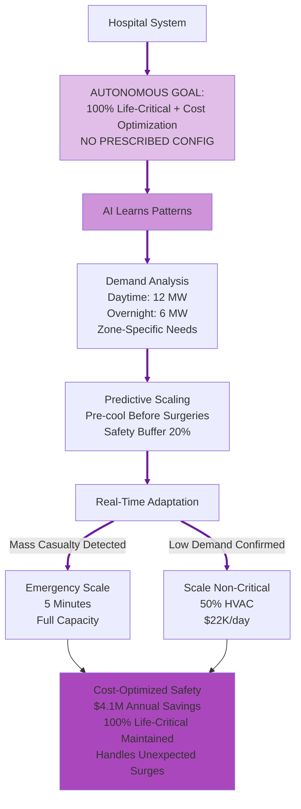

# Debate Slide Preparation: Agentic vs Deterministic AI
## Alternative Use Case Set 03

**Purpose:** Alternative use cases for Topics 4 & 6  
**Format:** 4 slides per topic (A: Introduction, B: Deterministic AI Approach, C: Agentic AI Approach, D: Strong Arguments Comparison)  
**Date:** February 20, 2026

---

# TOPIC 4: AGENTS ON DIFFERENT SDLC WORKFLOWS  
## Use Case: Risk Calculation API Development and Deployment

---

## TOPIC 4 - SLIDE A: Introduction & Use Case

### Narrative

An investment bank's risk management team needs a new API for real-time Value-at-Risk (VaR) calculations. The API will serve 200+ internal applications: trading platforms, portfolio management systems, regulatory reporting tools. Requirements: calculate VaR for any portfolio in <100ms, support 15 asset classes, handle 50,000 requests/minute during market hours.

The API must traverse the bank's SDLC gates before production:
- Requirements & Design: Stakeholder interviews, API specification, architecture review
- Development: Code implementation, unit testing, code review
- Integration Testing: Test with downstream systems, performance validation
- Security Review: Penetration testing, vulnerability scanning, compliance check
- UAT: Business users validate calculations match expectations
- Production Deployment: Gradual rollout, monitoring, rollback readiness

Current approach: 12-16 weeks sequential process. Each gate must complete fully before next begins. Risk team frustrated—market conditions change during development, requirements become outdated.

**The Question:** Should API development follow strict sequential SDLC gates (deterministic) or allow parallel development with intelligent integration (agentic)?

### Diagram

---

## TOPIC 4 - SLIDE B: Deterministic AI Approach

### Narrative

A Deterministic AI approach gives the AI **goal + prescribed SDLC sequence**. The bank specifies: "Develop Risk API following this exact sequence: (1) Requirements & Design (complete fully, 3 weeks), (2) Development (complete fully, 4 weeks), (3) Integration Testing (complete fully, 2 weeks), (4) Security Review (complete fully, 2 weeks), (5) UAT (complete fully, 2 weeks), (6) Production Deployment (1 week). Each gate must pass before next begins. No paralleling, no shortcuts."

The system:

1. **AI executes prescribed sequential gates** - AI manages requirements weeks 1-3 → AI coordinates development weeks 4-7 → AI orchestrates integration testing weeks 8-9 → AI facilitates security review weeks 10-11 → AI runs UAT weeks 12-13 → AI executes deployment week 14. AI ensures each gate completes fully before triggering next gate per prescribed sequence.
2. **AI applies deterministic gate criteria** - AI checks each gate's explicit exit criteria: Requirements (API spec signed by 5 stakeholders? ✓, architecture approved? ✓). Development (code review passed? ✓, unit tests 80% coverage? ✓). AI verifies all criteria met before advancing to next gate.
3. **AI creates verifiable audit trail** - AI logs every gate: timestamp, approver signatures, criteria verified, artifacts produced. Regulators can audit: "AI ensured this API followed exact 6-gate sequence, all criteria met, all approvals documented."
4. **AI ensures no abbreviated rigor** - AI applies same full 14-week review to simple API endpoint (single asset class) and complex endpoint (15 asset classes, exotic derivatives) per prescribed rules. AI provides equal treatment, zero shortcuts.

**Key advantage:** Regulatory compliance straightforward. Auditors verify: "API followed approved SDLC, all gates documented, security review complete." Predictable timeline enables project planning.

**Risk:** 14-week timeline fixed regardless of API complexity. Market conditions change during development—requirements from week 1 outdated by week 14. Competitors deploy faster.

### Diagram

---

## TOPIC 4 - SLIDE C: Agentic AI Approach

### Narrative

An Agentic AI approach gives the AI only **goal, no prescribed sequence**. The bank specifies: "Develop Risk API meeting performance and security requirements. Deploy when ready. Determine your own development path."

The system:

1. **Autonomously determines optimal workflow** - Identifies that API has 3 independent components: (1) VaR calculation engine, (2) portfolio data adapter, (3) API gateway layer. Develops all 3 in parallel with 3 separate teams. Timeline: 4 weeks instead of 7 sequential weeks.
2. **Intelligent gate orchestration** - Security review and integration testing run in parallel (not sequential). Security team reviews code while integration team tests system interactions. Both complete week 6. Deterministic approach: security waits for integration (week 11).
3. **Adaptive requirement refinement** - Week 3: Risk team realizes market volatility calculation needs adjustment. Agentic system: updates calculation engine component, re-runs affected tests, continues development. Deterministic approach: restart requirements gate, 14-week timeline becomes 18 weeks.
4. **Context-aware deployment** - Simple API endpoints (single asset class, proven calculations): deploy to production week 7. Complex endpoints (exotic derivatives, new calculations): extended UAT through week 10. Phased rollout based on risk.

**Key advantage:** API in production 7-10 weeks (vs 14 weeks). Parallel development accelerates delivery. Adaptive to changing requirements. Phased rollout reduces risk.

**Risk:** Parallel gates create coordination complexity. If security review and integration testing find conflicting issues, resolution unclear. Audit trail less linear—harder to verify all gates properly completed.

### Diagram

---

## TOPIC 4 - SLIDE D: Strong Arguments Comparison

### Deterministic AI Arguments (LEFT) | Agentic AI Arguments (RIGHT)

| **DETERMINISTIC AI** | **AGENTIC AI** |
|---|---|
| **Regulatory Defensibility** | **Context-Aware Development** |
| AI follows prescribed SDLC gates uniformly. Regulators ask: "How do you ensure API security and reliability?" Deterministic answer: "All APIs follow approved 6-gate SDLC. Gate 4 guarantees security review completion. Gate 5 guarantees UAT completion. Process identical for all APIs." Regulatory compliance satisfied through uniform prescribed gates. **In use case:** Compliance audit verifies Risk API followed approved SDLC, all 6 gates documented, security review complete—compliance proven through prescribed methodology. | Different API endpoints have different risk profiles. Simple VaR calculation for equities (proven math, single asset class) requires different rigor than exotic derivative VaR (complex math, multiple asset classes, model risk). Agentic system evaluates complexity and applies proportional gates. **In use case:** Simple endpoints deploy week 7 (accelerated gates), complex endpoints deploy week 10 (extended validation). Development effort matches actual risk. |
| **Clear Accountability** | **Competitive Time-to-Market** |
| AI executes 6 prescribed gates rigidly. When API fails in production, accountability clear: either gate was skipped, or gate criteria inadequate. Development team followed documented sequence identically to all other APIs. If criteria inadequate, process surfaces it uniformly. **In use case:** If API causes trading loss, audit trail shows: "Security team completed Gate 4 per prescribed criteria at timestamp X. Failure indicates gate criteria gap, not process deviation." Clear accountability from rigid prescribed gates. | Deterministic SDLC: 14 weeks sequential. Agentic approach: 7-10 weeks parallel workflow. Competitor deploys similar API in 8 weeks, captures market share. **In use case:** Bank deploys Risk API 6 weeks faster than deterministic approach, enables new trading strategies earlier, captures alpha during market opportunity. Parallel development eliminates sequential wait time while maintaining security and quality gates. |
| **Consistent Stakeholder Trust** | **Adaptive to Change** |
| AI follows identical prescribed SDLC for every API. Stakeholders know: all APIs require 14 weeks, all follow 6-gate sequence. Timeline predictable. Project planning certain. Business units trust consistent process. **In use case:** Risk team tells traders: "API development takes exactly 14 weeks, every time. Plan trading strategy launch accordingly." Predictability creates trust even if timeline longer than competitors. | Week 3: Market volatility calculation methodology changes (regulatory update). Deterministic SDLC: restart requirements gate, 14 weeks becomes 18 weeks. Agentic approach: updates calculation component, re-runs affected tests, continues development. Timeline: 8 weeks (1-week delay, not 4-week restart). **In use case:** Regulatory change mid-development. Agentic system adapts requirements in-flight, maintains delivery timeline. Deterministic system restarts entire SDLC, misses market window. |

---

---

# TOPIC 6: OPERATIONAL RELIABILITY AND COST
## Use Case: Hospital Energy Management System

---

## TOPIC 6 - SLIDE A: Introduction & Use Case

### Narrative

A large hospital system operates 24/7 critical care facilities across 5 locations. Total energy cost: $45K/day ($16.4M/year). Energy powers life-support systems, operating rooms, HVAC, medical equipment, data centers, and patient care facilities.

Energy demand patterns are highly variable:
- **Daytime (7am-7pm):** Peak demand (85-95% capacity) - surgeries, diagnostics, full staffing
- **Evening (7pm-11pm):** Medium demand (60-70% capacity) - reduced procedures, visitor hours
- **Overnight (11pm-7am):** Low demand (40-50% capacity) - emergency care only, minimal procedures
- **Seasonal:** Summer cooling peaks, winter heating peaks

Current approach: Provision for peak demand 24/7/365, maintaining full HVAC capacity everywhere, guaranteeing 100% power availability for life-critical systems.

Cost inefficiency: During overnight hours, 50% of HVAC capacity sits idle. But patient safety requirements (operating room readiness, life-support reliability) and regulatory standards (Joint Commission) make energy optimization risky.

**The Question:** Should hospital energy be provisioned deterministically (peak capacity 24/7 with safety guarantees) or optimized agentically (scale based on predicted demand with cost savings)?

### Diagram

---

## TOPIC 6 - SLIDE B: Deterministic AI Approach

### Narrative

A Deterministic AI approach gives the AI **goal + prescribed energy configuration**. The hospital specifies: "Maintain energy systems configured as follows: (1) Provision for peak daytime demand 24/7, (2) Maintain full HVAC capacity in all zones, (3) 100% backup generator capacity, (4) Redundancy: if 1 system fails, backup activates instantly. Keep this exact configuration permanently."

The system:

1. **AI executes prescribed energy configuration** - AI maintains full HVAC capacity 24/7 (peak daytime: 12 MW + 15% safety margin) per prescribed rules. AI applies same configuration every hour, every day. Daytime peak = overnight low = identical AI-managed capacity.
2. **AI applies deterministic safety commitment** - AI keeps energy constant → 100% availability guaranteed for life-critical systems. Can contractually commit to regulators: "AI ensures operating rooms ready 24/7, life-support never interrupted." Commitment backed by AI following fixed prescribed configuration.
3. **AI provides verifiable infrastructure** - "Our AI-managed energy systems: full redundancy, backup generators, 100% capacity maintained per prescribed rules. This AI-executed config has proven 99.999% uptime for 15 years." AI operations auditable and battle-tested.
4. **AI eliminates dynamic complexity** - AI applies same prescribed energy rules for daytime surgeries (efficient) and overnight low-demand (over-provisioned but predictable). AI has no optimization autonomy, no dynamic decision risk. AI-executed configuration stable and proven.

**Key advantage:** Patient safety absolute—zero power interruptions, zero HVAC failures. Regulatory compliance straightforward—Joint Commission verifies constant readiness. Liability risk minimized.

**Risk:** Energy massively underutilized overnight. Overnight (50% idle capacity) costs same $45K/day as daytime peak. $8-10M/year in wasted energy—budget pressure from hospital administration.

### Diagram

---

## TOPIC 6 - SLIDE C: Agentic AI Approach

### Narrative

An Agentic AI approach gives the AI only **goal, no prescribed configuration**. The hospital specifies: "Maintain 100% availability for life-critical systems while optimizing energy costs. Use all available data—determine your own energy strategy."

The system:

1. **Autonomously determines optimal energy allocation** - Learns demand patterns: daytime surgeries need 12 MW, overnight emergency care needs 6 MW. Scales HVAC dynamically: full capacity in active zones (operating rooms, ICU), reduced capacity in low-use zones (administrative offices, empty patient wings).
2. **Predictive capacity planning** - Analyzes surgical schedules: "Tomorrow: 8 surgeries scheduled, 3 operating rooms active. Pre-cool rooms 2 hours before procedures." Optimizes energy timing, avoids emergency HVAC ramp-up.
3. **Real-time adaptive scaling** - Unexpected mass casualty event (accident, natural disaster): agentic system detects surge, scales energy to full capacity in 5 minutes, activates backup systems, maintains life-critical operations. Deterministic system already at full capacity (no additional headroom).
4. **Cost-safety optimization** - Overnight: scales non-critical HVAC to 50% ($22K/day instead of $45K). Maintains 100% capacity for ICU, emergency department, life-support systems. Saves $23K/day × 180 overnight hours/month = $4.1M/year.

**Key advantage:** $4.1M annual savings while maintaining 100% life-critical availability. Handles unexpected surges better than fixed capacity. Reinvests savings in patient care equipment.

**Risk:** Energy predictions could be wrong. If overnight emergency surge exceeds prediction, system might scale too slowly, delaying operating room readiness. Patient safety depends on AI prediction accuracy.

### Diagram

---

## TOPIC 6 - SLIDE D: Strong Arguments Comparison

### Deterministic AI Arguments (LEFT) | Agentic AI Arguments (RIGHT)

| **DETERMINISTIC AI** | **AGENTIC AI** |
|---|---|
| **Guaranteed Patient Safety** | **Cost Efficiency Without Compromise** |
| Energy provisioned for worst-case scenario 24/7. Peak daytime capacity maintained overnight. Patient safety absolute: zero power interruptions, instant operating room readiness, 100% life-support reliability. Regulatory compliance straightforward—Joint Commission verifies constant readiness. **In use case:** Patient needs emergency surgery at 3am. Operating room instantly ready (HVAC pre-cooled, full power available). 100% availability guaranteed through massive over-provisioning. Patient safety never compromised. | Deterministic approach: $45K/day × 365 = $16.4M/year. Agentic approach: $45K/day × 12 hours (peak) + $22K/day × 12 hours (off-peak) = $12.3M/year. Savings: $4.1M annually while maintaining 100% life-critical availability. **In use case:** Reinvest $4.1M savings into new MRI machine, patient care equipment, nurse staffing. Cost optimization funds better patient care without compromising safety. |
| **Operational Simplicity** | **Adaptive Resilience** |
| Fixed energy means zero optimization complexity. No algorithms predicting demand. No dynamic scaling logic to debug. No risk of scaling failures. Facilities team manages static configuration—simple, proven, reliable. **In use case:** When mass casualty arrives, zero operational stress. Energy already provisioned at maximum. No emergency scaling, no prediction algorithms, no dynamic decisions. Facilities team confident because configuration never changes. | Unexpected events: Mass casualty event, 15 patients arrive simultaneously, all operating rooms needed. Deterministic infrastructure: already at peak capacity, no additional headroom. Agentic infrastructure: detects surge, scales energy to 120% capacity (activates reserve systems), maintains all operating rooms. **In use case:** Mass casualty becomes life-saving opportunity (not capacity crisis). Agentic system handles unknowns better than fixed capacity handles unexpected surges beyond normal peak. |
| **Predictable Financial Planning** | **Environmental Responsibility** |
| CFO knows exact energy cost: $16.4M/year, every year. No variance, no surprises. Budget planning simple. Board sees predictable cost structure. Financial forecasting accurate. **In use case:** Annual budget: $16.4M energy cost, locked in. No quarterly variance. Board presentation simple: "Energy costs stable and predictable year-over-year." Financial certainty valued by hospital administration and investors. | Deterministic approach: 50% overnight energy waste = 4,380 MWh/year wasted. Agentic approach: optimizes overnight energy, reduces waste by 45% = 1,971 MWh saved. Carbon footprint reduced by 1,200 tons CO2/year. **In use case:** Hospital achieves sustainability goals, earns LEED certification, improves community reputation. Energy optimization aligns with environmental responsibility without compromising patient safety. |

---
