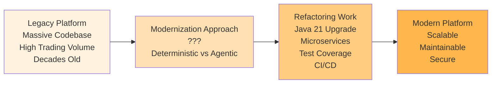
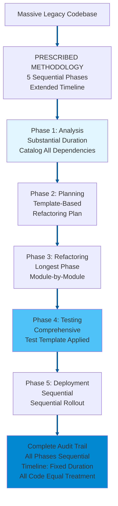
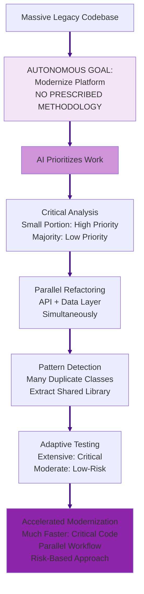
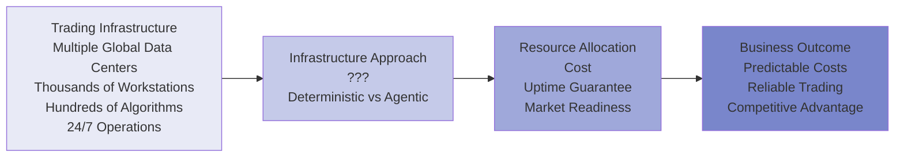
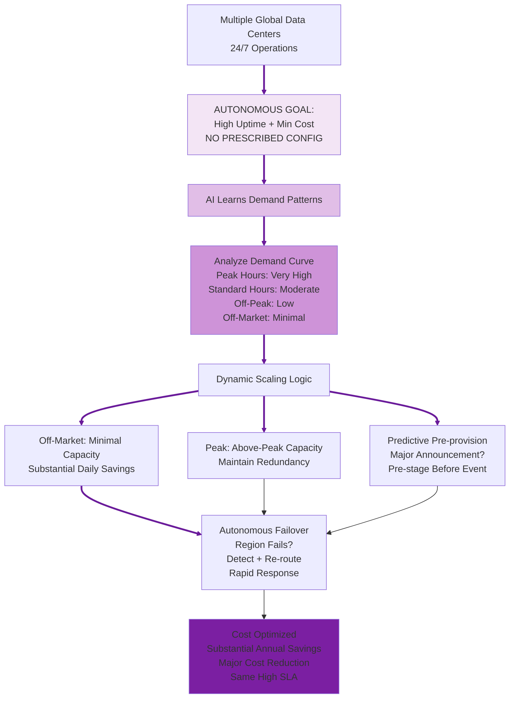

# Debate Slide Preparation: Agentic vs Deterministic AI
## Alternative Use Case Set 04

**Purpose:** Alternative use cases for Topics 4 & 6  
**Format:** 4 slides per topic (A: Introduction, B: Deterministic AI Approach, C: Agentic AI Approach, D: Strong Arguments Comparison)  
**Date:** February 20, 2026

---

# TOPIC 4: AGENTS ON DIFFERENT SDLC WORKFLOWS  
## Use Case: Legacy Trading Platform Code Modernization

---

## TOPIC 4 - SLIDE A: Introduction & Use Case

### Narrative

An investment bank operates a legacy equity trading platform built on an older Java version with a massive codebase. The platform processes substantial daily trading volume but has accumulated significant technical debt: deprecated libraries, monolithic architecture, inadequate test coverage, manual deployment processes.

The bank needs to modernize the platform while maintaining 24/7 trading operations:
- Upgrade to Java 21 (security patches, performance improvements)
- Refactor monolith into microservices (scalability, resilience)
- Increase test coverage substantially (regulatory requirement)
- Implement CI/CD pipeline (reduce deployment risk)
- Maintain backward compatibility (hundreds of downstream systems depend on APIs)

Current approach: Manual code analysis, spreadsheet tracking, sequential refactoring (analyze → plan → refactor → test → deploy). Estimated timeline: extended multi-year effort. Trading desk frustrated—new features blocked by modernization work.

**The Question:** Should code modernization follow prescribed refactoring steps (deterministic) or allow AI to autonomously identify and sequence refactoring work (agentic)?

### Diagram

---

## TOPIC 4 - SLIDE B: Deterministic AI Approach

### Narrative

A Deterministic AI approach gives the AI **goal + prescribed refactoring methodology**. The bank specifies: "Modernize trading platform following this exact sequence: (1) Analyze entire codebase, catalog all dependencies, (2) Create comprehensive refactoring plan per template, (3) Refactor code module-by-module in prescribed order, (4) Test each module per test template, (5) Deploy sequentially. Follow methodology exactly."

The system:

1. **AI executes prescribed analysis phase** - AI scans entire codebase → AI catalogs all classes, methods, and dependencies → AI produces comprehensive dependency matrix per prescribed template. Analysis phase takes substantial time, AI analyzes all code identically.
2. **AI applies deterministic refactoring sequence** - AI follows refactoring plan's prescribed module order: (1) Data access layer, (2) Business logic layer, (3) API layer, (4) UI layer. AI refactors each module completely before beginning next. No parallel work, no reordering per prescribed rules.
3. **AI creates verifiable refactoring trail** - AI logs every code change: timestamp, developer, refactoring pattern applied (per prescribed catalog), test results. Auditors can verify: "AI ensured Module A refactored using prescribed pattern, tests passed, deployed per sequence."
4. **AI ensures consistent refactoring quality** - AI refactors all classes using same prescribed patterns. AI applies deterministic rules: "If class exceeds size threshold, split per template. If method too large, extract per template." AI provides uniform application across all code.

**Key advantage:** Regulatory compliance straightforward. Auditors verify: "Modernization followed approved methodology, all refactoring documented, test coverage achieved." Predictable timeline enables business planning.

**Risk:** Extended timeline fixed regardless of code complexity. Critical trading logic (small portion of codebase) receives same refactoring timeline as low-risk reporting code (majority of codebase). Opportunity cost: extended period of blocked feature development.

### Diagram

---

## TOPIC 4 - SLIDE C: Agentic AI Approach

### Narrative

An Agentic AI approach gives the AI only **goal, no prescribed methodology**. The bank specifies: "Modernize trading platform to latest Java version, microservices, substantially improved test coverage, CI/CD. Maintain 24/7 operations. Determine your own refactoring path."

The system:

1. **Autonomously prioritizes refactoring work** - Analyzes entire codebase → identifies small portion as critical trading logic with high change frequency. Prioritizes these for immediate refactoring. Identifies majority as low-risk reporting/admin code. Defers refactoring or applies automated patterns.
2. **Discovers refactoring opportunities** - Identifies numerous classes with identical code patterns (copy-paste duplication). Deterministic approach: refactors each class individually (extended timeline). Agentic approach: extracts shared library, refactors all simultaneously (dramatically shorter timeline).
3. **Intelligent dependency management** - Realizes API layer and data access layer have minimal dependencies. Refactors both in parallel with separate teams. Deterministic approach: sequential (one layer, then next). Agentic approach: parallel (both complete simultaneously).
4. **Adaptive testing strategy** - Critical trading logic: generates extensive test cases per module (high risk). Low-risk reporting code: generates moderate test cases per module (lower risk). Test effort proportional to actual risk, not uniform template.

**Key advantage:** Critical trading logic modernized much faster. Parallel refactoring accelerates delivery. Feature development unblocked sooner. Low-risk code deferred or automated.

**Risk:** Variable refactoring approach creates consistency concerns. Auditors might question: "Why did module A get extensive tests but module B get moderate tests?" Harder to verify uniform quality standards applied.

### Diagram

---

## TOPIC 4 - SLIDE D: Strong Arguments Comparison

### Deterministic AI Arguments (LEFT) | Agentic AI Arguments (RIGHT)

| **DETERMINISTIC AI** | **AGENTIC AI** |
|---|---|
| **Regulatory Defensibility** | **Context-Aware Modernization** |
| AI follows prescribed refactoring methodology uniformly. Regulators ask: "How do you ensure code quality during modernization?" Deterministic answer: "Entire codebase refactored via approved methodology. All classes follow prescribed patterns. All modules tested per template." Regulatory compliance satisfied through uniform prescribed methodology. **In use case:** Compliance audit verifies trading platform followed approved refactoring methodology, all code changes documented, test coverage achieved—compliance proven through prescribed process. | Different code modules have different business criticality. Trading order execution logic (small portion, high business impact) requires different rigor than admin reporting code (large portion, minimal trading impact). Agentic system evaluates criticality and applies proportional refactoring effort. **In use case:** Critical trading logic modernized rapidly with extensive testing (high rigor). Low-risk code deferred or automated with moderate testing (appropriate rigor). Modernization effort matches actual business risk. |
| **Clear Accountability** | **Accelerated Business Value** |
| AI executes prescribed methodology rigidly. When refactored code fails in production, accountability clear: either methodology was skipped, or methodology inadequate. Development team followed documented sequence identically to all other modules. If methodology inadequate, process surfaces it uniformly. **In use case:** If refactored module causes trading outage, audit trail shows: "Module refactored using prescribed pattern per methodology at specific timestamp. Failure indicates methodology gap, not process deviation." Clear accountability from rigid prescribed methodology. | Deterministic methodology: extended timeline, all code treated equally. Agentic approach: much shorter timeline for critical code, feature development unblocked substantially earlier. **In use case:** Trading desk requests new algorithmic trading feature (requires modern microservices architecture). Deterministic: wait for full modernization completion. Agentic: critical trading logic modernized rapidly, new feature deployed soon after. Business value delivered much earlier, competitive advantage captured. |
| **Consistent Stakeholder Trust** | **Intelligent Debt Reduction** |
| AI follows identical prescribed methodology for all code. Developers know: entire codebase refactored using same patterns, same timeline, same rigor. Process predictable. Stakeholders trust consistent approach. **In use case:** CTO tells board: "Modernization takes fixed duration, every module treated equally. Plan feature roadmap accordingly." Predictability creates trust even if timeline longer than competitors. | Agentic system analyzing codebase discovers many classes with identical copy-paste code (technical debt hotspot). Deterministic approach: refactors each class individually per prescribed sequence (extended timeline). Agentic approach: recognizes duplication pattern, extracts shared library, refactors all simultaneously (dramatically shorter timeline). **In use case:** Eliminates substantial redundant refactoring work by detecting patterns deterministic methodology would miss. Intelligent debt reduction accelerates modernization while improving code quality. |

---

---

# TOPIC 6: OPERATIONAL RELIABILITY AND COST
## Use Case: Trading Infrastructure Cost Optimization Across Global Data Centers

---

## TOPIC 6 - SLIDE A: Introduction & Use Case

### Narrative

Investment bank operates trading infrastructure across multiple global data centers. Total infrastructure cost: substantial daily operational expense. This supports thousands of trading workstations, hundreds of trading algorithms, real-time market data feeds, and 24/7 trading operations.

Load patterns are highly cyclical:
- **Peak trading hours:** Very high load (near maximum capacity)
- **Standard trading hours:** Moderate load (well above baseline)
- **Off-peak hours:** Low load (minimal capacity usage)  
- **Off-market hours:** Minimal load (small fraction of capacity)

Current approach: Provision all data centers for peak load 24/7, maintaining redundancy everywhere, guaranteeing high uptime even during lowest-usage periods.

Cost inefficiency: During off-market hours, vast majority of infrastructure sits idle. But regulatory requirements (market-ready, ready to respond to emergency) and SLA commitments (high uptime guarantee) make cost optimization difficult.

**The Question:** Should infrastructure be provisioned deterministically (same capacity 24/7 with SLA guarantees) or optimized agentically (scale based on predicted demand with cost optimization)?

### Diagram

---

## TOPIC 6 - SLIDE B: Deterministic AI Approach

### Narrative

A Deterministic AI approach gives the AI **goal + prescribed infrastructure configuration**. The bank specifies: "Maintain multi-region trading infrastructure configured as follows: (1) Provision for peak load 24/7, (2) Maintain full database replication across all regions, (3) Deploy identical load balancers and failover routing, (4) Redundancy: if one region fails, others remain. Keep this exact configuration permanently."

The system:

1. **AI executes prescribed infrastructure configuration** - AI maintains substantial compute capacity provisioned globally 24/7 (peak capacity plus headroom) per prescribed rules. AI applies same configuration every hour, every day. Weekday peak = weekend off-market = identical AI-managed capacity.
2. **AI applies deterministic SLA commitment** - AI keeps infrastructure constant → uptime guaranteed at very high level. Can contractually commit to regulators: "AI ensures market-ready every hour, every day. Failure rate predictable per AI-executed proven architecture." Commitment backed by AI following fixed prescribed configuration.
3. **AI provides verifiable architecture** - "Our AI-managed infrastructure: multiple regions, full replication, load balancers on all zones per prescribed rules. This AI-executed config has proven high uptime for decades." AI operations auditable and battle-tested.
4. **AI eliminates dynamic complexity** - AI applies same prescribed infrastructure rules for peak hours (efficient) and off-market hours (over-provisioned but predictable). AI has no scaling autonomy, no dynamic decision risk. AI-executed configuration stable and proven.

**Key advantage:** Regulatory and clearing partners trust constant, proven infrastructure. SLA commitments backed by predictable, audited architecture.

**Risk:** Infrastructure massively underutilized off-market hours. Off-market (vast majority idle) costs same as peak hours. Substantial annual wasted capacity—competitive disadvantage vs. cost-optimized competitors.

### Diagram

---

## TOPIC 6 - SLIDE C: Agentic AI Approach

### Narrative

An Agentic AI approach gives the AI only **goal, no prescribed configuration**. The bank specifies: "Maintain very high trading infrastructure uptime. Optimize infrastructure cost. Use all available data—determine your own infrastructure configuration."

The system:

1. **Autonomously learns demand patterns** - Analyzes extended trading data history, learns: peak hours (very high demand), standard hours (moderate demand), off-peak hours (low demand), off-market (minimal demand). Determines demand curve.
2. **Dynamically scales infrastructure** - Off-market hours: scale to minimal capacity (substantial daily savings). Peak hours: scale to above-peak capacity (maintain redundancy). Off-peak hours: reduced-region routing (significant cost savings). Result: substantial annual cost reduction while maintaining uptime.
3. **Predicts demand spikes proactively** - Learns major announcement schedule triggers algorithm surges. Before major releases: autonomously pre-provision regions to higher capacity. When announcement drops: infrastructure already provisioned, zero latency spike.
4. **Orchestrates autonomous failover** - Region fails: autonomously detects, initiates failover, re-routes workload rapidly. Trading operations continue without human intervention. Monitoring flags issue for ops team to investigate.

**Key advantage:** Cost reduced substantially (major annual savings). High uptime maintained via intelligent dynamic scaling. Market readiness preserved via predictive pre-provisioning.

**Risk:** Dynamic scaling creates operational complexity and orchestration risk. Automation error could breach SLA. Auditors struggle to verify "dynamic provisioning" is reliable. Regulatory market-ready requirement harder to contractually guarantee when infrastructure constantly changing.

### Diagram

---

## TOPIC 6 - SLIDE D: Strong Arguments Comparison

### Deterministic AI Arguments (LEFT) | Agentic AI Arguments (RIGHT)

| **DETERMINISTIC AI** | **AGENTIC AI** |
|---|---|
| **Proven Reliability Architecture** | **Economic Optimization** |
| AI maintains prescribed infrastructure configuration: (1) Provision peak load 24/7 → (2) Full database replication across all regions → (3) Identical load balancers → (4) Redundancy maintained always. Same prescribed configuration every hour, every day. Infrastructure patterns (multi-region redundancy, geographic failover, capacity headroom) have decades-long track record proven by rigid prescribed configuration. Flight-tested through financial crises, Black Swan events, flash crashes via consistent prescribed process. Reliability proven because prescribed steps never vary. **In use case:** Trading infrastructure operates on battle-tested multi-region architecture via prescribed configuration. Uptime record: very high across decades because prescribed process is predictable. Regulators trust proven pattern because configuration follows rigid prescribed steps. | Every business has peak and off-peak demand. Deterministic AI: maintains full capacity 24/7 when market-open limited hours, off-market uses minimal fraction. Substantial annual waste. Agentic AI: scales to peak capacity during trading hours, minimal capacity off-market. Cost optimization: major percentage reduction (substantial annual savings). **In use case:** Trading infrastructure idle vast majority of time during weekends/holidays. Agentic system scales down, saves substantially daily off-market. Same high SLA maintained via intelligent provisioning. |
| **Contractable SLA Guarantees** | **Predictive Demand Management** |
| AI follows prescribed infrastructure configuration rigidly. Configuration prescribed in advance: (1) Peak capacity 24/7 → (2) Full replication → (3) Identical routing → (4) Maintenance unchanged. Can commit to regulators and counterparties: "Very high uptime maintained 24/7 via prescribed configuration, market emergency-ready." Fixed prescribed capacity infrastructure proves readiness. Regulatory certainty from predictable prescribed steps. **In use case:** Clearing partners require high guaranteed uptime. Bank contractually commits because prescribed configuration is rigid and predictable. Regulators audit: capacity always sufficient because prescribed, failover always ready because prescribed. Prescribed methodology enables SLA certainty. | Bank learns major announcements trigger predictable algorithm activity spike. Volatility spike known schedule. Agentic system: pre-provisions capacity before announcement release time. When announcement happens, infrastructure already at capacity. No lag, no performance under crisis. **In use case:** Historical data: every major announcement triggers substantial compute load spike at predictable time. Agentic system pre-stages capacity automatically. Traders experience zero latency during announcement. |
| **Testability and Validation** | **Continuous Learning Reliability** |
| Infrastructure follows prescribed configuration steps: same setup, same tests, same validation. Fully testable via chaos engineering because prescribed. Simulate data center failures, verify recovery procedures, prove high uptime projections via prescribed process. Reproducible testing creates confidence because prescribed steps are repeatable. **In use case:** Bank runs regular disaster recovery drills: "Simulate major data center failure → verify automatic failover (prescribed routing) → measure total recovery time → validate high SLA still achievable via prescribed process." Proven procedures breed confidence because prescribed configuration is testable, repeatable, and verifiable. | System learns from extensive operational hours. Discovers: CPU utilization above certain threshold correlates with failures hours later (specific to bank's architecture). Deterministic threshold too late. Agentic learns pattern, proactively scales at earlier threshold, prevents failures before they cascade. **In use case:** After analyzing years of incidents, learns bank's failure precursors. Implements predictive scaling: when CPU trending toward threshold, automatically provisions additional capacity before failure occurs. Reliability improves continuously. |

---