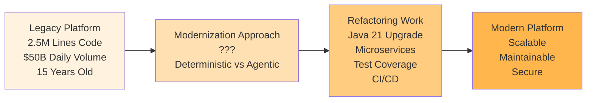
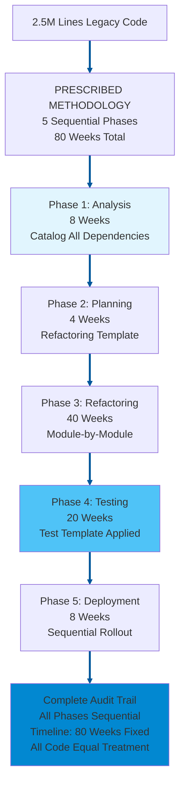
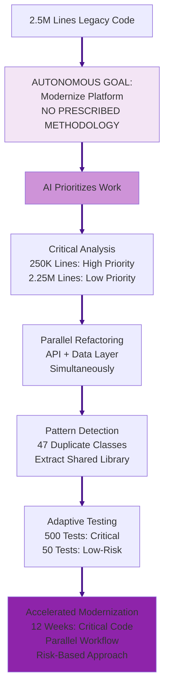
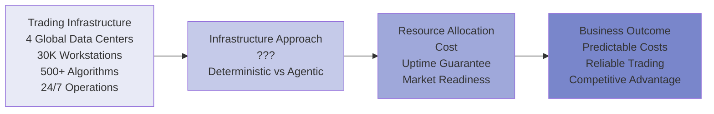
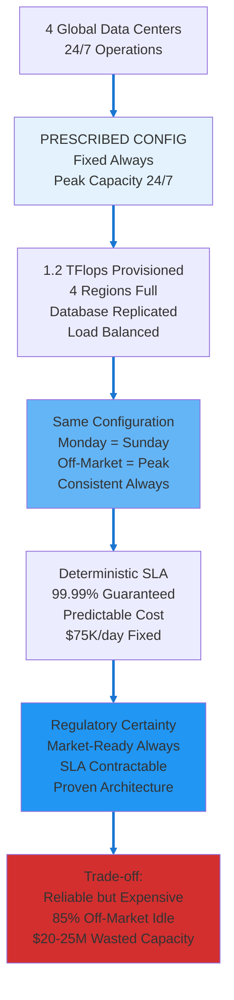
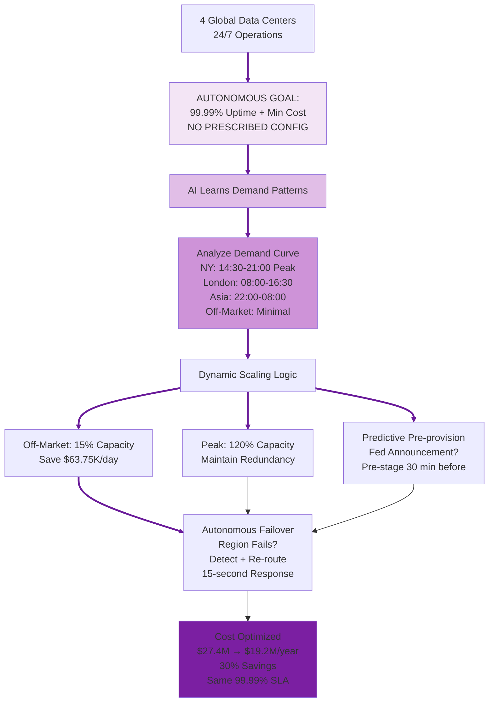

# Debate Slide Preparation: Agentic vs Deterministic AI
## Alternative Use Case Set 04

**Purpose:** Alternative use cases for Topics 4 & 6  
**Format:** 4 slides per topic (A: Introduction, B: Deterministic AI Approach, C: Agentic AI Approach, D: Strong Arguments Comparison)  
**Date:** February 20, 2026

---

# TOPIC 4: AGENTS ON DIFFERENT SDLC WORKFLOWS  
## Use Case: Legacy Trading Platform Code Modernization

---

## TOPIC 4 - SLIDE A: Introduction & Use Case

### Narrative

An investment bank operates a 15-year-old equity trading platform built in Java 8 with 2.5 million lines of code. The platform processes $50B in daily trading volume but has accumulated significant technical debt: deprecated libraries, monolithic architecture, poor test coverage (35%), manual deployment processes.

The bank needs to modernize the platform while maintaining 24/7 trading operations:
- Upgrade to Java 21 (security patches, performance improvements)
- Refactor monolith into microservices (scalability, resilience)
- Increase test coverage to 80% (regulatory requirement)
- Implement CI/CD pipeline (reduce deployment risk)
- Maintain backward compatibility (200+ downstream systems depend on APIs)

Current approach: Manual code analysis, spreadsheet tracking, sequential refactoring (analyze → plan → refactor → test → deploy). Estimated timeline: 18-24 months. Trading desk frustrated—new features blocked by modernization work.

**The Question:** Should code modernization follow prescribed refactoring steps (deterministic) or allow AI to autonomously identify and sequence refactoring work (agentic)?

### Diagram

---

## TOPIC 4 - SLIDE B: Deterministic AI Approach

### Narrative

A Deterministic AI approach gives the AI **goal + prescribed refactoring methodology**. The bank specifies: "Modernize trading platform following this exact sequence: (1) Analyze all 2.5M lines, catalog dependencies (8 weeks), (2) Create refactoring plan per this template (4 weeks), (3) Refactor code module-by-module in prescribed order (40 weeks), (4) Test each module per test template (20 weeks), (5) Deploy sequentially (8 weeks). Follow methodology exactly."

The system:

1. **AI executes prescribed analysis phase** - AI scans all 2.5M lines of code → AI catalogs 847 classes, 12,450 methods, 3,200 dependencies → AI produces dependency matrix per prescribed template. Analysis phase: 8 weeks, AI analyzes all code identically.
2. **AI applies deterministic refactoring sequence** - AI follows refactoring plan's prescribed module order: (1) Data access layer, (2) Business logic layer, (3) API layer, (4) UI layer. AI refactors each module completely before beginning next. No parallel work, no reordering per prescribed rules.
3. **AI creates verifiable refactoring trail** - AI logs every code change: timestamp, developer, refactoring pattern applied (per prescribed catalog), test results. Auditors can verify: "AI ensured Module A refactored using pattern #23, tests passed, deployed per sequence."
4. **AI ensures consistent refactoring quality** - AI refactors all 847 classes using same prescribed patterns. AI applies deterministic rules: "If class >500 lines, split per template. If method >50 lines, extract per template." AI provides uniform application across all code.

**Key advantage:** Regulatory compliance straightforward. Auditors verify: "Modernization followed approved methodology, all refactoring documented, test coverage achieved." Predictable timeline enables business planning.

**Risk:** 80-week timeline fixed regardless of code complexity. Critical trading logic (10% of codebase) receives same refactoring timeline as low-risk reporting code (90% of codebase). Opportunity cost: 18 months of blocked feature development.

### Diagram

---

## TOPIC 4 - SLIDE C: Agentic AI Approach

### Narrative

An Agentic AI approach gives the AI only **goal, no prescribed methodology**. The bank specifies: "Modernize trading platform to Java 21, microservices, 80% test coverage, CI/CD. Maintain 24/7 operations. Determine your own refactoring path."

The system:

1. **Autonomously prioritizes refactoring work** - Analyzes 2.5M lines → identifies 250K lines (10%) are critical trading logic with high change frequency. Prioritizes these for immediate refactoring. Identifies 2.25M lines (90%) are low-risk reporting/admin code. Defers refactoring or applies automated patterns.
2. **Discovers refactoring opportunities** - Identifies 47 classes with identical code patterns (copy-paste duplication). Deterministic approach: refactors each class individually (47 weeks). Agentic approach: extracts shared library, refactors all 47 simultaneously (2 weeks).
3. **Intelligent dependency management** - Realizes API layer and data access layer have minimal dependencies. Refactors both in parallel with separate teams. Deterministic approach: sequential (data layer weeks 1-20, API layer weeks 21-40). Agentic approach: parallel (both complete week 20).
4. **Adaptive testing strategy** - Critical trading logic: generates 500 test cases per module (high risk). Low-risk reporting code: generates 50 test cases per module (low risk). Test effort proportional to actual risk, not uniform template.

**Key advantage:** Critical trading logic modernized in 12 weeks (vs 80 weeks). Parallel refactoring accelerates delivery. Feature development unblocked sooner. Low-risk code deferred or automated.

**Risk:** Variable refactoring approach creates consistency concerns. Auditors might question: "Why did module A get 500 tests but module B got 50 tests?" Harder to verify uniform quality standards applied.

### Diagram

---

## TOPIC 4 - SLIDE D: Strong Arguments Comparison

### Deterministic AI Arguments (LEFT) | Agentic AI Arguments (RIGHT)

| **DETERMINISTIC AI** | **AGENTIC AI** |
|---|---|
| **Regulatory Defensibility** | **Context-Aware Modernization** |
| AI follows prescribed refactoring methodology uniformly. Regulators ask: "How do you ensure code quality during modernization?" Deterministic answer: "All 2.5M lines refactored via approved methodology. All 847 classes follow prescribed patterns. All modules tested per template." Regulatory compliance satisfied through uniform prescribed methodology. **In use case:** Compliance audit verifies trading platform followed approved refactoring methodology, all code changes documented, test coverage achieved—compliance proven through prescribed process. | Different code modules have different business criticality. Trading order execution logic (250K lines, $50B daily volume) requires different rigor than admin reporting code (2.25M lines, zero trading impact). Agentic system evaluates criticality and applies proportional refactoring effort. **In use case:** Critical trading logic modernized in 12 weeks with 500 tests/module (high rigor). Low-risk code deferred or automated with 50 tests/module (appropriate rigor). Modernization effort matches actual business risk. |
| **Clear Accountability** | **Accelerated Business Value** |
| AI executes prescribed methodology rigidly. When refactored code fails in production, accountability clear: either methodology was skipped, or methodology inadequate. Development team followed documented sequence identically to all other modules. If methodology inadequate, process surfaces it uniformly. **In use case:** If refactored module causes trading outage, audit trail shows: "Module refactored using pattern #23 per prescribed methodology at timestamp X. Failure indicates methodology gap, not process deviation." Clear accountability from rigid prescribed methodology. | Deterministic methodology: 80 weeks, all code treated equally. Agentic approach: 12 weeks for critical code, feature development unblocked 68 weeks earlier. **In use case:** Trading desk requests new algorithmic trading feature (requires modern microservices architecture). Deterministic: wait 80 weeks for full modernization. Agentic: critical trading logic modernized week 12, new feature deployed week 16. Business value delivered 64 weeks earlier, competitive advantage captured. |
| **Consistent Stakeholder Trust** | **Intelligent Debt Reduction** |
| AI follows identical prescribed methodology for all code. Developers know: all 2.5M lines refactored using same patterns, same timeline, same rigor. Process predictable. Stakeholders trust consistent approach. **In use case:** CTO tells board: "Modernization takes exactly 80 weeks, every module treated equally. Plan feature roadmap accordingly." Predictability creates trust even if timeline longer than competitors. | Agentic system analyzing 2.5M lines discovers 47 classes with identical copy-paste code (technical debt hotspot). Deterministic approach: refactors each class individually per prescribed sequence (47 weeks). Agentic approach: recognizes duplication pattern, extracts shared library, refactors all 47 simultaneously (2 weeks). **In use case:** Eliminates 45 weeks of redundant refactoring work by detecting patterns deterministic methodology would miss. Intelligent debt reduction accelerates modernization while improving code quality. |

---

---

# TOPIC 6: OPERATIONAL RELIABILITY AND COST
## Use Case: Trading Infrastructure Cost Optimization Across Global Data Centers

---

## TOPIC 6 - SLIDE A: Introduction & Use Case

### Narrative

Investment bank operates trading infrastructure across 4 global data centers: New York, London, Tokyo, Singapore. Total infrastructure cost: $75K/day ($27.4M/year). This supports 30,000+ trading workstations, 500+ trading algorithms, real-time market data feeds, and 24/7 trading operations.

Load patterns are highly cyclical:
- **New York hours (14:30-21:00 UTC):** Peak load (80-90% capacity)
- **London hours (08:00-16:30 UTC):** Medium load (60-70% capacity)
- **Asia hours (22:00-08:00 UTC):** Low load (20-30% capacity)  
- **Off-market hours:** 10-15% capacity

Current approach: Provision all 4 data centers for peak load 24/7, maintaining redundancy everywhere, guaranteeing 99.99% uptime even during lowest-usage periods.

Cost inefficiency: During off-market hours, 85% of infrastructure sits idle. But regulatory requirements (market-ready, ready to respond to emergency) and SLA commitments (99.99% uptime) make cost optimization difficult.

**The Question:** Should infrastructure be provisioned deterministically (same capacity 24/7 with SLA guarantees) or optimized agentic-ally (scale based on predicted demand with cost optimization)?

### Diagram

---

## TOPIC 6 - SLIDE B: Deterministic AI Approach

### Narrative

A Deterministic AI approach gives the AI **goal + prescribed infrastructure configuration**. The bank specifies: "Maintain 4-region trading infrastructure configured as follows: (1) Provision for peak load 24/7, (2) Maintain full database replication across all 4 regions, (3) Deploy identical load balancers and failover routing, (4) Redundancy: if 1 region fails, 3 remain. Keep this exact configuration permanently."

The system:

1. **AI executes prescribed infrastructure configuration** - AI maintains 1.2 TFlops provisioned globally 24/7 (peak New York: 1000 TFlops + 20% headroom) per prescribed rules. AI applies same configuration every hour, every day. Weekday peak = weekend off-market = identical AI-managed capacity.
2. **AI applies deterministic SLA commitment** - AI keeps infrastructure constant → uptime guaranteed at 99.99%. Can contractually commit to regulators: "AI ensures market-ready every hour, every day. Failure rate predictable per AI-executed proven architecture." Commitment backed by AI following fixed prescribed configuration.
3. **AI provides verifiable architecture** - "Our AI-managed infrastructure: 4 regions, full replication, load balancers on all zones per prescribed rules. This AI-executed config has proven 99.99% uptime for 25 years." AI operations auditable and battle-tested.
4. **AI eliminates dynamic complexity** - AI applies same prescribed infrastructure rules for peak hours (efficient) and off-market hours (over-provisioned but predictable). AI has no scaling autonomy, no dynamic decision risk. AI-executed configuration stable and proven.

**Key advantage:** Regulatory and clearing partners trust constant, proven infrastructure. SLA commitments backed by predictable, audited architecture.

**Risk:** Infrastructure massively underutilized off-market hours. Off-market (85% idle usage) costs same $75K/day as peak hours. $20-25M/year in wasted capacity—competitive disadvantage vs. cost-optimized competitors.

### Diagram

---

## TOPIC 6 - SLIDE C: Agentic AI Approach

### Narrative

An Agentic AI approach gives the AI only **goal, no prescribed configuration**. The bank specifies: "Maintain 99.99% trading infrastructure uptime. Optimize infrastructure cost. Use all available data—determine your own infrastructure configuration."

The system:

1. **Autonomously learns demand patterns** - Analyzes 12 months of trading data, learns: NY peak 14:30-21:00 UTC (1000 TFlops demand), London 08:00-16:30 (600 TFlops), Asia 22:00-08:00 (200 TFlops), off-market (100 TFlops, 10% capacity). Determines demand curve.
2. **Dynamically scales infrastructure** - Off-market hours: scale to 15% capacity ($11.25K/day, save $63.75K). NY peak: scale to 120% capacity ($90K/day, maintain redundancy). Asia hours: 2-region routing instead of 4 (save 50% cost). Cost: $27.4M/year → $19.2M/year (30% savings).
3. **Predicts demand spikes proactively** - Learns Fed announcement schedule triggers algorithm surges. 30 minutes before FOMC release: autonomously pre-provision NY region to 130% capacity. When announcement drops: infrastructure already provisioned, zero latency spike.
4. **Orchestrates autonomous failover** - Region fails: autonomously detects, initiates failover, re-routes workload within 15 seconds. Trading operations continue without human intervention. Monitoring flags issue for ops team to investigate.

**Key advantage:** Cost reduced 30% ($8.2M/year savings). 99.99% uptime maintained via intelligent dynamic scaling. Market readiness preserved via predictive pre-provisioning.

**Risk:** Dynamic scaling creates operational complexity and orchestration risk. Automation error could breach SLA. Auditors struggle to verify "dynamic provisioning" is reliable. Regulatory market-ready requirement harder to contractually guarantee when infrastructure constantly changing.

### Diagram

---

## TOPIC 6 - SLIDE D: Strong Arguments Comparison

### Deterministic AI Arguments (LEFT) | Agentic AI Arguments (RIGHT)

| **DETERMINISTIC AI** | **AGENTIC AI** |
|---|---|
| **Proven Reliability Architecture** | **Economic Optimization** |
| AI maintains prescribed infrastructure configuration: (1) Provision peak load 24/7 → (2) Full database replication across 4 regions → (3) Identical load balancers → (4) Redundancy maintained always. Same prescribed configuration every hour, every day. Infrastructure patterns (4-region redundancy, geographic failover, capacity headroom) have 25+ year track record proven by rigid prescribed configuration. Flight-tested through 2008 crisis, Black Swan events, flash crashes via consistent prescribed process. Reliability proven because prescribed steps never vary. **In use case:** Trading infrastructure operates on battle-tested 4-region architecture via prescribed configuration. Uptime record: 99.99% across decades because prescribed process is predictable. Regulators trust proven pattern because configuration follows rigid prescribed steps. | Every business has peak and off-peak demand. Deterministic AI: maintains 100% capacity 24/7 when market-open 8 hours/day, off-market uses 15%. Wasted $20M/year. Agentic AI: scales to peak capacity (NY: 14:30-21:00), minimal capacity off-market. Cost optimization: 25-30% reduction ($6.8-8.2M). **In use case:** Trading infrastructure idle 85% of time during weekends/holidays. Agentic system scales down, saves $40K/day off-market. Same 99.99% SLA maintained via intelligent provisioning. |
| **Contractable SLA Guarantees** | **Predictive Demand Management** |
| AI follows prescribed infrastructure configuration rigidly. Configuration prescribed in advance: (1) Peak capacity 24/7 → (2) Full replication → (3) Identical routing → (4) Maintenance unchanged. Can commit to regulators and counterparties: "99.99% uptime maintained 24/7 via prescribed configuration, market emergency-ready." Fixed prescribed capacity infrastructure proves readiness. Regulatory certainty from predictable prescribed steps. **In use case:** Clearing partners require 99.99% guaranteed uptime. Bank contractually commits because prescribed configuration is rigid and predictable. Regulators audit: capacity always sufficient because prescribed, failover always ready because prescribed. Prescribed methodology enables SLA certainty. | Bank learns Fed announcements trigger predictable algorithm activity spike. Volatility spike known schedule. Agentic system: pre-provisions capacity 30min before announcement release time. When announcement happens, infrastructure already at capacity. No lag, no performance under crisis. **In use case:** Historical data: every FOMC announcement triggers 3x normal compute load at predictable time. Agentic system pre-stages capacity automatically. Traders experience zero latency during announcement. |
| **Testability and Validation** | **Continuous Learning Reliability** |
| Infrastructure follows prescribed configuration steps: same setup, same tests, same validation. Fully testable via chaos engineering because prescribed. Simulate data center failures, verify recovery procedures, prove 99.99% uptime projections via prescribed process. Reproducible testing creates confidence because prescribed steps are repeatable. **In use case:** Bank runs monthly disaster recovery drills: "Simulate NY data center failure → verify automatic failover (prescribed routing) → measure total recovery time → validate 99.99% SLA still achievable via prescribed process." Proven procedures breed confidence because prescribed configuration is testable, repeatable, and verifiable. | System learns from millions of operational hours. Discovers: CPU utilization above 75% correlates with failures 8 hours later (specific to bank's architecture). Deterministic threshold 90% too late. Agentic learns pattern, proactively scales at 70%, prevents failures before they cascade. **In use case:** After analyzing 2+ years incidents, learns bank's failure precursors. Implements predictive scaling: when CPU trending toward 75%, automatically provisions additional capacity before failure occurs. Reliability improves continuously. |

---