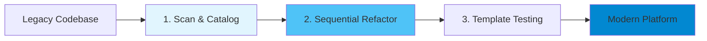
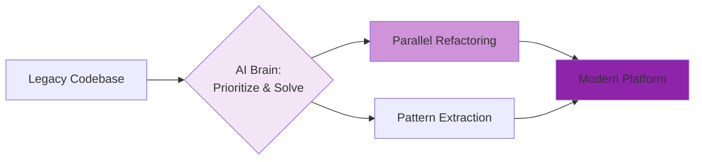
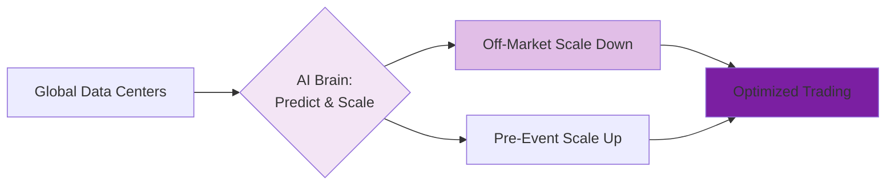

# Debate Slide Preparation: Agentic vs Deterministic AI (V3)
## Alternative Use Case Set 04 - Optimized Edition

**Purpose:** Alternative use cases for Topics 4 & 6 (Consolidated Format)  
**Format:** 3 slides per topic (A: Use Case & Deterministic Approach, B: Agentic AI Approach, C: Strong Arguments Comparison)  
**Date:** March 1, 2026

---

# TOPIC 4: AGENTS ON DIFFERENT SDLC WORKFLOWS  
## Use Case: Legacy Trading Platform Code Modernization

---

## TOPIC 4 - SLIDE A: Use Case & Deterministic Approach

### Narrative

An investment bank must modernize a massive legacy trading platform (Java upgrade, microservices, 24/7 uptime). The **Deterministic AI** approach follows a **Goal + Prescribed Methodology**. It executes a rigid, sequential refactoring plan (Analyze → Plan → Refactor → Test → Deploy) module-by-module.

1. **Step-by-Step Execution**: AI follows a fixed 5-phase sequence identical for all code.
2. **Prescribed Pattern Matching**: Applies standard refactoring templates to every class.
3. **Verifiable Audit Trail**: Logs every change against the approved methodology.

**Key Advantage:** Regulatory compliance is straightforward because the process is predictable and uniform.
**Risk:** Fixed, extended timeline; critical logic is blocked by low-risk code refactoring.

### Simplified Process Diagram (Deterministic)

---

## TOPIC 4 - SLIDE B: Agentic AI Approach

### Narrative

In contrast, the **Agentic AI** approach is given a **Goal only (No prescribed methodology)**. It autonomously determines the most efficient path to modernization based on real-world constraints and code criticality.

1. **Autonomous Prioritization**: Identifies and modernizes high-impact trading logic first.
2. **Intelligent Pattern Detection**: Recognizes duplication across modules to refactor once and share.
3. **Parallel Orchestration**: Runs multiple refactoring and testing streams simultaneously where safe.

**Key Advantage:** Rapid delivery of business value; critical features are unblocked significantly sooner.
**Risk:** Variable methodology makes uniform quality audits more complex to verify.

### Simplified Process Diagram (Agentic)

---

## TOPIC 4 - SLIDE C: Strong Arguments Comparison

| **DETERMINISTIC AI** | **AGENTIC AI** |
|---|---|
| **Regulatory Defensibility** | **Context-Aware Modernization** |
| Process is the proof. Auditors verify that every line of code followed the approved, uniform refactoring methodology. | Outcome over process. AI allocates maximum rigor to high-risk trading logic and automates low-risk reporting tasks. |
| **Clear Accountability** | **Accelerated Business Value** |
| If a failure occurs, it’s a gap in the methodology, not the execution. Accountability is anchored in rigid adherence to steps. | Unblocks the business faster. Critical features reach the market in months, not years, providing a massive competitive edge. |
| **Consistent Stakeholder Trust** | **Intelligent Debt Reduction** |
| Predictability creates trust. Stakeholders can plan roadmaps around a fixed (albeit slower) and stable delivery cadence. | Discovers shortcuts that humans and fixed templates miss, such as extracting shared libraries to refactor thousands of classes at once. |

---
---

# TOPIC 6: OPERATIONAL RELIABILITY AND COST
## Use Case: Trading Infrastructure Cost Optimization

---

## TOPIC 6 - SLIDE A: Use Case & Deterministic Approach

### Narrative

Managing global trading infrastructure is expensive. The **Deterministic AI** approach prioritizes stability via **Goal + Prescribed Configuration**. It maintains peak capacity 24/7 across all regions to guarantee SLAs, regardless of actual market activity.

1. **Fixed Provisioning**: peak capacity + headroom is maintained globally at all times.
2. **Static Redundancy**: Identical load balancers and full database replication are always active.
3. **Immutable Operations**: Monday off-market costs the same as Friday peak trading.

**Key Advantage:** Absolute reliability and regulatory certainty; the infrastructure is always "market-ready."
**Risk:** Massive waste; infrastructure is underutilized 70% of the time, creating a cost disadvantage.

### Simplified Process Diagram (Deterministic)

---

## TOPIC 6 - SLIDE B: Agentic AI Approach

### Narrative

In contrast, the **Agentic AI** approach is given a **Goal: High Uptime + Minimized Cost**. It uses autonomous reasoning to dynamically reconfigure infrastructure based on predicted and real-time demand.

1. **Predictive Scaling**: Learns market schedules to pre-provision capacity before news spikes.
2. **Dynamic Optimization**: Scales to minimal capacity during off-market hours for massive savings.
3. **Autonomous Failover**: Detects region failures and re-routes workloads without human scripts.

**Key Advantage:** Drastic reduction in operational expenses while maintaining high performance.
**Risk:** Orchestration complexity; dynamic changes are harder to audit than static configurations.

### Simplified Process Diagram (Agentic)

---

## TOPIC 6 - SLIDE C: Strong Arguments Comparison

| **DETERMINISTIC AI** | **AGENTIC AI** |
|---|---|
| **Proven Reliability Architecture** | **Economic Optimization** |
| Stability through consistency. A fixed peak-load configuration has no moving parts to fail during a crisis. | Efficiency is survival. Why pay for idle servers? Agentic AI captures the 50-70% savings hidden in off-peak hours. |
| **Contractable SLA Guarantees** | **Predictive Demand Management** |
| Legal certainty. Regulators and partners trust an architecture that is physically provisioned and ready for anything. | Intelligence over brute force. AI anticipates the news-cycle surges, scaling capacity before the latency even hits. |
| **Testability and Validation** | **Continuous Learning Reliability** |
| Chaos engineering on a static target. You can prove recovery times because the environment is predictable. | AI detects precursor patterns—like subtle CPU spikes—and scales before a failure even begins to cascade. |
