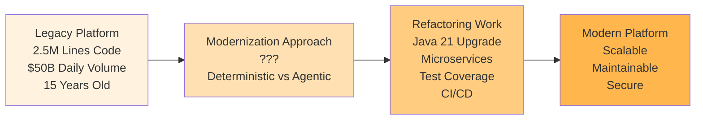
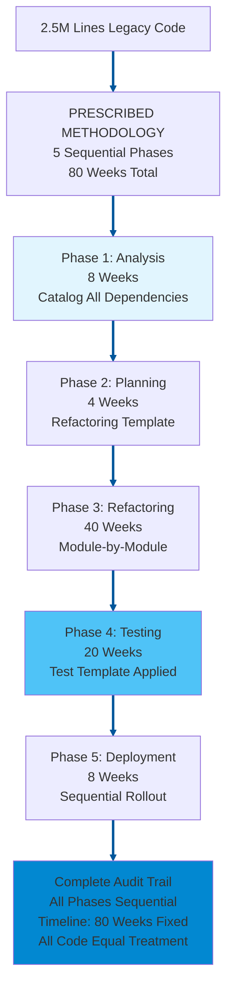
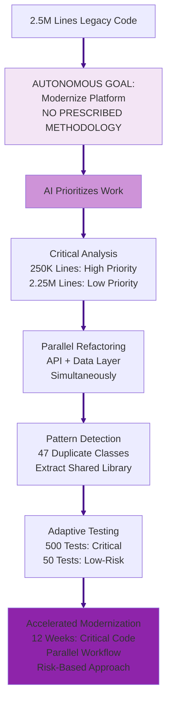
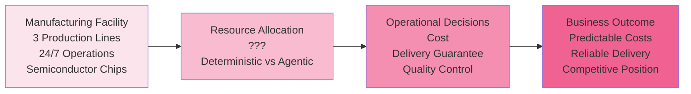
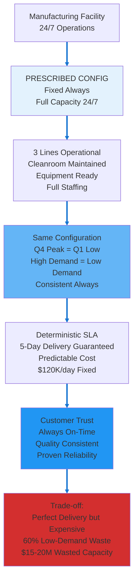
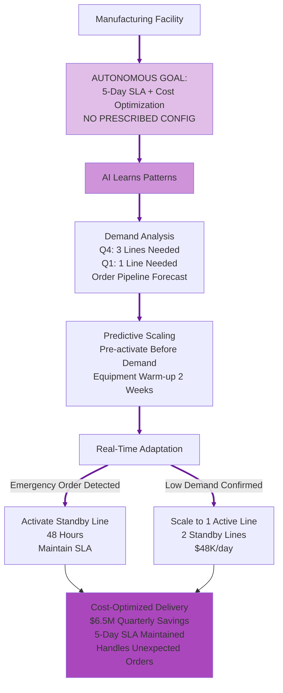

# Debate Slide Preparation: Agentic vs Deterministic AI
## Alternative Use Case Set 04

**Purpose:** Alternative use cases for Topics 4 & 6  
**Format:** 4 slides per topic (A: Introduction, B: Deterministic AI Approach, C: Agentic AI Approach, D: Strong Arguments Comparison)  
**Date:** February 20, 2026

---

# TOPIC 4: AGENTS ON DIFFERENT SDLC WORKFLOWS  
## Use Case: Legacy Trading Platform Code Modernization

---

## TOPIC 4 - SLIDE A: Introduction & Use Case

### Narrative

An investment bank operates a 15-year-old equity trading platform built in Java 8 with 2.5 million lines of code. The platform processes $50B in daily trading volume but has accumulated significant technical debt: deprecated libraries, monolithic architecture, poor test coverage (35%), manual deployment processes.

The bank needs to modernize the platform while maintaining 24/7 trading operations:
- Upgrade to Java 21 (security patches, performance improvements)
- Refactor monolith into microservices (scalability, resilience)
- Increase test coverage to 80% (regulatory requirement)
- Implement CI/CD pipeline (reduce deployment risk)
- Maintain backward compatibility (200+ downstream systems depend on APIs)

Current approach: Manual code analysis, spreadsheet tracking, sequential refactoring (analyze → plan → refactor → test → deploy). Estimated timeline: 18-24 months. Trading desk frustrated—new features blocked by modernization work.

**The Question:** Should code modernization follow prescribed refactoring steps (deterministic) or allow AI to autonomously identify and sequence refactoring work (agentic)?

### Diagram

---

## TOPIC 4 - SLIDE B: Deterministic AI Approach

### Narrative

A Deterministic AI approach gives the AI **goal + prescribed refactoring methodology**. The bank specifies: "Modernize trading platform following this exact sequence: (1) Analyze all 2.5M lines, catalog dependencies (8 weeks), (2) Create refactoring plan per this template (4 weeks), (3) Refactor code module-by-module in prescribed order (40 weeks), (4) Test each module per test template (20 weeks), (5) Deploy sequentially (8 weeks). Follow methodology exactly."

The system:

1. **AI executes prescribed analysis phase** - AI scans all 2.5M lines of code → AI catalogs 847 classes, 12,450 methods, 3,200 dependencies → AI produces dependency matrix per prescribed template. Analysis phase: 8 weeks, AI analyzes all code identically.
2. **AI applies deterministic refactoring sequence** - AI follows refactoring plan's prescribed module order: (1) Data access layer, (2) Business logic layer, (3) API layer, (4) UI layer. AI refactors each module completely before beginning next. No parallel work, no reordering per prescribed rules.
3. **AI creates verifiable refactoring trail** - AI logs every code change: timestamp, developer, refactoring pattern applied (per prescribed catalog), test results. Auditors can verify: "AI ensured Module A refactored using pattern #23, tests passed, deployed per sequence."
4. **AI ensures consistent refactoring quality** - AI refactors all 847 classes using same prescribed patterns. AI applies deterministic rules: "If class >500 lines, split per template. If method >50 lines, extract per template." AI provides uniform application across all code.

**Key advantage:** Regulatory compliance straightforward. Auditors verify: "Modernization followed approved methodology, all refactoring documented, test coverage achieved." Predictable timeline enables business planning.

**Risk:** 80-week timeline fixed regardless of code complexity. Critical trading logic (10% of codebase) receives same refactoring timeline as low-risk reporting code (90% of codebase). Opportunity cost: 18 months of blocked feature development.

### Diagram

---

## TOPIC 4 - SLIDE C: Agentic AI Approach

### Narrative

An Agentic AI approach gives the AI only **goal, no prescribed methodology**. The bank specifies: "Modernize trading platform to Java 21, microservices, 80% test coverage, CI/CD. Maintain 24/7 operations. Determine your own refactoring path."

The system:

1. **Autonomously prioritizes refactoring work** - Analyzes 2.5M lines → identifies 250K lines (10%) are critical trading logic with high change frequency. Prioritizes these for immediate refactoring. Identifies 2.25M lines (90%) are low-risk reporting/admin code. Defers refactoring or applies automated patterns.
2. **Discovers refactoring opportunities** - Identifies 47 classes with identical code patterns (copy-paste duplication). Deterministic approach: refactors each class individually (47 weeks). Agentic approach: extracts shared library, refactors all 47 simultaneously (2 weeks).
3. **Intelligent dependency management** - Realizes API layer and data access layer have minimal dependencies. Refactors both in parallel with separate teams. Deterministic approach: sequential (data layer weeks 1-20, API layer weeks 21-40). Agentic approach: parallel (both complete week 20).
4. **Adaptive testing strategy** - Critical trading logic: generates 500 test cases per module (high risk). Low-risk reporting code: generates 50 test cases per module (low risk). Test effort proportional to actual risk, not uniform template.

**Key advantage:** Critical trading logic modernized in 12 weeks (vs 80 weeks). Parallel refactoring accelerates delivery. Feature development unblocked sooner. Low-risk code deferred or automated.

**Risk:** Variable refactoring approach creates consistency concerns. Auditors might question: "Why did module A get 500 tests but module B got 50 tests?" Harder to verify uniform quality standards applied.

### Diagram

---

## TOPIC 4 - SLIDE D: Strong Arguments Comparison

### Deterministic AI Arguments (LEFT) | Agentic AI Arguments (RIGHT)

| **DETERMINISTIC AI** | **AGENTIC AI** |
|---|---|
| **Regulatory Defensibility** | **Context-Aware Modernization** |
| AI follows prescribed refactoring methodology uniformly. Regulators ask: "How do you ensure code quality during modernization?" Deterministic answer: "All 2.5M lines refactored via approved methodology. All 847 classes follow prescribed patterns. All modules tested per template." Regulatory compliance satisfied through uniform prescribed methodology. **In use case:** Compliance audit verifies trading platform followed approved refactoring methodology, all code changes documented, test coverage achieved—compliance proven through prescribed process. | Different code modules have different business criticality. Trading order execution logic (250K lines, $50B daily volume) requires different rigor than admin reporting code (2.25M lines, zero trading impact). Agentic system evaluates criticality and applies proportional refactoring effort. **In use case:** Critical trading logic modernized in 12 weeks with 500 tests/module (high rigor). Low-risk code deferred or automated with 50 tests/module (appropriate rigor). Modernization effort matches actual business risk. |
| **Clear Accountability** | **Accelerated Business Value** |
| AI executes prescribed methodology rigidly. When refactored code fails in production, accountability clear: either methodology was skipped, or methodology inadequate. Development team followed documented sequence identically to all other modules. If methodology inadequate, process surfaces it uniformly. **In use case:** If refactored module causes trading outage, audit trail shows: "Module refactored using pattern #23 per prescribed methodology at timestamp X. Failure indicates methodology gap, not process deviation." Clear accountability from rigid prescribed methodology. | Deterministic methodology: 80 weeks, all code treated equally. Agentic approach: 12 weeks for critical code, feature development unblocked 68 weeks earlier. **In use case:** Trading desk requests new algorithmic trading feature (requires modern microservices architecture). Deterministic: wait 80 weeks for full modernization. Agentic: critical trading logic modernized week 12, new feature deployed week 16. Business value delivered 64 weeks earlier, competitive advantage captured. |
| **Consistent Stakeholder Trust** | **Intelligent Debt Reduction** |
| AI follows identical prescribed methodology for all code. Developers know: all 2.5M lines refactored using same patterns, same timeline, same rigor. Process predictable. Stakeholders trust consistent approach. **In use case:** CTO tells board: "Modernization takes exactly 80 weeks, every module treated equally. Plan feature roadmap accordingly." Predictability creates trust even if timeline longer than competitors. | Agentic system analyzing 2.5M lines discovers 47 classes with identical copy-paste code (technical debt hotspot). Deterministic approach: refactors each class individually per prescribed sequence (47 weeks). Agentic approach: recognizes duplication pattern, extracts shared library, refactors all 47 simultaneously (2 weeks). **In use case:** Eliminates 45 weeks of redundant refactoring work by detecting patterns deterministic methodology would miss. Intelligent debt reduction accelerates modernization while improving code quality. |

---

---

# TOPIC 6: OPERATIONAL RELIABILITY AND COST
## Use Case: Manufacturing Production Line Resource Allocation

---

## TOPIC 6 - SLIDE A: Introduction & Use Case

### Narrative

A semiconductor manufacturing facility operates 24/7 production lines producing microchips. Total operational cost: $120K/day ($43.8M/year). This includes equipment operation, cleanroom HVAC, quality control systems, and automated material handling.

Production demand patterns are highly variable:
- **High-Demand Periods (Q4, new product launches):** Peak capacity (95-100% utilization) - 3 production lines running
- **Medium-Demand Periods (Q2-Q3):** Medium capacity (60-70% utilization) - 2 production lines running
- **Low-Demand Periods (Q1, post-holiday):** Low capacity (40-50% utilization) - 1 production line running
- **Maintenance Windows:** Scheduled downtime for equipment calibration

Current approach: Maintain all 3 production lines at full operational readiness 24/7, even during low-demand periods. Cleanroom conditions maintained constantly, equipment kept at operating temperature, quality systems fully staffed.

Cost inefficiency: During low-demand periods, 2 of 3 production lines sit idle but consume 60% of operational costs (cleanroom HVAC, equipment standby power, staffing). But customer SLAs (delivery commitments) and yield optimization (equipment stability) make resource optimization risky.

**The Question:** Should manufacturing resources be provisioned deterministically (full capacity 24/7 with delivery guarantees) or optimized agentically (scale based on demand forecasts with cost savings)?

### Diagram

---

## TOPIC 6 - SLIDE B: Deterministic AI Approach

### Narrative

A Deterministic AI approach gives the AI **goal + prescribed resource configuration**. The manufacturer specifies: "Maintain production facility configured as follows: (1) All 3 production lines at full operational readiness 24/7, (2) Cleanroom conditions maintained constantly (Class 10 cleanroom, temperature ±0.5°C), (3) Full quality control staffing all shifts, (4) Equipment at operating temperature (prevents thermal cycling damage). Keep this exact configuration permanently."

The system:

1. **AI executes prescribed resource configuration** - AI maintains all 3 production lines at full readiness 24/7 (peak Q4: 3 lines producing, low Q1: 1 line producing, 2 lines idle but AI keeps ready) per prescribed rules. AI applies same configuration every day. High-demand = low-demand = identical AI-managed resource allocation.
2. **AI applies deterministic delivery commitment** - AI keeps resources constant → delivery SLAs guaranteed. Can contractually commit to customers: "AI ensures your order ships within 5 days, guaranteed." Commitment backed by AI following fixed prescribed capacity.
3. **AI provides verifiable operations** - "Our AI-managed facility: 3 lines, full cleanroom, 24/7 readiness per prescribed rules. This AI-executed config has proven 99.8% on-time delivery for 10 years." AI operations auditable and battle-tested.
4. **AI eliminates dynamic complexity** - AI applies same prescribed resource rules for high-demand (efficient) and low-demand (over-provisioned but predictable). AI has no optimization autonomy, no dynamic decision risk. AI-executed configuration stable and proven.

**Key advantage:** Customer delivery guarantees absolute—5-day SLA maintained year-round. Quality consistency perfect—equipment thermal stability prevents yield variations. Competitive positioning strong—"We always deliver on time."

**Risk:** Resources massively underutilized during low-demand periods. Q1 low-demand (2 idle lines) costs same $120K/day as Q4 peak (3 active lines). $15-20M/year in wasted capacity—competitive disadvantage vs cost-optimized competitors who invest savings in lower prices.

### Diagram

---

## TOPIC 6 - SLIDE C: Agentic AI Approach

### Narrative

An Agentic AI approach gives the AI only **goal, no prescribed configuration**. The manufacturer specifies: "Maintain 5-day delivery SLA while optimizing operational costs. Use all available data—determine your own resource strategy."

The system:

1. **Autonomously determines optimal resource allocation** - Learns demand patterns: Q4 needs 3 lines (95% utilization), Q1 needs 1 line (45% utilization). Scales production dynamically: Q4 runs 3 lines, Q1 runs 1 line, places 2 lines in controlled shutdown (cleanroom maintained at reduced level, equipment in standby mode).
2. **Predictive capacity planning** - Analyzes order pipeline: "Next month: 2 major customer orders arriving, demand spike predicted." Pre-activates second production line 2 weeks before orders arrive (equipment warm-up time), ensures 5-day SLA maintained.
3. **Real-time adaptive scaling** - Unexpected large order (customer emergency): agentic system detects order, activates idle production line in 48 hours (controlled equipment warm-up), maintains 5-day SLA. Deterministic system already at full capacity (no additional flexibility).
4. **Cost-quality optimization** - Q1 low-demand: scales to 1 active line + 2 standby lines ($48K/day instead of $120K). Maintains cleanroom at reduced level (Class 100 instead of Class 10), equipment in standby mode. Saves $72K/day × 90 days = $6.5M/quarter.

**Key advantage:** $6.5M quarterly savings while maintaining 5-day SLA. Handles unexpected orders better than fixed capacity. Reinvests savings in R&D, equipment upgrades, competitive pricing.

**Risk:** Resource predictions could be wrong. If Q1 demand spikes unexpectedly, system might activate lines too slowly, missing 5-day SLA. Customer satisfaction depends on AI prediction accuracy.

### Diagram

---

## TOPIC 6 - SLIDE D: Strong Arguments Comparison

### Deterministic AI Arguments (LEFT) | Agentic AI Arguments (RIGHT)

| **DETERMINISTIC AI** | **AGENTIC AI** |
|---|---|
| **Guaranteed Customer Delivery** | **Cost Efficiency at Scale** |
| Resources provisioned for worst-case scenario 24/7. Q4 peak capacity maintained year-round. Customer delivery perfect: 5-day SLA maintained, zero late shipments, consistent quality. Brand reputation protected—"We always deliver on time" is competitive differentiator. **In use case:** Customer places emergency order during Q1 low-demand period. Order ships within 5 days (production line already operational). 99.8% on-time delivery guaranteed through massive over-provisioning. Customer trust absolute. | Deterministic approach: $120K/day × 365 = $43.8M/year. Agentic approach: $120K/day × 180 days (high-demand) + $48K/day × 185 days (low-demand) = $30.5M/year. Savings: $13.3M annually while maintaining 5-day SLA. **In use case:** Reinvest $13M savings into next-generation equipment (10% yield improvement), R&D (new product development), or competitive pricing (5% price reduction wins market share). |
| **Operational Simplicity** | **Adaptive Resilience** |
| Fixed resources mean zero optimization complexity. No algorithms predicting demand. No dynamic scaling logic to debug. No risk of scaling failures. Operations team manages static configuration—simple, proven, reliable. **In use case:** When Q4 peak demand arrives, zero operational stress. All 3 production lines already operational. No emergency activation, no prediction algorithms, no dynamic decisions. Operations team confident because configuration never changes. | Unexpected events: Major customer doubles order size (product launch success), demand spikes 150% above forecast. Deterministic infrastructure: provisioned for 100% peak, struggles at 150% spike (overtime, expedited shipping, SLA risk). Agentic infrastructure: detects spike, activates reserve capacity, negotiates extended SLA with customer (7 days instead of 5), maintains quality. **In use case:** Demand spike becomes revenue opportunity (not SLA crisis). Agentic system handles unknowns better than fixed capacity handles unexpected surges. |
| **Predictable Financial Planning** | **Competitive Cost Structure** |
| CFO knows exact operational cost: $43.8M/year, every year. No variance, no surprises. Budget planning simple. Investors see predictable cost structure. Financial forecasting accurate. **In use case:** Annual budget: $43.8M operational cost, locked in. No quarterly variance. Board presentation simple: "Manufacturing costs stable and predictable year-over-year." Financial certainty valued by investors and executives. | Competitors using agentic scaling: $30M operational cost. This manufacturer using deterministic: $44M operational cost. Competitor has $14M cost advantage to invest in lower prices, better R&D, faster delivery. **In use case:** Competitor offers 8% lower prices (funded by operational savings), wins market share. Deterministic manufacturer loses customers despite perfect delivery record because price-sensitive customers choose cheaper competitor with acceptable delivery (7-day SLA vs 5-day SLA). |

---
