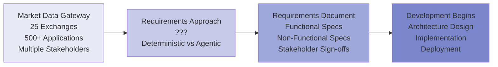
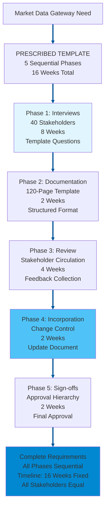
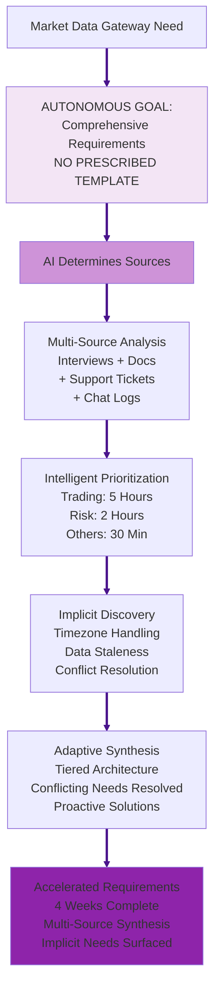
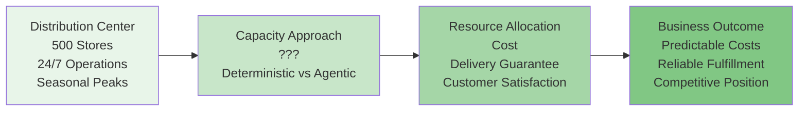
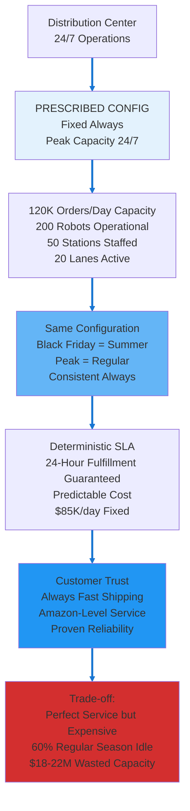
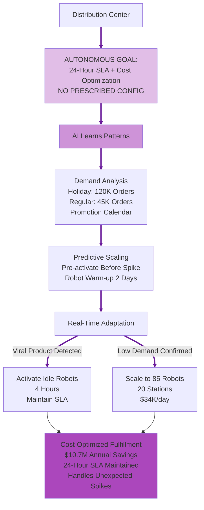

# Debate Slide Preparation: Agentic vs Deterministic AI
## Alternative Use Case Set 05

**Purpose:** Alternative use cases for Topics 4 & 6  
**Format:** 4 slides per topic (A: Introduction, B: Deterministic AI Approach, C: Agentic AI Approach, D: Strong Arguments Comparison)  
**Date:** February 20, 2026

---

# TOPIC 4: AGENTS ON DIFFERENT SDLC WORKFLOWS  
## Use Case: Market Data Gateway Requirements Gathering and Specification

---

## TOPIC 4 - SLIDE A: Introduction & Use Case

### Narrative

An investment bank needs a new Market Data Gateway to aggregate real-time market data from 25 exchanges (NYSE, NASDAQ, LSE, Tokyo, etc.) and distribute to 500+ internal trading applications. Requirements are complex and distributed across multiple stakeholders:
- Trading Desk: Needs <10ms latency, 99.99% uptime, support for 50K symbols
- Risk Management: Needs historical data retention (7 years), audit trails, data quality validation
- Compliance: Needs regulatory reporting (MiFID II, SEC), data lineage tracking
- Technology: Needs scalable architecture, cloud-native, API-first design
- Finance: Needs cost optimization, vendor consolidation, TCO analysis

Current approach: Business analyst conducts 40+ stakeholder interviews over 8 weeks, manually synthesizes notes into 120-page requirements document, circulates for review (4 weeks), incorporates feedback (2 weeks), obtains sign-offs (2 weeks). Total: 16 weeks. By the time requirements finalized, market conditions changed, some requirements outdated.

**The Question:** Should requirements gathering follow prescribed interview templates (deterministic) or allow AI to autonomously synthesize requirements from multiple sources (agentic)?

### Diagram

---

## TOPIC 4 - SLIDE B: Deterministic AI Approach

### Narrative

A Deterministic AI approach gives the AI **goal + prescribed requirements template**. The bank specifies: "Gather requirements following this exact process: (1) Conduct stakeholder interviews per this template (40 interviews, 8 weeks), (2) Document requirements per this 120-page template structure (functional, non-functional, constraints), (3) Circulate for review per this stakeholder matrix (4 weeks), (4) Incorporate feedback per this change control process (2 weeks), (5) Obtain sign-offs per this approval hierarchy (2 weeks). Follow template exactly."

The system:

1. **AI executes prescribed interview process** - AI schedules 40 stakeholder interviews (1 hour each) → AI asks identical template questions to all stakeholders → AI records responses in structured format. Trading desk interview: AI uses same template questions as compliance interview. AI provides uniform data collection.
2. **AI applies deterministic documentation structure** - AI generates requirements document following prescribed 120-page template: Section 1 (Functional Requirements), Section 2 (Non-Functional Requirements), Section 3 (Constraints), Section 4 (Assumptions). AI documents all requirements in identical format.
3. **AI creates verifiable requirements trail** - AI logs every requirement: source stakeholder, interview timestamp, requirement ID, traceability to business objective. Auditors can verify: "AI documented Requirement R-247 from Trading Desk interview #12, per template section 1.3.4."
4. **AI ensures consistent stakeholder coverage** - AI gives all 40 stakeholders identical interview time (1 hour), identical template questions, identical documentation format per prescribed rules. AI provides no stakeholder prioritization, no adaptive questioning.

**Key advantage:** Regulatory compliance straightforward. Auditors verify: "Requirements followed approved template, all 40 stakeholders interviewed, all sign-offs obtained." Comprehensive stakeholder coverage guaranteed.

**Risk:** 16-week timeline fixed regardless of requirement complexity. Template questions might miss critical nuances. By week 16, market conditions changed—some requirements outdated before development begins.

### Diagram

---

## TOPIC 4 - SLIDE C: Agentic AI Approach

### Narrative

An Agentic AI approach gives the AI only **goal, no prescribed template**. The bank specifies: "Gather comprehensive requirements for Market Data Gateway. Synthesize from all available sources. Determine your own requirements gathering approach."

The system:

1. **Autonomously determines requirements sources** - Identifies multiple data sources beyond interviews: existing system documentation, support tickets (3 years of user complaints), trading desk chat logs (reveals actual pain points), competitor product specs, regulatory filings. Synthesizes requirements from all sources, not just interviews.
2. **Intelligent stakeholder prioritization** - Analyzes that Trading Desk generates 80% of system usage, Risk Management 15%, others 5%. Conducts deep interviews with Trading (5 hours total) and Risk (2 hours), brief interviews with others (30 minutes). Time allocation proportional to system impact.
3. **Discovers implicit requirements** - Support tickets reveal: "System crashes when processing Tokyo exchange data during US market hours" (timezone handling requirement not mentioned in interviews). Chat logs reveal: "Traders manually refresh data feeds 20x/day" (data staleness requirement not explicitly stated). Agentic system surfaces implicit requirements.
4. **Adaptive requirements synthesis** - Week 2: Realizes Trading Desk and Risk Management have conflicting latency requirements (Trading: <10ms, Risk: <100ms acceptable). Proposes tiered architecture satisfying both. Deterministic template would document conflict, not resolve it.

**Key advantage:** Requirements complete in 4 weeks (vs 16 weeks). Discovers implicit requirements template interviews miss. Resolves conflicts proactively. Development begins 12 weeks earlier.

**Risk:** Variable stakeholder engagement creates fairness concerns. Compliance team might complain: "Why did Trading get 5 hours but we got 30 minutes?" Harder to verify all stakeholders adequately consulted.

### Diagram

---

## TOPIC 4 - SLIDE D: Strong Arguments Comparison

### Deterministic AI Arguments (LEFT) | Agentic AI Arguments (RIGHT)

| **DETERMINISTIC AI** | **AGENTIC AI** |
|---|---|
| **Regulatory Defensibility** | **Context-Aware Requirements** |
| AI follows prescribed requirements template uniformly. Regulators ask: "How do you ensure comprehensive requirements gathering?" Deterministic answer: "All projects follow approved 120-page template. All 40 stakeholders interviewed using identical template questions. All requirements documented per prescribed structure." Regulatory compliance satisfied through uniform prescribed template. **In use case:** Compliance audit verifies Market Data Gateway followed approved requirements template, all 40 stakeholders interviewed, all sign-offs obtained—compliance proven through prescribed methodology. | Different stakeholders have different system impact. Trading Desk generates 80% of system usage (critical requirements), Compliance generates 5% (important but lower volume). Agentic system allocates requirements effort proportionally: 5 hours with Trading (deep dive), 30 minutes with Compliance (focused interview). **In use case:** Trading Desk requirements deeply explored (latency, throughput, failover), Compliance requirements efficiently captured (audit trails, reporting). Requirements effort matches actual system impact and stakeholder criticality. |
| **Clear Accountability** | **Implicit Requirements Discovery** |
| AI executes prescribed template rigidly. When system fails in production due to missing requirement, accountability clear: either template was skipped, or template inadequate. Business analyst followed documented template identically to all other projects. If template inadequate, process surfaces it uniformly. **In use case:** If Market Data Gateway fails due to timezone handling bug, audit trail shows: "Requirements phase completed per prescribed template at timestamp X. Failure indicates template gap (timezone handling not in template questions), not process deviation." Clear accountability from rigid prescribed template. | Template interviews ask explicit questions, miss implicit needs. Support tickets reveal: "System crashes processing Tokyo data during US hours" (3-year pattern). Chat logs reveal: "Traders refresh feeds 20x/day" (data staleness pain point). Agentic system analyzes support tickets + chat logs, discovers implicit requirements template interviews would never surface. **In use case:** Prevents production failures by discovering timezone handling requirement (from support tickets) and data staleness requirement (from chat logs) that stakeholders never explicitly mentioned in interviews. |
| **Consistent Stakeholder Trust** | **Accelerated Time-to-Market** |
| AI follows identical prescribed template for all stakeholders. All 40 stakeholders receive 1-hour interview, identical template questions, identical documentation format. Stakeholders trust equal treatment. No favoritism, no prioritization. **In use case:** Compliance team confident their requirements captured with same rigor as Trading Desk requirements. Equal treatment builds stakeholder trust even if some requirements less critical than others. | Deterministic template: 16 weeks requirements gathering. Agentic approach: 4 weeks requirements synthesis (multi-source analysis, intelligent prioritization, adaptive synthesis). Development begins 12 weeks earlier. **In use case:** Market Data Gateway deployed 12 weeks faster, captures competitive advantage during market opportunity window. Faster requirements gathering enables faster time-to-market while maintaining comprehensive requirement coverage through multi-source synthesis. |

---

---

# TOPIC 6: OPERATIONAL RELIABILITY AND COST
## Use Case: Retail Distribution Center Fulfillment Operations

---

## TOPIC 6 - SLIDE A: Introduction & Use Case

### Narrative

A national retail chain operates a distribution center fulfilling online orders for 500 stores. Total operational cost: $85K/day ($31M/year). This includes warehouse automation, picking robots, packing stations, shipping systems, and 24/7 staffing.

Order volume patterns are highly seasonal and time-sensitive:
- **Holiday Season (Nov-Dec):** Peak volume (120K orders/day) - Black Friday, Cyber Monday, Christmas rush
- **Back-to-School (Aug-Sep):** High volume (80K orders/day) - seasonal spike
- **Regular Season (Jan-Jul):** Medium volume (45K orders/day) - baseline operations
- **Overnight Processing:** Order cutoff 8pm, fulfillment runs overnight, ships next morning

Current approach: Maintain full capacity for peak holiday volume 24/7/365. All picking robots operational, all packing stations staffed, all shipping lanes active. Guarantees 24-hour fulfillment (order today, ships tomorrow) year-round.

Cost inefficiency: During regular season, 60% of capacity sits idle. But customer expectations (Amazon Prime sets 24-hour standard) and competitive pressure (fast shipping wins customers) make capacity optimization risky.

**The Question:** Should fulfillment capacity be provisioned deterministically (peak capacity 24/7 with delivery guarantees) or optimized agentically (scale based on demand forecasts with cost savings)?

### Diagram

---

## TOPIC 6 - SLIDE B: Deterministic AI Approach

### Narrative

A Deterministic AI approach gives the AI **goal + prescribed capacity configuration**. The retailer specifies: "Maintain distribution center configured as follows: (1) Full capacity for 120K orders/day maintained 24/7/365, (2) All 200 picking robots operational, (3) All 50 packing stations staffed, (4) All 20 shipping lanes active. Keep this exact configuration permanently."

The system:

1. **AI executes prescribed capacity configuration** - AI maintains full capacity 24/7 (peak holiday: 120K orders/day) per prescribed rules. AI applies same configuration every day. Black Friday = summer weekday = identical AI-managed capacity. AI keeps all robots operational, all stations staffed, all lanes active.
2. **AI applies deterministic delivery commitment** - AI keeps capacity constant → 24-hour fulfillment guaranteed. Can contractually commit to customers: "AI ensures order today, ships tomorrow, guaranteed." Commitment backed by AI following fixed prescribed capacity.
3. **AI provides verifiable operations** - "Our AI-managed distribution center: 200 robots, 50 stations, 20 lanes, 24/7 readiness per prescribed rules. This AI-executed config has proven 99.5% on-time fulfillment for 5 years." AI operations auditable and battle-tested.
4. **AI eliminates dynamic complexity** - AI applies same prescribed capacity rules for holiday peak (efficient) and regular season (over-provisioned but predictable). AI has no optimization autonomy, no dynamic decision risk. AI-executed configuration stable and proven.

**Key advantage:** Customer delivery guarantees absolute—24-hour fulfillment maintained year-round. Competitive positioning strong—"We ship as fast as Amazon." Brand reputation protected.

**Risk:** Capacity massively underutilized during regular season. Regular season (60% idle capacity) costs same $85K/day as holiday peak. $18-22M/year in wasted capacity—competitive disadvantage vs cost-optimized competitors who invest savings in lower prices.

### Diagram

---

## TOPIC 6 - SLIDE C: Agentic AI Approach

### Narrative

An Agentic AI approach gives the AI only **goal, no prescribed configuration**. The retailer specifies: "Maintain 24-hour fulfillment SLA while optimizing operational costs. Use all available data—determine your own capacity strategy."

The system:

1. **Autonomously determines optimal capacity allocation** - Learns demand patterns: Holiday season needs 120K orders/day capacity (200 robots), regular season needs 50K orders/day capacity (85 robots). Scales capacity dynamically: holiday runs full capacity, regular season runs reduced capacity (115 robots idle, 35 stations unstaffed).
2. **Predictive capacity planning** - Analyzes order pipeline + marketing calendar: "Next week: major promotion launching, 30% order spike predicted." Pre-activates additional robots 2 days before promotion, ensures 24-hour SLA maintained.
3. **Real-time adaptive scaling** - Unexpected viral product (social media trend drives 200% order spike): agentic system detects surge, activates idle robots in 4 hours, adds temporary packing staff, maintains 24-hour SLA. Deterministic system at fixed capacity (would miss SLA during 200% spike).
4. **Cost-service optimization** - Regular season: scales to 85 active robots + 20 packing stations ($34K/day instead of $85K). Maintains 24-hour SLA for actual order volume (45K orders/day). Saves $51K/day × 210 days = $10.7M/year.

**Key advantage:** $10.7M annual savings while maintaining 24-hour SLA. Handles unexpected spikes better than fixed capacity. Reinvests savings in lower prices, faster shipping options, store improvements.

**Risk:** Capacity predictions could be wrong. If regular season order spike exceeds prediction, system might scale too slowly, missing 24-hour SLA. Customer satisfaction depends on AI prediction accuracy.

### Diagram

---

## TOPIC 6 - SLIDE D: Strong Arguments Comparison

### Deterministic AI Arguments (LEFT) | Agentic AI Arguments (RIGHT)

| **DETERMINISTIC AI** | **AGENTIC AI** |
|---|---|
| **Guaranteed Customer Experience** | **Cost Efficiency at Scale** |
| Capacity provisioned for worst-case scenario 24/7. Black Friday peak capacity maintained year-round. Customer experience perfect: 24-hour fulfillment guaranteed, zero late shipments, Amazon-level service. Brand reputation protected—"We ship as fast as Amazon" is competitive differentiator. **In use case:** Customer places order during summer regular season. Order ships within 24 hours (full capacity already operational). 99.5% on-time fulfillment guaranteed through massive over-provisioning. Customer trust absolute. | Deterministic approach: $85K/day × 365 = $31M/year. Agentic approach: $85K/day × 60 days (holiday) + $34K/day × 305 days (regular) = $15.5M/year. Savings: $15.5M annually while maintaining 24-hour SLA. **In use case:** Reinvest $15M savings into lower prices (3% price reduction wins market share), faster shipping options (same-day delivery pilot), or store improvements (better inventory, customer service). |
| **Operational Simplicity** | **Adaptive Resilience** |
| Fixed capacity means zero optimization complexity. No algorithms predicting demand. No dynamic scaling logic to debug. No risk of scaling failures. Operations team manages static configuration—simple, proven, reliable. **In use case:** When Black Friday arrives, zero operational stress. All 200 robots already operational. No emergency activation, no prediction algorithms, no dynamic decisions. Operations team confident because configuration never changes. | Unexpected events: Viral TikTok video mentions product, orders spike 200% in 6 hours. Deterministic infrastructure: provisioned for 120K orders/day (100% capacity), overwhelmed at 240K orders/day (200% spike), misses 24-hour SLA. Agentic infrastructure: detects spike, activates idle robots in 4 hours, adds temporary staff, maintains SLA. **In use case:** Viral moment becomes revenue opportunity (not fulfillment crisis). Agentic system handles unknowns better than fixed capacity handles unexpected surges. |
| **Predictable Financial Planning** | **Competitive Cost Structure** |
| CFO knows exact operational cost: $31M/year, every year. No variance, no surprises. Budget planning simple. Investors see predictable cost structure. Financial forecasting accurate. **In use case:** Annual budget: $31M fulfillment cost, locked in. No quarterly variance. Board presentation simple: "Fulfillment costs stable and predictable year-over-year." Financial certainty valued by investors and executives. | Competitors using agentic scaling: $15M fulfillment cost. This retailer using deterministic: $31M fulfillment cost. Competitor has $16M cost advantage to invest in lower prices, better marketing, faster shipping. **In use case:** Competitor offers 3% lower prices (funded by fulfillment savings), wins market share. Deterministic retailer loses customers despite perfect fulfillment because price-sensitive shoppers choose cheaper competitor with acceptable fulfillment (24-hour SLA maintained by both). |

---
