# Debate Slide Preparation: Agentic vs Deterministic AI
## 6-Topic Series with Use Case Scenarios

**Purpose:** Detailed slide content for debate series  
**Format:** 4 slides per topic (A: Introduction, B: Deterministic AI Approach, C: Agentic AI Approach, D: Strong Arguments Comparison)  
**Date:** February 20, 2026

---

# TOPIC 1: INFORMATION PROCESSING
## Use Case: Investment Bank Portfolio Company Divestiture Analysis

---

## TOPIC 1 - SLIDE A: Introduction & Use Case

### Narrative

A top-tier investment bank has assembled a $8B portfolio of 47 portfolio companies. Market conditions have shifted, and the bank needs to identify the optimal divestiture strategy: which companies to divest, which to hold, which to sell to competitors, which to merge.

The challenge: The bank has collected 2,340 documents across all 47 companies: financial statements (5 years), customer contracts, supplier agreements, competitive intelligence, regulatory filings, management presentations, board materials, acquisition memos from when companies were bought. 

An associate team has 10 weeks to synthesize this into a divestiture recommendation: which 8-12 companies should be sold, in what sequence, to which buyer categories, and why. The recommendation will drive $2-3B in transactions.

Current approach: 8 senior analysts spend 10 weeks reading documents, making notes, performing manual analysis. Analysis quality varies—some analysts find critical risks, others miss patterns. Recommendations often reflect analyst biases rather than systematic findings.

**The Question:** Which approach better identifies the strategic fit and exit opportunities buried across 2,340 documents?

### Diagram

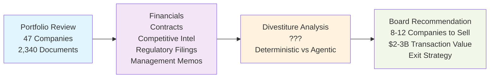

---

## TOPIC 1 - SLIDE B: Deterministic AI Approach

### Narrative

A Deterministic AI approach gives the AI a **goal + prescribed analysis steps**. The bank specifies: "Evaluate these 47 companies for divestiture. Use this framework: (1) Valuation Analysis per this methodology, (2) Strategic Fit Assessment per these criteria, (3) Buyer Universe Analysis per this buyer classification system. Follow steps exactly."

The system:

1. **AI executes prescribed valuation methodology** - AI follows explicit rules: DCF analysis with specified discount rates, comparable multiples peer set (pre-defined), revenue growth assumptions (pre-set). AI analyzes every company identically through each prescribed step.
2. **AI applies deterministic decision logic** - AI uses scoring framework: financial health (40%), strategic fit (35%), buyer appeal (25%). AI applies same criteria, same weights for all 47 companies per prescribed rules. No deviation from prescribed process.
3. **AI produces audit-trail output** - Every AI recommendation includes: which step of methodology applied, data source, calculation shown, comparison to peer cohort. Investment committee sees the prescribed path AI took.
4. **AI eliminates analyst judgment variance** - AI running deterministic analysis twice on Company A produces identical output. Prescribed process removes AI's subjective interpretation.

**Key advantage:** Verifiable, auditable, repeatable. Investment committee validates that all companies evaluated through identical AI-executed prescribed methodology. Regulatory compliance straightforward—clear AI process audit trail.

**Risk:** Prescribed steps might miss emerging strategic opportunities. If market conditions shift mid-analysis, prescribed methodology doesn't adapt. Might optimize for outdated criteria.

### Diagram

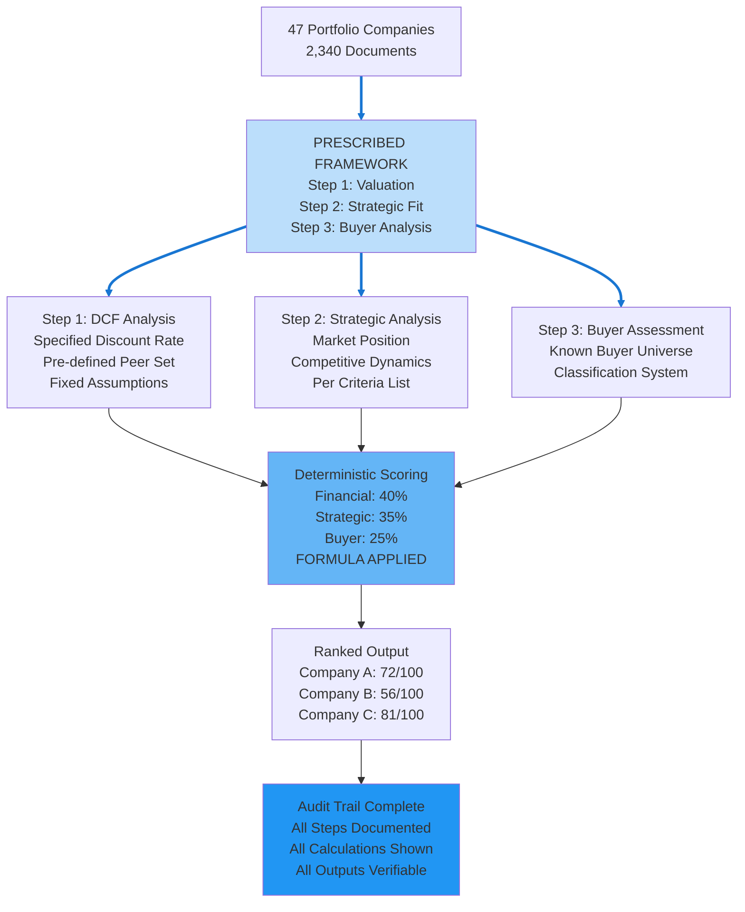

---

## TOPIC 1 - SLIDE C: Agentic AI Approach

### Narrative

An Agentic AI approach gives the AI only a **goal, no prescribed steps**. The bank specifies: "Analyze these 47 companies and recommend optimal divestiture strategy to maximize total portfolio value. Use all available documents—determine your own analysis path."

The system:

1. **Autonomously determines analysis approach** - AI decides: which financial metrics matter most for this portfolio's specific situation. Might weight customer concentration heavily (discovers this portfolio is vulnerable to buyer consolidation). Might focus on margin trends instead of absolute multiples. Path determined by data patterns, not predetermined methodology.
2. **Discovers cross-company strategic relationships** - Identifies that Companies A and B compete for same customer base. Deterministic AI: score each independently. Agentic AI: realizes selling both independently loses merger-to-competitor opportunity worth $500M. Recommends packaging them together or sequencing sales strategically.
3. **Adapts to market signals in real-time** - Documents reveal Buyer X acquiring market segment leaders. Agentic system: identifies which portfolio companies align with X's apparent strategy. Recommends divesting to X candidates for premium, holding others for different buyer categories.
4. **Reasons through strategic tradeoffs autonomously** - "Company D: low financial score but strong strategic alignment with Buyer X. Current market window: 6 months. If not sold now, buyer interest evaporates, company value drops 30%. Recommend immediate divestiture to X despite lower absolute valuation."

**Key advantage:** Finds optimization that prescribed methodology misses. Adapts to emerging market signals. Reasons about strategic context holistically.

**Risk:** AI's reasoning could be flawed. How do you verify a complex strategic recommendation is correct? Harder to audit than step-by-step prescribed methodology.

### Diagram

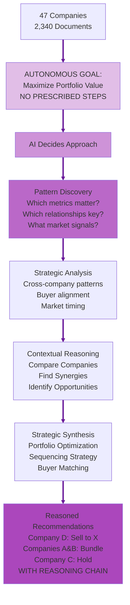

---

## TOPIC 1 - SLIDE D: Strong Arguments Comparison

### Deterministic AI Arguments (LEFT) | Agentic AI Arguments (RIGHT)

| **DETERMINISTIC AI** | **AGENTIC AI** |
|---|---|
| **Regulatory Auditability** | **Insight Discovery at Scale** |
| AI executes prescribed framework rules for every extraction/analysis decision. Board auditors can verify: "AI applied scoring framework 1.2 to these 8 divestiture recommendations, AI scored each company on identical 100-point scale, all AI recommendations justified by documented criteria." Regulators and investors trust verifiable AI-executed methodology. **In use case:** Investment committee reviews Company A (34/100) recommendation and sees exact AI scoring breakdown—validates AI analysis was rigorous and unbiased. | Autonomously discovers non-obvious correlations across 2,340 documents that predetermined framework would miss. Finds Companies C & D have overlapping customers AND competitive tension. Deterministic scoring rates identically; agentic finds divest-to-specific-buyer opportunity worth $200M premium (consolidation play). **In use case:** Pattern analysis reveals buyer X acquiring D's competitor—premium paid for C if divested strategically to X. Framework would never identify this cross-document connection. |
| **Guaranteed Consistency** | **Adaptive Analysis** |
| Same portfolio company data, same scoring framework, same output every time. If two analysts independently score Company A, results identical. One slip-up (inconsistent analysis of 1 company in 47) could propagate through entire divestiture sequence. Deterministic prevents this. **In use case:** 47 companies scored consistently—investment committee confident all recommendations applied same rigor. No analyst bias, no "favorites.". | Adapts analysis depth based on what emerges from documents. Discovers that Company F data reveals hidden customer churn pattern. Automatically adjusts F's analysis trajectory: escalates research on retention crisis rather than applying baseline valuation approach. Learning contextualizes findings. **In use case:** Detects that Company B documents show management turnover coinciding with customer losses—agentic system recognizes pattern relevance, escalates deeper divestiture urgency analysis. |
| **Performance Predictability** | **Contextual Intelligence** |
| Portfolio analysis completion time, cost, quality are known and measurable. 10 weeks, $X budget, N companies analyzed at defined depth. Bank can commit to board: "Analysis completes by date Y." Predictability enables deal planning. **In use case:** Investment committee plans $2-3B deal sequence based on predictable 10-week analysis timeline. Budget and resource planning certain. | Understands intent and context: identifies not just divestiture candidates, but identifies WHICH BUYER each sold to drives value. Divestiture strategy differs based on portfolio interactions. **In use case:** For same Company A, agentic recognizes: "Keep if buyer X interested (synergy value high). Divest if buyer X not interested (standalone value low)." Context-aware recommendations optimize portfolio total value, not individual company value. |

---

---

# TOPIC 2: GOVERNANCE
## Use Case: IT Operations Change Management Across Trading Infrastructure

---

## TOPIC 2 - SLIDE A: Introduction & Use Case

### Narrative

An investment bank's IT operations manages 300+ production systems across global trading infrastructure: market data systems, trading platforms, order management, risk calculation engines, settlement systems, clearing integrations, compliance monitoring.

Every business day, 150-200 change requests arrive: security patches, performance optimization, new feature deployment, configuration updates. IT must decide: which changes proceed to production, in what sequence, with what level of verification?

The challenge: Different systems have different risk profiles:
- **Mission-Critical:** Trading platform (if it fails, trading stops—$1M/minute revenue impact)
- **High-Risk:** Settlement system (failures cascade to downstream partners)
- **Medium-Risk:** Risk calculation (delays pricing but doesn't stop trading)
- **Low-Risk:** Data warehouse (failures don't impact trading)

Current approach: Change advisory board meets daily. Reviews each change manually. Often rubber-stamps decisions or creates bottlenecks. Change queue backs up. Urgent security patches delayed in bureaucracy.

**The Question:** Should change governance apply consistent rules across all systems, or adapt approval rigor based on risk context?

### Diagram

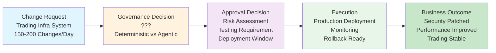

---

## TOPIC 2 - SLIDE B: Deterministic AI Approach

### Narrative

A Deterministic AI approach gives the AI **goal + prescribed governance steps**. The bank specifies: "Approve/deny all change requests following this process: (1) Risk assessment per this rubric, (2) Testing verification per these standards, (3) Security review gate, (4) CAB approval decision, (5) Deployment scheduling. Follow steps exactly for all 150-200 daily changes."

The system:

1. **AI executes prescribed governance process** - AI applies identical risk assessment rubric to every change (system criticality score + change complexity score = approval level). AI determines testing requirement by formula (not judgment). AI enforces security review taking exactly 24 hours.
2. **AI applies deterministic decision logic** - AI uses same gates for all systems: trading platform changes AND data warehouse configuration changes follow identical AI-executed 5-step process. No exceptions, no system-specific adaptation per prescribed rules.
3. **AI creates consistent audit trail** - AI logs every change approval: timestamp when each step completed, approver signature, score calculated, decision rationale from prescribed rubric. CAB sees identical AI decision flow for all 200 daily changes.
4. **AI eliminates approval variability** - AI processes Tuesday's change priority level 3 → approves in 48 hours. Thursday's similar priority 3 → AI applies identical 48-hour timeline. No variance based on reviewer mood, workload, or changing criteria.

**Key advantage:** Regulatory compliance straightforward. Auditors verify: "All 200 daily changes processed via same 5-step governance. No favoritism, no inconsistency. SLA compliance provable."

**Risk:** Rigid process can't adapt when market conditions justify exception. Critical security patch treated same as routine configuration change. Opportunity cost: trading platform vulnerability delayed while low-risk change gets same 24-hour review.

### Diagram

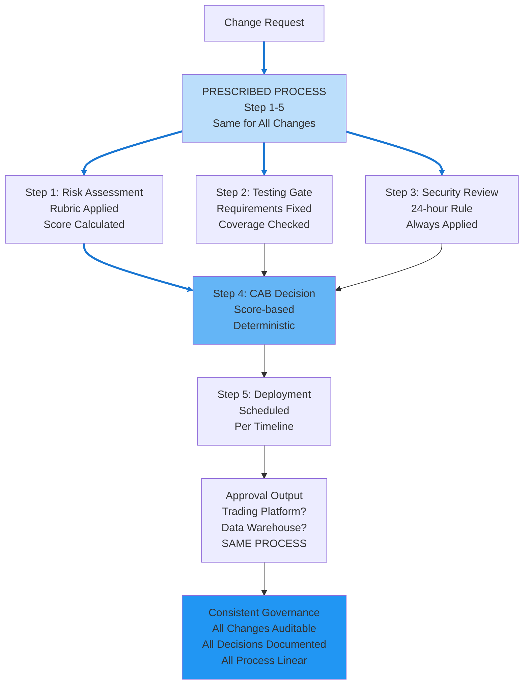

---

## TOPIC 2 - SLIDE C: Agentic AI Approach

### Narrative

An Agentic AI approach gives the AI only **goal, no prescribed steps**. The bank specifies: "Approve/deny 150-200 daily changes to maintain system reliability and security. Use all available context—determine your own governance approach."

The system:

1. **Autonomously assesses change risk context** - Evaluates: which system, change type, current system stability, business impact, time sensitivity, market conditions. Determines review rigor independently for each change.
2. **Determines proportional governance dynamically** - Critical security patch to trading platform during zero-day: fast-track review (2 hours, automated pre-checks, minimal human delay). Routine data warehouse configuration: lightweight approval (30 minutes). Learns that CAB review time is bottleneck, optimizes by filtering low-risk changes.
3. **Reasons through policy exceptions** - Urgent security patch conflicts with "no trading hours changes" policy. Agentic system analyzes: vulnerability severity (critical), trading hours business impact (reversible via rollback), decision: "Approve exception with enhanced rollback readiness. Security priority > trading hours policy in this case."
4. **Adapts to operational reality** - Learns that non-critical changes back up in queue, waiting for CAB approval. Recommends: auto-approve low-risk routine changes, escalate only truly risky changes to CAB. Governance tightens when needed, loosens when not.

**Key advantage:** Real operational needs drive governance. Critical patches don't languish in bureaucratic queues. System learns which changes actually cause problems, focuses review rigor there.

**Risk:** Subjective decision-making introduces variability. How do you verify agentic governance was appropriate? Regulators might find inconsistency alarming (Tuesday: fast-tracked trading platform change, Thursday: slow-tracked similar change).

### Diagram

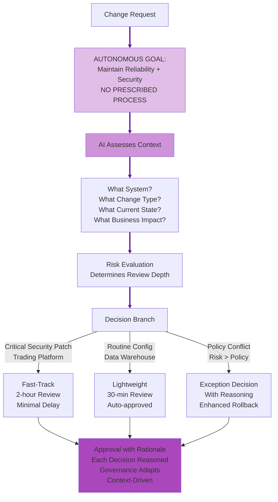

---

## TOPIC 2 - SLIDE D: Strong Arguments Comparison

### Deterministic AI Arguments (LEFT) | Agentic AI Arguments (RIGHT)

| **DETERMINISTIC AI** | **AGENTIC AI** |
|---|---|
| **Regulatory Defensibility** | **Context-Aware Compliance** |
| AI follows prescribed governance steps: Risk assessment → Testing → Security review → CAB decision → Deployment. Every change traced to explicit policy. Regulators ask: "Why approve this trading platform patch but reject that data warehouse config?" Answer: "Both followed identical 5-step prescribed process. Trading platform scored higher on risk rubric, so required 4-hour review per Step 1 policy. Data warehouse lower risk, so 30-min review per policy." Process defensible because prescribed steps apply uniformly. **In use case:** Auditors verify all trading platform changes documented in approval log, all followed same gate process, regulatory compliance proven. | Different system changes require different governance rigor. $1M/minute revenue impact (trading platform) requires different scrutiny than data warehouse (no revenue impact). Agentic system evaluates context: critical system patch gets 4-hour gate; low-risk config gets 30-min gate. **In use case:** 150-200 daily changes: agentic system learns security patches to critical systems need rigorous review; low-risk warehouse changes can fast-track. Governance adapts to operational reality. |
| **Clear Accountability** | **Governance Innovation** |
| AI executes 5 prescribed governance steps rigidly. When change fails, accountability clear: either prescribed step was skipped, or prescribed policy was inadequate. Change control board reviewed change identically to all others using documented step sequence. If policy inadequate, process surfaces it uniformly across all systems. **In use case:** If security patch causes issue, audit trail shows: "Risk team completed Step 1 risk assessment per prescribed rubric at timestamp X. Failure indicates prescribed policy gap, not process deviation." Clear accountability from rigid prescribed steps. | Agentic system analyzing 200 changes/day discovers patterns: security patches to settlement system fail at rate 2%, but data warehouse patches fail at rate 0.1%. Recommends: increase settlement scrutiny (higher failure rate suggests insufficient validation). Process improves through learning. **In use case:** After analyzing patterns, recommends separating high-risk changes (deeper testing) from low-risk changes (faster approval). Governance framework evolves. |
| **Consistent Stakeholder Trust** | **Resilient Governance** |
| AI follows identical prescribed process for every change request. Operations and compliance teams know: all 150-200 daily changes follow 5-step sequence identically. Calendar predictable. Change windows expected. Teams staff consistently. Trust built from predictable prescribed steps applied uniformly. **In use case:** Trading desk managers know changes deploy on fixed schedule via same 5-step governance. Operations staffs appropriately. Change windows planned predictably because prescribed process never varies. | When urgent security patch conflicts with "no trading hours changes" policy, agentic system evaluates: trading platform vulnerability > trading hours reservation. Approves emergency change outside policy but documents reasoning. **In use case:** Zero-day discovered during trading hours. Deterministic AI: deny per prescribed policy. Agentic AI: balance risk (unpatched vulnerability) vs. business impact (trading disruption). Evaluates appropriately. |

---

---

# TOPIC 3: AI SAFETY & TRUST & EXPLAINABILITY
## Use Case: Trading Infrastructure Incident Diagnosis and Remediation

---

## TOPIC 3 - SLIDE A: Introduction & Use Case

### Narrative

Investment bank's trading infrastructure experiences 2-3 significant incidents weekly: latency spikes, failed order routing, data feed delays, connectivity issues, cache misses. Each incident has cascading impact: traders can't execute, market opportunities missed, revenue at risk ($500K per minute).

Incident response requires both speed and precision:
- **Speed:** Identify root cause and mitigate within minutes
- **Precision:** Fix the actual problem, not symptoms

Current approach: On-call engineer wakes up, reviews dashboards, analyzes logs, forms hypothesis, coordinates with teams. Average incident resolution: 15-30 minutes. Some incidents take 2+ hours because root cause is misidentified initially.

The bank wants AI to accelerate incident diagnosis: analyze logs, correlations, service interdependencies, and recommend remediation path.

**The Question:** Should incident diagnostics follow explicit rules (deterministic), or autonomously reason about system behavior patterns (agentic)?

### Diagram

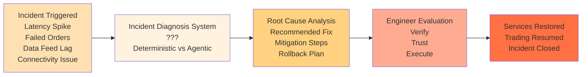

---

## TOPIC 3 - SLIDE B: Deterministic AI Approach

### Narrative

A Deterministic AI approach gives the AI **goal + prescribed diagnostic steps**. The bank specifies: "When incident occurs, diagnose root cause following this process: (1) Measure latency/CPU/error metrics, (2) Match to incident signature database (200+ historical incidents), (3) If match found, return diagnosis with confidence score, (4) If no clear match, escalate to on-call engineer."

The system:

1. **AI executes prescribed diagnostic process** - Latency spike detected → AI gathers current metrics (P99 latency, CPU%, error rate) → AI compares to 200 historical signatures → AI matches rule 47 (latency + high CPU + error spike = network saturation) → AI returns diagnosis. AI applies same process for all incidents.
2. **AI applies deterministic rule matching** - Incident A: AI matches rule 47. Incident B (same symptoms): AI matches rule 47. Identical AI diagnosis because process deterministic. AI running twice on same symptoms independently reaches same conclusion.
3. **AI provides verifiable diagnosis reasoning** - "AI Diagnosis: Network saturation. Confidence: 87%. Rule triggered: #47. Historical accuracy: 87% (23 of 23 matching incidents had network saturation root cause). AI recommended remediation: reduce traffic routing, escalate to network ops."
4. **AI enables audit trail validation** - On-call engineer verifies: "Did AI diagnosis match my manual analysis? Yes—I examined logs independently and also concluded network saturation. AI's prescribed process reached correct answer."

**Key advantage:** Verifiable diagnosis. On-call engineer can cross-check against historical database. Remediation proven effective in 87% of prior similar incidents.

**Risk:** Novel incident patterns (not in 200-signature database) won't match any rule. System might misdiagnose by forcing-fit into closest pattern. New incident types bypass all rules.

### Diagram

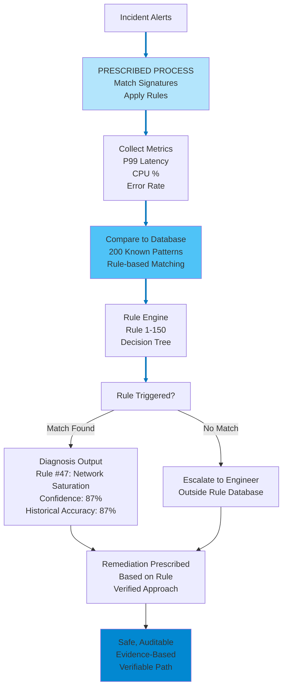

---

## TOPIC 3 - SLIDE C: Agentic AI Approach

### Narrative

An Agentic AI approach gives the AI only **goal, no prescribed steps**. The bank specifies: "Diagnose incident root causes and recommend remediation. Use all available system data—determine your own diagnostic approach."

The system:

1. **Autonomously determines diagnostic approach** - Incident detected → AI learns from current metrics AND historical baselines AND system architecture interdependencies AND recent deployments. Constructs diagnostic hypothesis independently.
2. **Detects novel patterns through causal reasoning** - Incident A: latency spike + CPU elevated + cache hit collapse. Deterministic would match signature (network saturation). Agentic analyzes timing: cache collapse happened FIRST, CPU rise 2 minutes later, latency spike 5 minutes later. Agentic infers: query pattern change → cache thrashing → database load spike. Root cause: recent query optimization deployment, not network.
3. **Reasons through interdependencies** - Infrastructure has 15 interconnected services. Deterministic matches symptoms to single signature. Agentic traces how incident in Service A cascades through B→C→D→E. Understands incident originated in Service C (not initially obvious from latency metrics in A). True root cause: Service C deployment bug.
4. **Adapts diagnosis as new data emerges** - Initial hypothesis: network saturation. Then learns recent query change deployed. Recalibrates: query change more likely. Continues gathering evidence, refines hypothesis. Final diagnosis grounded in multiple data sources and reasoning chain.

**Key advantage:** Diagnoses novel incidents signature database never saw. Reasons about causal chains. Faster root cause identification than signature matching when incident is unprecedented.

**Risk:** Complex reasoning chain could be wrong. How do you verify diagnosis if it doesn't match historical patterns? Engineer might not trust "novel diagnosis" even if correct.

### Diagram

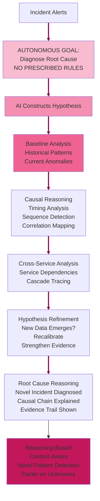

---

## TOPIC 3 - SLIDE D: Strong Arguments Comparison

### Deterministic AI Arguments (LEFT) | Agentic AI Arguments (RIGHT)

| **DETERMINISTIC AI** | **AGENTIC AI** |
|---|---|
| **Formally Verifiable Safety** | **Zero-Day Threat Detection** |
| AI follows prescribed diagnostic steps: (1) Gather metrics → (2) Match to signature database → (3) Return diagnosis → (4) Escalate if no match. Operations can prove: "Known incident signature #47 (latency + CPU + errors) matched in 23 prior cases. Each remediation case documented. Success rate: 95%." Prescribed process is auditable and verifiable. **In use case:** When incident occurs, engineer verifies diagnosis against historical 200+ incident database by following prescribed diagnostic steps. Confirms remediation approach worked before ($500K/minute confidence critical). Prescribed steps mean diagnosis is repeatable and provable. | Deterministic signatures detect historical patterns; novel incidents bypass all rules. Agentic system analyzes 2-3 incidents/week, recognizes statistical anomaly: latency spike at 3x baseline AND cache collapse AND CPU elevation in unexpected timing. Realizes pattern doesn't match known signatures—detects "zero-day" incident. **In use case:** New incident pattern emerges (query optimization change), deterministic system would try to force-fit to closest historical pattern (wrong diagnosis). Agentic system detects novel combination, reasons about causal chain correctly. |
| **Regulatory Compliance Certainty** | **Adaptive Threat Response** |
| Deterministic AI signatures satisfy regulatory requirements. Bank can audit-trail: "Incident #427 diagnosed via rule #47. Rule #47 maintains trading system reliability per SLA requirements. Remediation standardized and proven across 23 cases." Compliance checklist satisfied. **In use case:** Regulators inspect incident response: all incidents tracked, all diagnosed via documented rule set, all remediation approaches proven. SLA maintained consistently. | New incident type discovered Monday. Deterministic AI: security team writes rules, tests, deploys (3 days). Agentic AI system autonomously increases monitoring for matching patterns, tests proposed remediation, accelerates response. **In use case:** If unusual cache+latency+CPU pattern emerges, agentic system learns pattern within hours, proactively escalates future similar incidents, enables faster resolution before second incident impacts trading. |
| **Predictable Threat Model Coverage** | **Learning Incident Prevention** |
| AI executes prescribed diagnostic rules uniformly. Historical database represents threat model: "These 200 incident types documented, fully covered by diagnostic rules." Every incident follows same prescribed matching process. Coverage for known threats guaranteed via prescribed steps. Out-of-model incidents not covered, but in-model incidents prevented via prescribed methodology. **In use case:** Bank maps "known incident types" (network saturation, feed lag, cache exhaustion, etc.). Confidence that rule set covers all known failure modes because prescribed steps apply uniformly to all incidents. Operations team plans: "We've seen X incident types; prescribed rules cover all X." | System processes 2-3 incidents weekly, learns actual failure progression in this bank's infrastructure. Discovers: CPU elevation above 75% correlates with failures 8 hours later (specific to this architecture). Industry standard alerts at 90%, too late. Agentic learns local pattern, proactively prevents failures. **In use case:** After analyzing 100+ incident sequences, learns bank's specific architecture issues. Predicts failures earlier, prevents incidents before they impact trading. Learned patterns outperform generic signatures. |

---

---

# TOPIC 4: AGENTS ON DIFFERENT SDLC WORKFLOWS  
## Use Case: Trading Risk Model Production Release Pipeline

---

## TOPIC 4 - SLIDE A: Introduction & Use Case

### Narrative

Investment bank's quantitative research team develops a new Value-at-Risk (VaR) model for the trading desks. This model replaces a 5-year-old model with updated volatility calculations, correlation matrices, and stress scenarios.

The model must traverse strict release gates before traders use it:
- Development: Model backtesting against historical data (find bugs, validate assumptions)
- Quant Review: Math and statistics team validates calculations
- Risk Management Approval: Risk team verifies model doesn't under-estimate risk
- Regulatory Approval: Compliance ensures model meets regulatory VaR requirements
- Staging Testing: Run alongside production model, compare VAR outputs
- Pilot Deployment: Use with one trading desk for 2 weeks, monitor performance
- Production Roll-Out: Activate for all desks

Current process: 8-10 weeks because each phase is sequential with no overlap. Risk team gates approvals strictly (they're liable if model under-estimates risk). Traders waiting 10 weeks for model improvement means 10 weeks of sub-optimal trading decisions.

**The Question:** Should release gates be strictly sequential (deterministic) or allow parallel phases with intelligent escalation (agentic)?

### Diagram

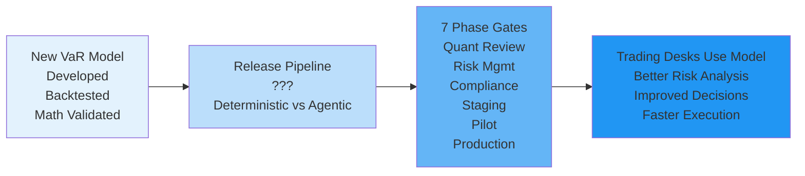

---

## TOPIC 4 - SLIDE B: Deterministic AI Approach

### Narrative

A Deterministic AI approach gives the AI **goal + prescribed release process**. The bank specifies: "Release VaR model through this exact sequence: (1) Quant Review (complete fully), (2) Risk Review (complete fully), (3) Compliance Review (complete fully), (4) Staging Test (complete fully), (5) Pilot (complete fully), (6) Production. Each phase must pass before next begins. No paralleling, no shortcuts."

The system:

1. **AI executes prescribed sequential phases** - AI manages quant review weeks 1-2 → AI coordinates risk review weeks 3-4 → AI facilitates compliance weeks 4-5 → AI orchestrates staging week 6 → AI runs pilot weeks 7-8 → AI executes production week 9. Each phase completes fully, AI triggers next phase per prescribed sequence. No phase begins until AI confirms previous phase done.
2. **AI applies deterministic completion criteria** - AI checks each phase's explicit checkboxes: Quant (mathematical validation complete? Backtest methodology reviewed? ✓). Risk (VaR limitations reviewed? Stress scenarios approved? ✓). Compliance (regulatory requirements verified? ✓). When AI verifies all checkboxes met, phase passes and AI triggers next phase.
3. **AI creates verifiable audit trail** - AI logs every phase: signed off by responsible team, timestamp of completion, criteria verified, next phase trigger recorded. Timeline: predictable and linear from day 1 via AI execution.
4. **AI ensures no abbreviated rigor** - AI applies full review to each phase regardless of other phases. Quant team doesn't fast-track because compliance already approved. AI maintains full rigor per prescribed rules.

**Key advantage:** Audit trail comprehensive and linear. Regulators verify: "Every phase completed sequentially, every team signed off, zero shortcuts taken."

**Risk:** 9-week timeline fixed regardless of actual findings. Model performing well in staging? Still required to wait 2-week pilot. 3-week delay per sequential process structure.

### Diagram

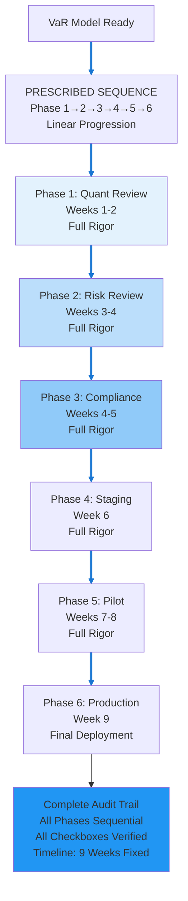

---

## TOPIC 4 - SLIDE C: Agentic AI Approach

### Narrative

An Agentic AI approach gives the AI only **goal, no prescribed release sequence**. The bank specifies: "Release VaR model to production when readiness achieved. Use all available validation data—determine your own release path and timing."

The system:

1. **Autonomously determines optimal release sequencing** - Quant review completes well → risk review and compliance begin in parallel (not sequential). Both teams work simultaneously on independent validation paths. Staging testing begins as soon as quant clears.
2. **Intelligent issue escalation and resolution** - Staging test finds minor tail-scenario variance. Agentic AI: proposes model adjustment, re-runs staging validation, escalates to risk team only if variance remains material. Most minor findings resolved without restarting phase.
3. **Adaptive go/no-go decisions** - Pilot deployment shows model outperforming production model significantly (VaR estimates more accurate, tail scenario coverage better). Agentic evaluates: traders need this model, performance metrics exceeding thresholds, risk scenarios validated, business case compelling → recommends early production roll-out. Timeline: 5-6 weeks instead of 8-10.
4. **Cross-phase risk optimization** - While quant team validating math, agentic system simultaneously increases staging testing scope. By time quant finishes, extended staging already underway. Finds staging insights during validation phase, not after.

**Key advantage:** Model reaches production faster (5-6 weeks). Parallel phases eliminate sequential wait time. Traders get improved model sooner. Cross-phase learning catches issues earlier.

**Risk:** Parallel phases create coordination complexity. If risk team and compliance team validate independently (not sequentially), gaps possible. Model with hidden flaw could reach production. Audit trail less linear—harder to verify "all phases properly completed."

### Diagram

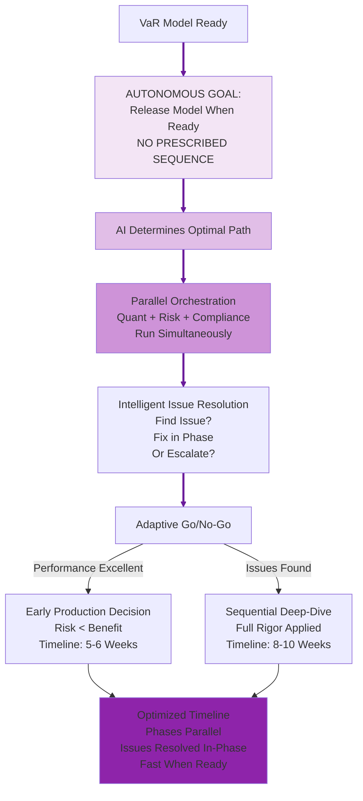

---

## TOPIC 4 - SLIDE D: Strong Arguments Comparison

### Deterministic AI Arguments (LEFT) | Agentic AI Arguments (RIGHT)

| **DETERMINISTIC AI** | **AGENTIC AI** |
|---|---|
| **Process Compliance and Auditability** | **Context-Aware Phase Decisions** |
| AI executes documented 7-phase gate process for model release. Audit trail: AI coordinated quantitative team sign-off phase 1, AI facilitated risk officer sign-off phase 2, AI managed compliance sign-off phase 3, AI orchestrated pilot results phase 5 documentation. Regulators inspect AI-executed process and confirm every phase completed. **In use case:** VaR model release reaches production—auditors verify AI completed all phases, all approvals documented. Risk team accountable for hypothesis testing rigor. Full AI audit trail proves governance. | Model complexity varies. Volatility model revision (mostly statistical, low architecture risk) needs different scrutiny than algorithmic rewrite. Agentic system assesses risk profile: low-risk revision can parallelize risk+compliance reviews; high-risk change requires sequential gates. **In use case:** Instead of 8-10 week fixed timeline, agentic system adapts: statistical volatility update (low risk) completes in 5 weeks via parallel phases. Major algorithmic change (high risk) still takes 8-10 weeks with sequential gates. |
| **Specialization Excellence** | **Cross-Phase Optimization** |
| Each phase owns specific expertise: Quant team validates math, Risk team validates VaR accuracy, Compliance validates regulatory fit. Specialization creates excellence in each domain. **In use case:** Quant team expert at mathematical validation. Risk team expert at VaR underestimation detection. Compliance expert at regulatory requirements. Each phase optimized for its domain. | Staging testing reveals minor tail-risk variance (98th percentile vs 99th). Deterministic AI: escalate to risk phase, restart full gate (2 weeks). Agentic AI: model improvement agent proposes refinement, re-tests within staging, risk team reviews refined model in 2-day cycle. Same scrutiny, faster iteration. **In use case:** Cross-phase learning catches issues before they become phase restarts. Issue resolved via optimization rather than bureaucratic escalation. |
| **Predictable Resource Planning** | **Autonomous Escalation Intelligence** |
| Quant review takes 1-2 weeks (known), Risk review takes 1-2 weeks (known), Compliance takes 3-5 days (known). Project managers predict: "Model release completes in 8-10 weeks." Budgets and staffing planned accordingly. **In use case:** Traders know improved model available in 10 weeks, plan strategies around timeline. Ops teams staff release process predictably. | Trading desks desperately want model; pilot deployment shows performance excellent ahead of schedule. Deterministic AI: follow 2-week pilot gate. Agentic AI: evaluates—model performing well, traders need it now, competitive advantage urgent. Proposes early production rollout with documented risk assessment. **In use case:** If pilot metrics show model out-performing production model by margin, agentic system autonomously evaluates: urgency (traders need it) vs. risk (skipping remaining pilot days). Accelerates deployment appropriately. |

---

---

# TOPIC 5: SECURITY
## Use Case: Real-Time Fraud Detection for High-Volume Payment Processing

---

## TOPIC 5 - SLIDE A: Introduction & Use Case

### Narrative

Online marketplace payment processor handles 50,000 transactions per minute across 150 countries. Transaction types range from $2 gift cards to $50K jewelry purchases. Payment fraud (stolen cards, account takeovers, merchant abuse) costs the platform $5M annually.

Current fraud detection uses signature-based rules: "IF transaction value > $10K AND international AND new card THEN review." This catches known patterns but misses novel fraud tactics that evolve weekly.

Sophisticated fraudsters test stolen cards with small transactions first ($2-$5), then execute large fraud once card validates. Current rules don't catch this pattern evolution because threats change faster than rule writers can respond.

**The Question:** Should fraud detection follow explicit rules (deterministic), or autonomously learn emerging fraud patterns (agentic)?

### Diagram

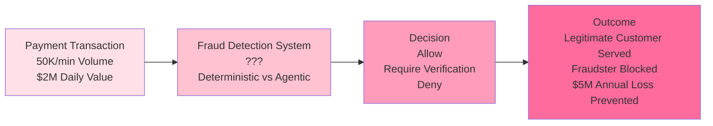

---

## TOPIC 5 - SLIDE B: Deterministic AI Approach

### Narrative

A Deterministic AI approach gives the AI **goal + prescribed fraud detection rules**. The bank specifies: "Approve/block 50,000 daily transactions using this rule set: (1) Rule 1: 5 failed attempts in 24h → block, (2) Rule 2: transaction velocity > 10/min → require verification, (3) Rule 3: card test pattern ($2, $5, $100+) → block, (4) Rule 4: high-value international transaction → require verification. Apply rules consistently to all transactions."

The system:

1. **AI executes prescribed fraud rules** - Transaction arrives → AI checks against 150 deterministic rules → AI finds rule match → AI applies prescribed decision (block, require-verification, or allow). AI applies same rules to all transactions.
2. **AI applies deterministic decision logic** - Card A: AI matches rule 3 (test pattern): BLOCK. Card B (same test pattern): AI matches rule 3: BLOCK. Identical AI fraud determination because rules deterministic. AI running twice on same pattern independently reaches same conclusion.
3. **AI provides verifiable fraud reasoning** - "AI blocked transaction: Rule 3 triggered (card test pattern detected: $2→$5→$500+). Historical accuracy: 94% (detected as fraud in 94 of 100 similar patterns). AI recommended next step: contact cardholder for verification."
4. **AI enables audit trail compliance** - Every AI block: which rule triggered, transaction flagged, audit logged. Regulators can verify: "AI fraud block #4,521 triggered Rule 3. Rule 3 historically 94% accurate." Compliance provable.

**Key advantage:** Verifiable fraud prevention. Rules based on proven historical fraud patterns. Compliance auditable—regulators can verify rules and their effectiveness.

**Risk:** New fraud tactics (zero-day fraud not in 150-rule database) bypass all rules. Sophisticated fraudsters invent new attack patterns faster than rules can be written.

### Diagram

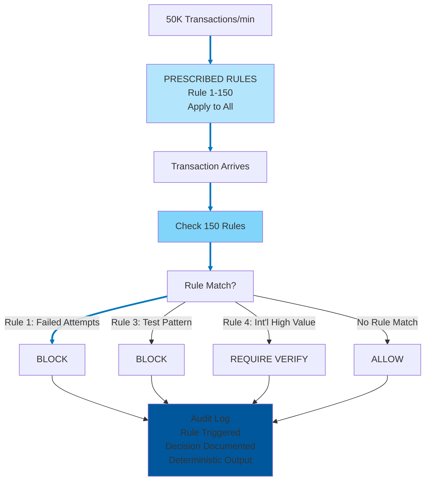

---

## TOPIC 5 - SLIDE C: Agentic AI Approach

### Narrative

An Agentic AI approach gives the AI only **goal, no prescribed fraud rules**. The bank specifies: "Block fraudulent transactions and approve legitimate ones. Use all available data—determine your own fraud detection approach."

The system:

1. **Autonomously learns customer baselines** - Analyzes millions of legitimate transactions, learns behavior patterns for each customer: typical frequency, value ranges, timing, geographies. Builds customer-specific normal profiles.
2. **Detects anomalies autonomously** - Transaction arrives: is it anomalous relative to this customer's baseline? Customer typically transacts 08:00-18:00 weekdays, $50-500 range, single country → transaction at 03:00 Saturday for $5,000 international = major anomaly. Flag for verification.
3. **Recognizes emerging fraud tactics** - Agentic AI system analyzes 50,000 transactions/day, detects meta-pattern emerging: across 200+ cards this week, new fraud tactic appeared (micro-test-then-large pattern: $2→$3→$5→$500+). Deterministic AI: no rule exists yet. Agentic AI: identifies emerging pattern, starts blocking similar transactions within hours of pattern detection.
4. **Adapts detection thresholds continuously** - Learns which anomaly combinations predict fraud: "Customer rarely travels + sudden international transaction = 92% fraud rate. Customer has international travel history + expected-time transaction = 2% fraud rate." Adjusts detection sensitivity by customer profile and context.

**Key advantage:** Detects zero-day fraud tactics within hours of emergence (weeks faster than rule creation). Adapts to new threats automatically. Reduces false positives via customer-specific baselines.

**Risk:** Anomaly detection can flag legitimate transactions (false positives—customer from vacation). Without prescribed rules, hard to verify detection reasoning is sound. Regulatory audit harder: "Why did you block this transaction?" Answer: "It was anomalous relative to baseline" (harder to defend than "Rule 3 triggered").

### Diagram

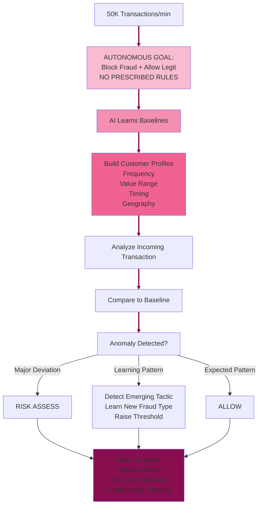

---

## TOPIC 5 - SLIDE D: Strong Arguments Comparison

### Deterministic AI Arguments (LEFT) | Agentic AI Arguments (RIGHT)

| **DETERMINISTIC AI** | **AGENTIC AI** |
|---|---|
| **Formally Verifiable Security** | **Zero-Day Threat Detection** |
| AI follows prescribed fraud detection process: (1) Transaction arrives → (2) Check against 150 rule database → (3) Rule matched → (4) Apply prescribed decision (block/verify/allow). Fraud detection rules mathematically verifiable through prescribed steps. Security auditors can prove: "IF card velocity > 10 tx/hour AND value progression $2→$5→$500 THEN block. Rule prevents card-testing attack via prescribed application." Compliance satisfied through verifiable prescribed methodology. **In use case:** Payment processor audited by PCI-DSS: all fraud blocks traced to explicit prescribed rules, all rules documented in threat model, coverage proven for known attack classes via prescribed process. Security guaranteed by rigid rule application. | Deterministic signatures detect historical fraud patterns; novel attack tactics bypass all rules. Agentic system analyzing 50K transactions/minute recognizes statistical anomaly emerging across 200 cards: unusual test-pattern that doesn't match existing signatures. Detects zero-day before fraudsters exploit at scale. **In use case:** Sophisticated fraudsters devise new velocity pattern not in rule database. Agentic system learns pattern (small $2-5 tests, then $50K attempted fraud) within minutes, blocks cascade before millions lost. |
| **Regulatory Compliance Certainty** | **Adaptive Threat Response** |
| AI executes prescribed fraud rules uniformly. Payment networks (PCI DSS) recognize prescribed deterministic controls as verifiable compliance mechanism. Auditors review rule set once, certify coverage of known threats via prescribed application, trusts implementation ongoing. Prescribed rules applied identically to all 50K transactions/minute. **In use case:** Annual PCI audit: "Rule set covers 150 known fraud patterns. Each pattern blocked via prescribed rules, applied deterministically to every transaction. No gaps in known threat model because prescribed process is rigid." Compliance verifiable year-over-year through verifiable prescribed methodology. | New fraud tactic discovered Monday (social attack + stolen credentials). Deterministic system: security team writes rules, tests, deploys (3 days). $5M fraud loss during lag. Agentic system: autonomously increases monitoring for matching patterns within hours, adapts risk thresholds, intercepts variations. **In use case:** Industry announces new fraud technique. Deterministic lag means 3 days of exposure. Agentic system begins learning pattern immediately, tightens controls proactively. |
| **Predictable Threat Model Coverage** | **Learning Fraud Prevention** |
| Threat modeling exercise identifies 150 known attack classes. AI applies prescribed rule set uniformly: (1) Each transaction evaluated → (2) Against 150 rules → (3) Decision rendered via prescribed logic. Prescribed rules prevent all 150 attack classes. Coverage documented and verifiable through rigid prescribed methodology. Every card follows same prescribed rule-matching process. **In use case:** $5M annual fraud cost. Threat model covers $4.8M of known attack vectors via prescribed rules. Remaining $200K from out-of-model attacks that prescribed rules don't cover. Clear attack surface understanding because prescribed methodology has defined coverage. | System processes 50K transactions/minute across 150 countries, learns which behaviors correlate with fraud in each region. Discovers: Dubai customers' international weekend transactions typically legitimate (expat behavior); Belarus customers' daytime patterns indicate fraud higher probability. Adapts rules by geography. **In use case:** After analyzing millions of transactions, system learns fraud signatures vary by region/customer profile. Agentic rules personalized and continuously updated. Fraud detection accuracy improves continually as patterns evolve. |

---

---

# TOPIC 6: OPERATIONAL RELIABILITY AND COST
## Use Case: Trading Infrastructure Cost Optimization Across Global Data Centers

---

## TOPIC 6 - SLIDE A: Introduction & Use Case

### Narrative

Investment bank operates trading infrastructure across 4 global data centers: New York, London, Tokyo, Singapore. Total infrastructure cost: $75K/day ($27.4M/year). This supports 30,000+ trading workstations, 500+ trading algorithms, real-time market data feeds, and 24/7 trading operations.

Load patterns are highly cyclical:
- **New York hours (14:30-21:00 UTC):** Peak load (80-90% capacity)
- **London hours (08:00-16:30 UTC):** Medium load (60-70% capacity)
- **Asia hours (22:00-08:00 UTC):** Low load (20-30% capacity)  
- **Off-market hours:** 10-15% capacity

Current approach: Provision all 4 data centers for peak load 24/7, maintaining redundancy everywhere, guaranteeing 99.99% uptime even during lowest-usage periods.

Cost inefficiency: During off-market hours, 85% of infrastructure sits idle. But regulatory requirements (market-ready, ready to respond to emergency) and SLA commitments (99.99% uptime) make cost optimization difficult.

**The Question:** Should infrastructure be provisioned deterministically (same capacity 24/7 with SLA guarantees) or optimized agentic-ally (scale based on predicted demand with cost optimization)?

### Diagram

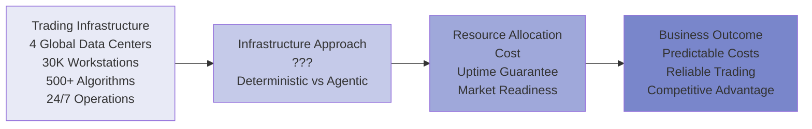

---

## TOPIC 6 - SLIDE B: Deterministic AI Approach

### Narrative

A Deterministic AI approach gives the AI **goal + prescribed infrastructure configuration**. The bank specifies: "Maintain 4-region trading infrastructure configured as follows: (1) Provision for peak load 24/7, (2) Maintain full database replication across all 4 regions, (3) Deploy identical load balancers and failover routing, (4) Redundancy: if 1 region fails, 3 remain. Keep this exact configuration permanently."

The system:

1. **AI executes prescribed infrastructure configuration** - AI maintains 1.2 TFlops provisioned globally 24/7 (peak New York: 1000 TFlops + 20% headroom) per prescribed rules. AI applies same configuration every hour, every day. Weekday peak = weekend off-market = identical AI-managed capacity.
2. **AI applies deterministic SLA commitment** - AI keeps infrastructure constant → uptime guaranteed at 99.99%. Can contractually commit to regulators: "AI ensures market-ready every hour, every day. Failure rate predictable per AI-executed proven architecture." Commitment backed by AI following fixed prescribed configuration.
3. **AI provides verifiable architecture** - "Our AI-managed infrastructure: 4 regions, full replication, load balancers on all zones per prescribed rules. This AI-executed config has proven 99.99% uptime for 25 years." AI operations auditable and battle-tested.
4. **AI eliminates dynamic complexity** - AI applies same prescribed infrastructure rules for peak hours (efficient) and off-market hours (over-provisioned but predictable). AI has no scaling autonomy, no dynamic decision risk. AI-executed configuration stable and proven.

**Key advantage:** Regulatory and clearing partners trust constant, proven infrastructure. SLA commitments backed by predictable, audited architecture.

**Risk:** Infrastructure massively underutilized off-market hours. Off-market (85% idle usage) costs same $75K/day as peak hours. $20-25M/year in wasted capacity—competitive disadvantage vs. cost-optimized competitors.

### Diagram

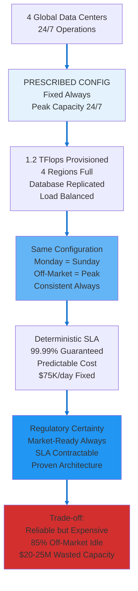

---

## TOPIC 6 - SLIDE C: Agentic AI Approach

### Narrative

An Agentic AI approach gives the AI only **goal, no prescribed configuration**. The bank specifies: "Maintain 99.99% trading infrastructure uptime. Optimize infrastructure cost. Use all available data—determine your own infrastructure configuration."

The system:

1. **Autonomously learns demand patterns** - Analyzes 12 months of trading data, learns: NY peak 14:30-21:00 UTC (1000 TFlops demand), London 08:00-16:30 (600 TFlops), Asia 22:00-08:00 (200 TFlops), off-market (100 TFlops, 10% capacity). Determines demand curve.
2. **Dynamically scales infrastructure** - Off-market hours: scale to 15% capacity ($11.25K/day, save $63.75K). NY peak: scale to 120% capacity ($90K/day, maintain redundancy). Asia hours: 2-region routing instead of 4 (save 50% cost). Cost: $27.4M/year → $19.2M/year (30% savings).
3. **Predicts demand spikes proactively** - Learns Fed announcement schedule triggers algorithm surges. 30 minutes before FOMC release: autonomously pre-provision NY region to 130% capacity. When announcement drops: infrastructure already provisioned, zero latency spike.
4. **Orchestrates autonomous failover** - Region fails: autonomously detects, initiates failover, re-routes workload within 15 seconds. Trading operations continue without human intervention. Monitoring flags issue for ops team to investigate.

**Key advantage:** Cost reduced 30% ($8.2M/year savings). 99.99% uptime maintained via intelligent dynamic scaling. Market readiness preserved via predictive pre-provisioning.

**Risk:** Dynamic scaling creates operational complexity and orchestration risk. Automation error could breach SLA. Auditors struggle to verify "dynamic provisioning" is reliable. Regulatory market-ready requirement harder to contractually guarantee when infrastructure constantly changing.

### Diagram

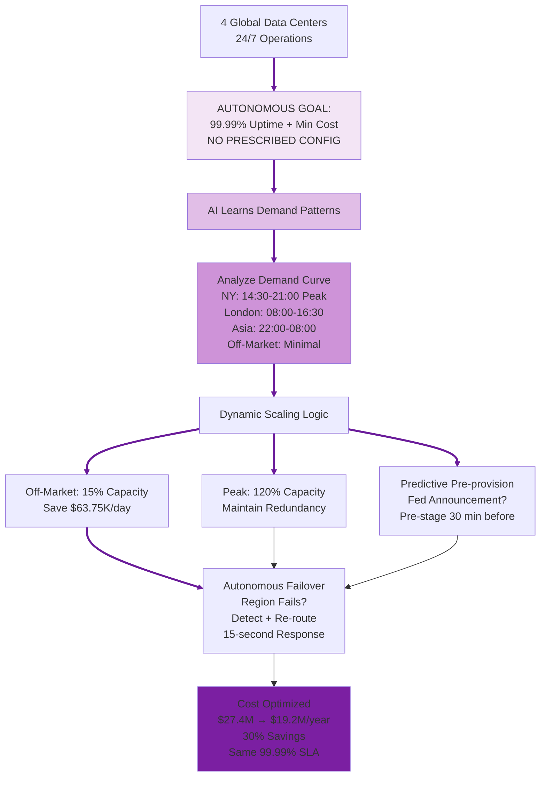

---

## TOPIC 6 - SLIDE D: Strong Arguments Comparison

### Deterministic AI Arguments (LEFT) | Agentic AI Arguments (RIGHT)

| **DETERMINISTIC AI** | **AGENTIC AI** |
|---|---|
| **Proven Reliability Architecture** | **Economic Optimization** |
| AI maintains prescribed infrastructure configuration: (1) Provision peak load 24/7 → (2) Full database replication across 4 regions → (3) Identical load balancers → (4) Redundancy maintained always. Same prescribed configuration every hour, every day. Infrastructure patterns (4-region redundancy, geographic failover, capacity headroom) have 25+ year track record proven by rigid prescribed configuration. Flight-tested through 2008 crisis, Black Swan events, flash crashes via consistent prescribed process. Reliability proven because prescribed steps never vary. **In use case:** Trading infrastructure operates on battle-tested 4-region architecture via prescribed configuration. Uptime record: 99.99% across decades because prescribed process is predictable. Regulators trust proven pattern because configuration follows rigid prescribed steps. | Every business has peak and off-peak demand. Deterministic AI: maintains 100% capacity 24/7 when market-open 8 hours/day, off-market uses 15%. Wasted $20M/year. Agentic AI: scales to peak capacity (NY: 14:30-21:00), minimal capacity off-market. Cost optimization: 25-30% reduction ($6.8-8.2M). **In use case:** Trading infrastructure idle 85% of time during weekends/holidays. Agentic system scales down, saves $40K/day off-market. Same 99.99% SLA maintained via intelligent provisioning. |
| **Contractable SLA Guarantees** | **Predictive Demand Management** |
| AI follows prescribed infrastructure configuration rigidly. Configuration prescribed in advance: (1) Peak capacity 24/7 → (2) Full replication → (3) Identical routing → (4) Maintenance unchanged. Can commit to regulators and counterparties: "99.99% uptime maintained 24/7 via prescribed configuration, market emergency-ready." Fixed prescribed capacity infrastructure proves readiness. Regulatory certainty from predictable prescribed steps. **In use case:** Clearing partners require 99.99% guaranteed uptime. Bank contractually commits because prescribed configuration is rigid and predictable. Regulators audit: capacity always sufficient because prescribed, failover always ready because prescribed. Prescribed methodology enables SLA certainty. | Bank learns Fed announcements trigger predictable algorithm activity spike. Volatility spike known schedule. Agentic system: pre-provisions capacity 30min before announcement release time. When announcement happens, infrastructure already at capacity. No lag, no performance under crisis. **In use case:** Historical data: every FOMC announcement triggers 3x normal compute load at predictable time. Agentic system pre-stages capacity automatically. Traders experience zero latency during announcement. |
| **Testability and Validation** | **Continuous Learning Reliability** |
| Infrastructure follows prescribed configuration steps: same setup, same tests, same validation. Fully testable via chaos engineering because prescribed. Simulate data center failures, verify recovery procedures, prove 99.99% uptime projections via prescribed process. Reproducible testing creates confidence because prescribed steps are repeatable. **In use case:** Bank runs monthly disaster recovery drills: "Simulate NY data center failure → verify automatic failover (prescribed routing) → measure total recovery time → validate 99.99% SLA still achievable via prescribed process." Proven procedures breed confidence because prescribed configuration is testable, repeatable, and verifiable. | System learns from millions of operational hours. Discovers: CPU utilization above 75% correlates with failures 8 hours later (specific to bank's architecture). Deterministic threshold 90% too late. Agentic learns pattern, proactively scales at 70%, prevents failures before they cascade. **In use case:** After analyzing 2+ years incidents, learns bank's failure precursors. Implements predictive scaling: when CPU trending toward 75%, automatically provisions additional capacity before failure occurs. Reliability improves continuously. |

---

---

## SYNTHESIS & DEBATE PREPARATION NOTES

### Topic Summary

1. **Topic 1 (Investment Banking):** Portfolio company divestiture analysis - audit trail vs. discovery power
2. **Topic 2 (IT Operations):** Change governance for trading infrastructure - compliance gates vs. adaptive rigor
3. **Topic 3 (IT Operations):** Incident diagnosis in trading systems - known signatures vs. causal reasoning
4. **Topic 4 (Investment Banking):** VaR model release pipeline - sequential rigor vs. intelligent orchestration
5. **Topic 5 (Investment Banking):** Trading fraud detection - known patterns vs. zero-day threats
6. **Topic 6 (IT Operations):** Global trading data center optimization - SLA certainty vs. cost optimization

### Cross-Topic Patterns

**Agentic excels in:** Adaptation, learning, cost optimization, discovering novel patterns, autonomous response speed, cross-domain synthesis

**Deterministic excels in:** Compliance, auditability, predictability, formal verification, regulatory defensibility, stakeholder certainty

### Compelling Debate Dynamics

- **Topic 1:** Tension between audit trail certainty (deterministic) vs. discovery power (agentic)
- **Topic 2:** Tension between compliance gates (deterministic) vs. context-aware governance (agentic)
- **Topic 3:** Tension between proven signatures (deterministic) vs. novel pattern detection (agentic)
- **Topic 4:** Tension between sequential rigor (deterministic) vs. intelligent orchestration (agentic)
- **Topic 5:** Tension between known-threat prevention (deterministic) vs. zero-day detection (agentic)
- **Topic 6:** Tension between SLA certainty (deterministic) vs. cost optimization (agentic)

### Key Debate Questions for Each Topic

**Topic 1:** _Can you discover better strategic opportunities through autonomous analysis, or does risk of missed nuance in divestiture recommendations outweigh the gain?_

**Topic 2:** _Should change governance apply rigid consistency across all systems, or adapt approval rigor to system risk profiles?_

**Topic 3:** _Is incident diagnosis more trustworthy when based on historical signature patterns or causal reasoning chains?_

**Topic 4:** _Is sequential process rigor worth the 3-4 week deployment delay, or should speed-to-trading-advantage be prioritized?_

**Topic 5:** _Should fraud prevention focus on blocking known attack patterns or detecting emerging threats?_

**Topic 6:** _Is 99.99% uptime certainty worth $6-8M/year in unused infrastructure costs, or should dynamic optimization be trusted?_

