# Debate Slide Preparation: Agentic vs Deterministic AI
## 6-Topic Series with Use Case Scenarios

**Purpose:** Detailed slide content for debate series  
**Format:** 4 slides per topic (A: Introduction, B: Deterministic Approach, C: Agentic Approach, D: Arguments)  
**Date:** February 20, 2026

---

# TOPIC 1: INFORMATION PROCESSING
## Use Case: Investment Bank Portfolio Company Divestiture Analysis

---

## TOPIC 1 - SLIDE A: Introduction & Use Case

### Narrative

A top-tier investment bank has assembled a $8B portfolio of 47 portfolio companies. Market conditions have shifted, and the bank needs to identify the optimal divestiture strategy: which companies to divest, which to hold, which to sell to competitors, which to merge.

The challenge: The bank has collected 2,340 documents across all 47 companies: financial statements (5 years), customer contracts, supplier agreements, competitive intelligence, regulatory filings, management presentations, board materials, acquisition memos from when companies were bought. 

An associate team has 10 weeks to synthesize this into a divestiture recommendation: which 8-12 companies should be sold, in what sequence, to which buyer categories, and why. The recommendation will drive $2-3B in transactions.

Current approach: 8 senior analysts spend 10 weeks reading documents, making notes, performing manual analysis. Analysis quality varies—some analysts find critical risks, others miss patterns. Recommendations often reflect analyst biases rather than systematic findings.

**The Question:** Which approach better identifies the strategic fit and exit opportunities buried across 2,340 documents?

### Diagram

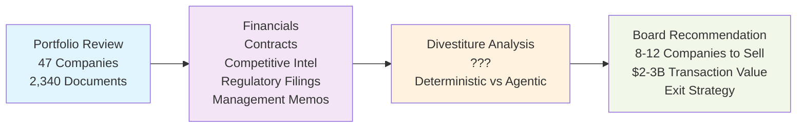

---

## TOPIC 1 - SLIDE B: Deterministic AI Approach

### Narrative

A deterministic approach uses predefined analysis frameworks grounded in investment banking methodology. The system:

1. **Applies standardized valuation and fit analysis** - Evaluates each company against explicit criteria: revenue growth runway, EBITDA margin vs. peer set, customer concentration, market position, regulatory headwinds, synergy potential with peer companies in portfolio
2. **Creates consistent divestiture scoring** - Every company scored identically: financial health (40% weighting), strategic fit (35%), buyer attractiveness (25%). Scoring transparent and replicable.
3. **Builds audit trail** - Every recommendation includes: valuation data source, scoring rationale, comparative peer data, exit window assessment. Investment committee can verify analysis rigor.
4. **Ensures consistency** - Two similar portfolio companies with similar profiles receive similar divestiture recommendation (both hold or both divest), eliminating analyst bias

**Key advantage:** Investment committee can validate the analysis is systematic and objective. Institutional knowledge captured in the scoring framework can be applied to future portfolio decisions. Peer comparison validates recommendations.

**Risk:** Predefined criteria might miss strategic nuances—a company might be "low score" on paper but have hidden strategic value that deterministic scoring doesn't capture.

### Diagram

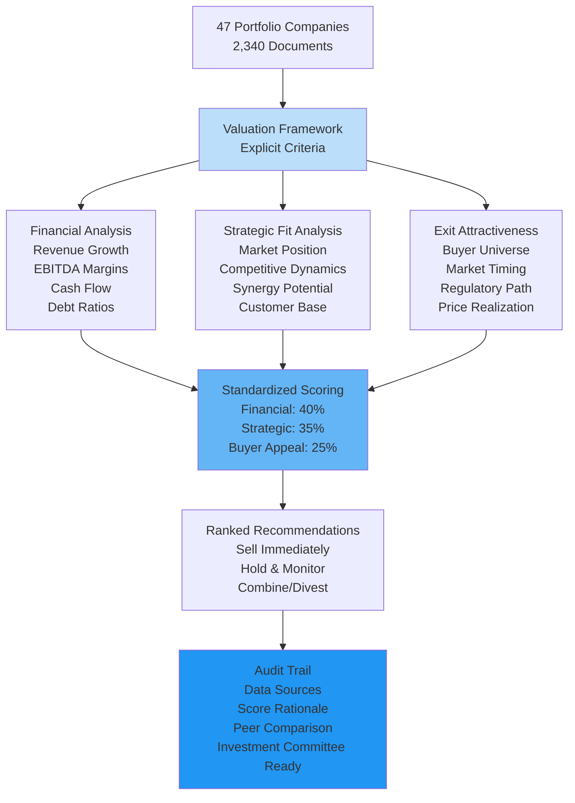

---

## TOPIC 1 - SLIDE C: Agentic AI Approach

### Narrative

An agentic approach treats portfolio analysis as strategic discovery and synthesis. The system:

1. **Autonomously discovers strategic patterns** - Reads all documents and identifies recurring themes, business model tensions, and competitive positioning without predefined categories
2. **Identifies hidden strategic relationships** - Discovers that Company A and Company B have overlapping customer bases with conflicting contract terms—creating either divestiture urgency or merger opportunity. Deterministic scoring wouldn't capture this cross-document insight.
3. **Synthesizes market context** - Learns from market intelligence documents that Buyer Category X is increasingly interested in specific market verticals. Identifies which portfolio companies align with emerging buyer interests.
4. **Explains strategic reasoning** - "Company D is exit candidate because: (1) customer contracts show increasing churn, (2) competitor positioned better, (3) buyer X has stated interest in this vertical but will pay premium for market share consolidation. Exit window: 18 months before market shift makes valuation difficult."

**Key advantage:** Discovers strategic insights that scoring frameworks miss. Identifies opportunities (merger, divest-to-specific-buyer) that emerge from cross-company pattern analysis.

**Risk:** Complex reasoning might miss financial details that deterministic analysis would flag consistently.

### Diagram

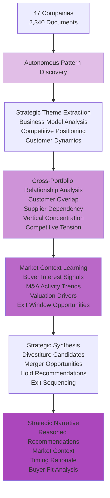

---

## TOPIC 1 - SLIDE D: Strong Arguments Comparison

### Deterministic Arguments (LEFT) | Agentic Arguments (RIGHT)

| **DETERMINISTIC** | **AGENTIC** |
|---|---|
| **Regulatory Auditability** | **Insight Discovery at Scale** |
| Every extraction/analysis decision traced to explicit framework rules. Board auditors can verify: "These 8 divestiture recommendations followed scoring framework 1.2, each company scored on identical 100-point scale, all recommendations justified by documented criteria." Regulators and investors trust verifiable methodology. **In use case:** Investment committee reviews Company A (34/100) recommendation and sees exact scoring breakdown—validates analysis was rigorous and unbiased. | Autonomously discovers non-obvious correlations across 2,340 documents that predetermined framework would miss. Finds Companies C & D have overlapping customers AND competitive tension. Deterministic scoring rates identically; agentic finds divest-to-specific-buyer opportunity worth $200M premium (consolidation play). **In use case:** Pattern analysis reveals buyer X acquiring D's competitor—premium paid for C if divested strategically to X. Framework would never identify this cross-document connection. |
| **Guaranteed Consistency** | **Adaptive Analysis** |
| Same portfolio company data, same scoring framework, same output every time. If two analysts independently score Company A, results identical. One slip-up (inconsistent analysis of 1 company in 47) could propagate through entire divestiture sequence. Deterministic prevents this. **In use case:** 47 companies scored consistently—investment committee confident all recommendations applied same rigor. No analyst bias, no "favorites.". | Adapts analysis depth based on what emerges from documents. Discovers that Company F data reveals hidden customer churn pattern. Automatically adjusts F's analysis trajectory: escalates research on retention crisis rather than applying baseline valuation approach. Learning contextualizes findings. **In use case:** Detects that Company B documents show management turnover coinciding with customer losses—agentic system recognizes pattern relevance, escalates deeper divestiture urgency analysis. |
| **Performance Predictability** | **Contextual Intelligence** |
| Portfolio analysis completion time, cost, quality are known and measurable. 10 weeks, $X budget, N companies analyzed at defined depth. Bank can commit to board: "Analysis completes by date Y." Predictability enables deal planning. **In use case:** Investment committee plans $2-3B deal sequence based on predictable 10-week analysis timeline. Budget and resource planning certain. | Understands intent and context: identifies not just divestiture candidates, but identifies WHICH BUYER each sold to drives value. Divestiture strategy differs based on portfolio interactions. **In use case:** For same Company A, agentic recognizes: "Keep if buyer X interested (synergy value high). Divest if buyer X not interested (standalone value low)." Context-aware recommendations optimize portfolio total value, not individual company value. |

---

---

# TOPIC 2: GOVERNANCE
## Use Case: IT Operations Change Management Across Trading Infrastructure

---

## TOPIC 2 - SLIDE A: Introduction & Use Case

### Narrative

An investment bank's IT operations manages 300+ production systems across global trading infrastructure: market data systems, trading platforms, order management, risk calculation engines, settlement systems, clearing integrations, compliance monitoring.

Every business day, 150-200 change requests arrive: security patches, performance optimization, new feature deployment, configuration updates. IT must decide: which changes proceed to production, in what sequence, with what level of verification?

The challenge: Different systems have different risk profiles:
- **Mission-Critical:** Trading platform (if it fails, trading stops—$1M/minute revenue impact)
- **High-Risk:** Settlement system (failures cascade to downstream partners)
- **Medium-Risk:** Risk calculation (delays pricing but doesn't stop trading)
- **Low-Risk:** Data warehouse (failures don't impact trading)

Current approach: Change advisory board meets daily. Reviews each change manually. Often rubber-stamps decisions or creates bottlenecks. Change queue backs up. Urgent security patches delayed in bureaucracy.

**The Question:** Should change governance apply consistent rules across all systems, or adapt approval rigor based on risk context?

### Diagram

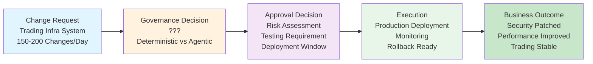

---

## TOPIC 2 - SLIDE B: Deterministic Governance Approach

### Narrative

A deterministic approach implements explicit change governance policies applied consistently across all systems. The system:

1. **Defines standard change control process** - Every change follows same workflow: risk assessment, testing validation (95% coverage required), stakeholder notification, scheduled deployment window, rollback plan documentation
2. **Applies consistent approval criteria** - All changes must meet same gates: security review approval (24 hours), performance impact assessment, deployment window coordination
3. **Clear ownership and audit trail** - Every change has documented approval chain. Change advisory board reviews all changes identically, creating predictable approval behavior.
4. **Prevents system-specific exceptions** - Even trading platform changes follow same process as data warehouse changes, ensuring no privileged fast-track that could bypass safety checks

**Key advantage:** Regulatory and compliance teams trust that all production changes are vetted consistently. Audit trails prove governance rigor. No system gets special treatment that could create risk.

**Risk:** Inflexible process delays critical security patches. Low-risk change (data warehouse configuration) consumes same approval time as critical trading system patch.

### Diagram

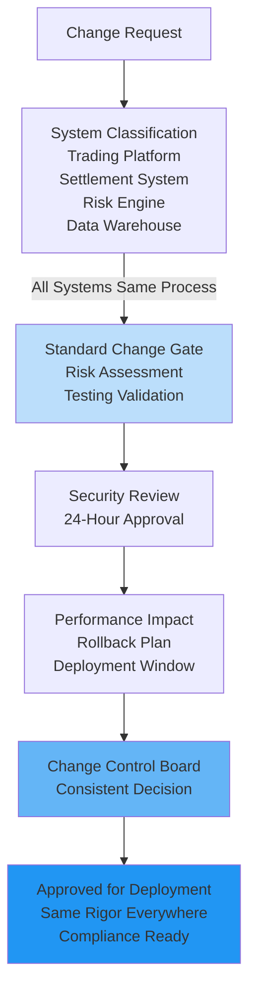

---

## TOPIC 2 - SLIDE C: Agentic Governance Approach

### Narrative

An agentic approach enables the system to reason about change risk and governance context intelligently. The system:

1. **Evaluates system risk profile dynamically** - Assesses the specific change: which system, what type of change, current system stability, market conditions, time sensitivity
2. **Applies proportional governance** - Critical security patch to trading platform: rigorous review (4 hours). Configuration change to data warehouse: lightweight review (30 minutes). Data schema fix to compliance system: medium rigor (2 hours).
3. **Identifies governance optimization** - Learns that non-critical changes frequently back up in change queue. Recommends expedited approval for low-risk changes, freeing capacity for critical ones.
4. **Balances competing frameworks** - When urgent security patch conflicts with "no trading hours changes" policy, reasons through business impact and makes context-aware exception decision

**Key advantage:** Governance adapts to real operational needs. Doesn't delay critical security patches in bureaucracy. Doesn't over-scrutinize low-risk changes.

**Risk:** Regulators might question whether "adaptive governance" truly maintains consistent risk management across all systems.

### Diagram

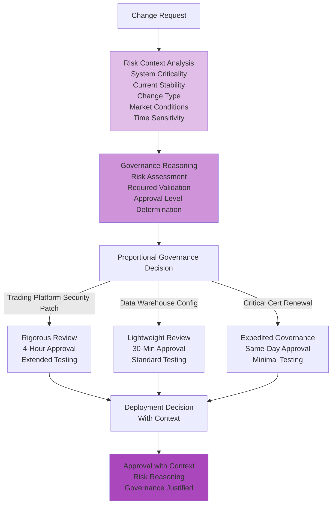

---

## TOPIC 2 - SLIDE D: Strong Arguments Comparison

### Deterministic Arguments (LEFT) | Agentic Arguments (RIGHT)

| **DETERMINISTIC** | **AGENTIC** |
|---|---|
| **Regulatory Defensibility** | **Context-Aware Compliance** |
| Deterministic change policy withstands regulatory scrutiny. Regulators ask: "Why approve this trading platform patch but reject that data warehouse config?" Answer: "Trading platform gets 4-hour rigorous review per policy 2.1. Data warehouse gets 30-min lightweight review per policy 3.4." **In use case:** Auditors verify all trading platform changes documented in approval log, all followed same gate process, regulatory compliance proven. | Different system changes require different governance rigor. $1M/minute revenue impact (trading platform) requires different scrutiny than data warehouse (no revenue impact). Agentic system evaluates context: critical system patch gets 4-hour gate; low-risk config gets 30-min gate. **In use case:** 150-200 daily changes: agentic system learns security patches to critical systems need rigorous review; low-risk warehouse changes can fast-track. Governance adapts to operational reality. |
| **Clear Accountability** | **Governance Innovation** |
| When change fails, accountability clear: policy inadequate or implementation failed. Change control board reviewed change identically to all others. If policy was wrong, process surfaces it across all systems. **In use case:** If security patch causes issue, audit trail shows: "Risk team approved per policy 2.1 at timestamp X. Failure indicates policy inadequacy, not process gap." Clear channel for improvement. | Agentic system analyzing 200 changes/day discovers patterns: security patches to settlement system fail at rate 2%, but data warehouse patches fail at rate 0.1%. Recommends: increase settlement scrutiny (higher failure rate suggests insufficient validation). Process improves through learning. **In use case:** After analyzing patterns, recommends separating high-risk changes (deeper testing) from low-risk changes (faster approval). Governance framework evolves. |
| **Consistent Stakeholder Trust** | **Resilient Governance** |
| Operations and compliance teams know: all changes follow identical process. Calendar predictable. Change windows expected. Teams staff consistently. Trust from predictability. **In use case:** Trading desk managers know changes deploy on fixed schedule. Operations staffs appropriately. Change windows planned predictably. | When urgent security patch conflicts with "no trading hours changes" policy, agentic system evaluates: trading platform vulnerability > trading hours reservation. Approves emergency change outside policy but documents reasoning. **In use case:** Zero-day discovered during trading hours. Deterministic: deny per policy. Agentic: balance risk (unpatched vulnerability) vs. business impact (trading disruption). Evaluates appropriately. |

---

---

# TOPIC 3: AI SAFETY & TRUST & EXPLAINABILITY
## Use Case: Trading Infrastructure Incident Diagnosis and Remediation

---

## TOPIC 3 - SLIDE A: Introduction & Use Case

### Narrative

Investment bank's trading infrastructure experiences 2-3 significant incidents weekly: latency spikes, failed order routing, data feed delays, connectivity issues, cache misses. Each incident has cascading impact: traders can't execute, market opportunities missed, revenue at risk ($500K per minute).

Incident response requires both speed and precision:
- **Speed:** Identify root cause and mitigate within minutes
- **Precision:** Fix the actual problem, not symptoms

Current approach: On-call engineer wakes up, reviews dashboards, analyzes logs, forms hypothesis, coordinates with teams. Average incident resolution: 15-30 minutes. Some incidents take 2+ hours because root cause is misidentified initially.

The bank wants AI to accelerate incident diagnosis: analyze logs, correlations, service interdependencies, and recommend remediation path.

**The Question:** Should incident diagnostics follow explicit rules (deterministic), or autonomously reason about system behavior patterns (agentic)?

### Diagram

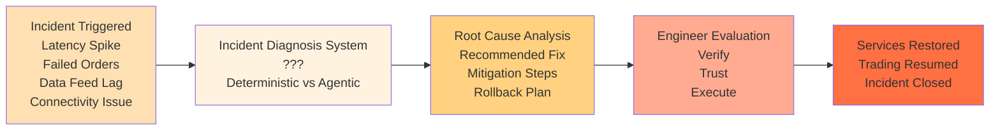

---

## TOPIC 3 - SLIDE B: Deterministic Safety Approach

### Narrative

A deterministic approach implements incident diagnosis using explicit troubleshooting rules based on historical incidents. The system:

1. **Implements known incident signatures** - Database of 200+ historical incidents with root causes: "latency spike + CPU > 80% + error rate spike = network saturation," "failed orders + connection timeouts = feed provider lag," "cache miss pattern = insufficient cache capacity"
2. **Follows explicit decision trees** - If-then logic matching current symptoms to known root causes
3. **Provides transparent diagnosis** - On-call engineer asks "why network saturation?", system responds with: "Rule 47: latency pattern matches P99 latency spike 15 min ago, CPU utilization crossed 80% threshold, error rate increased 10x. Historical incidents matching this signature: 23 occurrences. Root cause distribution: network saturation (65%), feed provider issue (20%), database lock (15%). Most likely cause: network saturation."
4. **Enables verification** - Engineer can cross-reference system's diagnosis against historical incident verdicts

**Key advantage:** On-call engineer can verify diagnosis against known incident patterns. Remediation based on proven historical fixes. Reduces decision-making uncertainty.

**Risk:** Novel incident patterns (not in historical database) won't match any rule. System might misdiagnose by fitting new incident into closest historical pattern.

### Diagram

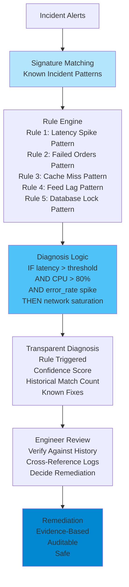

---

## TOPIC 3 - SLIDE C: Agentic Safety Approach

### Narrative

An agentic approach enables the system to autonomously reason about system behavior patterns and diagnose root causes. The system:

1. **Learns system behavior baselines** - Analyzes thousands of incident-free hours, learns what "normal" looks like: typical latency distribution, normal CPU usage patterns, expected error rates, cache hit patterns
2. **Detects behavioral anomalies** - Current state: latency is 3x higher than historical baseline AND CPU utilization is elevated AND cache hit rate collapsed. Anomalies correlate in unexpected way.
3. **Reasons about causal chains** - Analyzes: "When latency spiked past 3x historical, CPU usage followed 2 minutes later. Cache hit rate collapse preceded both. This suggests: query pattern changed → cache eviction → re-hitting database queries → increased CPU → latency spike." Root cause: query pattern change (not network saturation).
4. **Explains diagnosis reasoning** - "Observed pattern doesn't match any historical incident signature, but correlations suggest novel scenario. Root cause analysis indicates query optimization change may have altered access patterns. Recommend: verify recent deployments."

**Key advantage:** Detects novel incident patterns not in historical database. Reasons about causal chains rather than matching signatures. Faster diagnosis for unprecedented scenarios.

**Risk:** Causal reasoning might be incorrect. Complex systems have hidden interdependencies that agentic reasoning could misidentify.

### Diagram

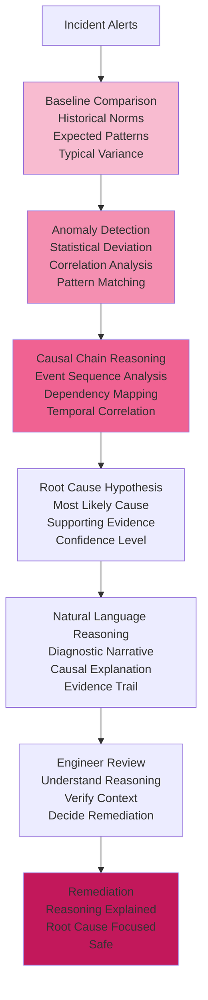

---

## TOPIC 3 - SLIDE D: Strong Arguments Comparison

### Deterministic Arguments (LEFT) | Agentic Arguments (RIGHT)

| **DETERMINISTIC** | **AGENTIC** |
|---|---|
| **Formally Verifiable Safety** | **Zero-Day Threat Detection** |
| Incident diagnosis rules mathematically verifiable. Operations can prove: "Known incident signature #47 (latency + CPU + errors) matched in 23 prior cases. Each remediation case documented. Success rate: 95%." Auditable methodology grounded in proven patterns. **In use case:** When incident occurs, engineer verifies diagnosis against historical 200+ incident database. Confirms remediation approach worked before ($500K/minute confidence critical). | Deterministic signatures detect historical patterns; novel incidents bypass all rules. Agentic system analyzes 2-3 incidents/week, recognizes statistical anomaly: latency spike at 3x baseline AND cache collapse AND CPU elevation in unexpected timing. Realizes pattern doesn't match known signatures—detects "zero-day" incident. **In use case:** New incident pattern emerges (query optimization change), deterministic system would try to force-fit to closest historical pattern (wrong diagnosis). Agentic system detects novel combination, reasons about causal chain correctly. |
| **Regulatory Compliance Certainty** | **Adaptive Threat Response** |
| Deterministic signatures satisfy regulatory requirements. Bank can audit-trail: "Incident #427 diagnosed via rule #47. Rule #47 maintains trading system reliability per SLA requirements. Remediation standardized and proven across 23 cases." Compliance checklist satisfied. **In use case:** Regulators inspect incident response: all incidents tracked, all diagnosed via documented rule set, all remediation approaches proven. SLA maintained consistently. | New incident type discovered Monday. Deterministic: security team writes rules, tests, deploys (3 days). Agentic system autonomously increases monitoring for matching patterns, tests proposed remediation, accelerates response. **In use case:** If unusual cache+latency+CPU pattern emerges, agentic system learns pattern within hours, proactively escalates future similar incidents, enables faster resolution before second incident impacts trading. |
| **Predictable Threat Model Coverage** | **Learning Incident Prevention** |
| Historical database represents threat model: "These 200 incident types documented, fully covered by diagnostic rules." Coverage for known threats guaranteed. Out-of-model incidents not covered, but in-model incidents prevented. **In use case:** Bank maps "known incident types" (network saturation, feed lag, cache exhaustion, etc.). Confidence that rule set covers all known failure modes. Operations team plans: "We've seen X incident types; rules cover all X." | System processes 2-3 incidents weekly, learns actual failure progression in this bank's infrastructure. Discovers: CPU elevation above 75% correlates with failures 8 hours later (specific to this architecture). Industry standard alerts at 90%, too late. Agentic learns local pattern, proactively prevents failures. **In use case:** After analyzing 100+ incident sequences, learns bank's specific architecture issues. Predicts failures earlier, prevents incidents before they impact trading. Learned patterns outperform generic signatures. |

---

---

# TOPIC 4: AGENTS ON DIFFERENT SDLC WORKFLOWS  
## Use Case: Trading Risk Model Production Release Pipeline

---

## TOPIC 4 - SLIDE A: Introduction & Use Case

### Narrative

Investment bank's quantitative research team develops a new Value-at-Risk (VaR) model for the trading desks. This model replaces a 5-year-old model with updated volatility calculations, correlation matrices, and stress scenarios.

The model must traverse strict release gates before traders use it:
- Development: Model backtesting against historical data (find bugs, validate assumptions)
- Quant Review: Math and statistics team validates calculations
- Risk Management Approval: Risk team verifies model doesn't under-estimate risk
- Regulatory Approval: Compliance ensures model meets regulatory VaR requirements
- Staging Testing: Run alongside production model, compare VAR outputs
- Pilot Deployment: Use with one trading desk for 2 weeks, monitor performance
- Production Roll-Out: Activate for all desks

Current process: 8-10 weeks because each phase is sequential with no overlap. Risk team gates approvals strictly (they're liable if model under-estimates risk). Traders waiting 10 weeks for model improvement means 10 weeks of sub-optimal trading decisions.

**The Question:** Should release gates be strictly sequential (deterministic) or allow parallel phases with intelligent escalation (agentic)?

### Diagram

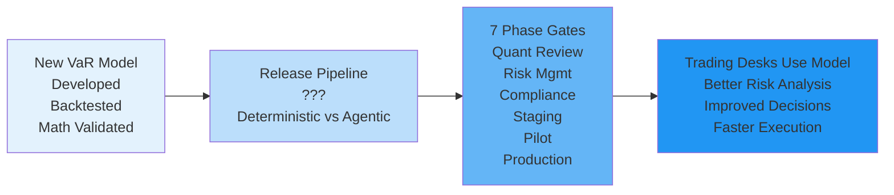

---

## TOPIC 4 - SLIDE B: Deterministic SDLC Workflow

### Narrative

A deterministic approach implements strict phase gates with linear progression. Each phase completes, formal approval happens, next phase begins.

1. **Quant Review Phase** (1-2 weeks) - Quantitative research team validates mathematical correctness, verifies backtest methodology
2. **Risk Management Phase** (1-2 weeks) - Risk officer ensures model doesn't under-estimate VaR, reviews stress scenarios, validates limitations
3. **Compliance Phase** (3-5 days) - Regulatory team verifies model meets regulatory VaR requirements, updates documentation
4. **Staging Testing** (1 week) - Run new model alongside production model, compare output on real historical data
5. **Pilot Deployment** (2 weeks) - One trading desk uses new model with risk manager oversight, production metrics validated
6. **Production Roll-Out** (1 day) - Activate for all desks

Each phase has explicit completion criteria. No advance to next phase without previous phase approval. Trading desks must wait for all phases to complete.

**Key advantage:** Risk team can audit each phase and verify rigor. If model performs poorly post-release, audit trail shows every team signed off on it. Clear accountability.

**Risk:** 8-10 week timeline means traders operate with suboptimal risk model for months. Competitive disadvantage vs. banks with faster release processes.

### Diagram

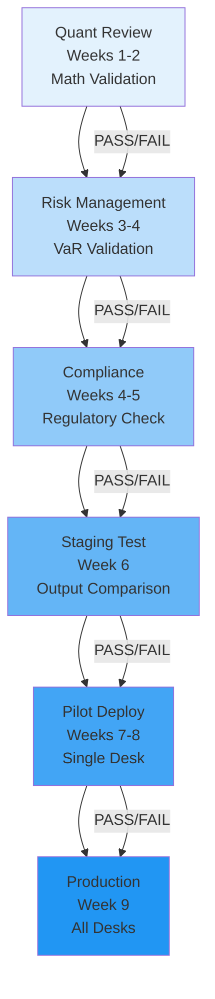

---

## TOPIC 4 - SLIDE C: Agentic SDLC Orchestration

### Narrative

An agentic approach enables intelligent phase orchestration based on findings. The system:

1. **Autonomous phase planning** - Quant review completes successfully -> compliance review can begin in parallel (doesn't need quant to finish). Risk review starts simultaneously with quant review where possible.
2. **Cross-phase optimization** - Staging testing reveals minor output variance in tail scenarios. Rather than escalate full finding to risk team for phase restart, model improvement agent proposes fix, re-tests, iterates. Issue resolved without phase restart.
3. **Intelligent escalation** - Most issues handled autonomously within review teams. Only true showstoppers escalate to next phase gate.
4. **Adaptive gatekeeping** - If pilot deployment shows model performing well ahead of schedule, agent evaluates whether early production roll-out is appropriate (traders need model, performance looks good). Proposes acceleration with documented rationale.

**Key advantage:** Model reaches production in 5-6 weeks instead of 8-10. Traders get better model sooner. Cross-phase learning catches and fixes issues before they become phase blockers.

**Risk:** If agents skip appropriate rigor, model with hidden flaw reaches production. Risk team loses audit trail of "every phase explicitly completed."

### Diagram

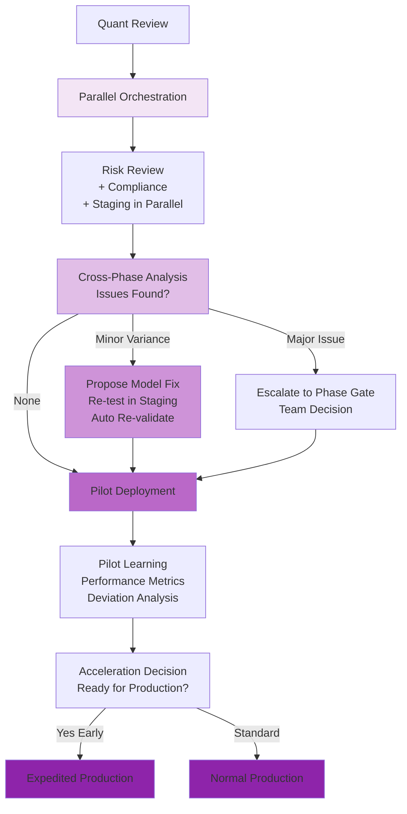

---

## TOPIC 4 - SLIDE D: Strong Arguments Comparison

### Deterministic Arguments (LEFT) | Agentic Arguments (RIGHT)

| **DETERMINISTIC** | **AGENTIC** |
|---|---|
| **Process Compliance and Auditability** | **Context-Aware Phase Decisions** |
| Model release follows documented 7-phase gate process. Audit trail: quantitative team signed off phase 1, risk officer signed off phase 2, compliance signed off phase 3, pilot results phase 5 documented. Regulators inspect process and confirm every phase completed. **In use case:** VaR model release reaches production—auditors verify all phases completed, all approvals documented. Risk team accountable for hypothesis testing rigor. Full audit trail proves governance. | Model complexity varies. Volatility model revision (mostly statistical, low architecture risk) needs different scrutiny than algorithmic rewrite. Agentic system assesses risk profile: low-risk revision can parallelize risk+compliance reviews; high-risk change requires sequential gates. **In use case:** Instead of 8-10 week fixed timeline, agentic system adapts: statistical volatility update (low risk) completes in 5 weeks via parallel phases. Major algorithmic change (high risk) still takes 8-10 weeks with sequential gates. |
| **Specialization Excellence** | **Cross-Phase Optimization** |
| Each phase owns specific expertise: Quant team validates math, Risk team validates VaR accuracy, Compliance validates regulatory fit. Specialization creates excellence in each domain. **In use case:** Quant team expert at mathematical validation. Risk team expert at VaR underestimation detection. Compliance expert at regulatory requirements. Each phase optimized for its domain. | Staging testing reveals minor tail-risk variance (98th percentile vs 99th). Deterministic: escalate to risk phase, restart full gate (2 weeks). Agentic: model improvement agent proposes refinement, re-tests within staging, risk team reviews refined model in 2-day cycle. Same scrutiny, faster iteration. **In use case:** Cross-phase learning catches issues before they become phase restarts. Issue resolved via optimization rather than bureaucratic escalation. |
| **Predictable Resource Planning** | **Autonomous Escalation Intelligence** |
| Quant review takes 1-2 weeks (known), Risk review takes 1-2 weeks (known), Compliance takes 3-5 days (known). Project managers predict: "Model release completes in 8-10 weeks." Budgets and staffing planned accordingly. **In use case:** Traders know improved model available in 10 weeks, plan strategies around timeline. Ops teams staff release process predictably. | Trading desks desperately want model; pilot deployment shows performance excellent ahead of schedule. Deterministic: follow 2-week pilot gate. Agentic: evaluates—model performing well, traders need it now, competitive advantage urgent. Proposes early production rollout with documented risk assessment. **In use case:** If pilot metrics show model out-performing production model by margin, agentic system autonomously evaluates: urgency (traders need it) vs. risk (skipping remaining pilot days). Accelerates deployment appropriately. |

---

---

# TOPIC 5: SECURITY
## Use Case: Real-Time Fraud Detection for High-Volume Payment Processing

---

## TOPIC 5 - SLIDE A: Introduction & Use Case

### Narrative

Online marketplace payment processor handles 50,000 transactions per minute across 150 countries. Transaction types range from $2 gift cards to $50K jewelry purchases. Payment fraud (stolen cards, account takeovers, merchant abuse) costs the platform $5M annually.

Current fraud detection uses signature-based rules: "IF transaction value > $10K AND international AND new card THEN review." This catches known patterns but misses novel fraud tactics that evolve weekly.

Sophisticated fraudsters test stolen cards with small transactions first ($2-$5), then execute large fraud once card validates. Current rules don't catch this pattern evolution because threats change faster than rule writers can respond.

**The Question:** Should fraud detection follow explicit rules (deterministic), or autonomously learn emerging fraud patterns (agentic)?

### Diagram

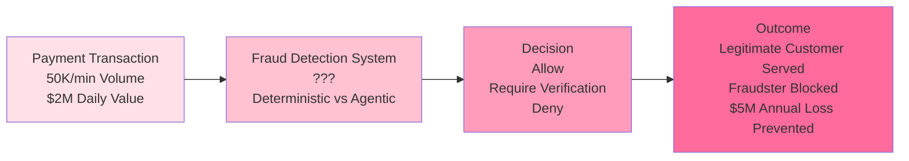

---

## TOPIC 5 - SLIDE B: Deterministic Security Controls

### Narrative

A deterministic approach implements explicit security rules and constraints. The system:

1. **Defines known attack signatures** - Database of fraud patterns discovered historically: "test transaction followed by large transaction = fraud," "multiple card attempts = account takeover," "transaction velocity impossible = card testing"
2. **Implements hard constraints** - Rules based on proven patterns: "Block all transactions on card if 5 failed attempts in 24 hours"
3. **Follows verified security model** - Rules derived from cryptographic security principles and historical attack analysis
4. **Provides audit trail** - Every block includes: which rule triggered, transaction flagged as result, audit logging enables compliance review

**Key advantage:** Formal verification possible. Can prove: "IF rule R is enforced, THEN this attack class P is prevented." Regulatory compliance demonstrated through deterministic controls.

**Risk:** New fraud tactics (not in signature database) will bypass these controls. Zero-day fraud exploits the time gap between attack invention and rule creation.

### Diagram

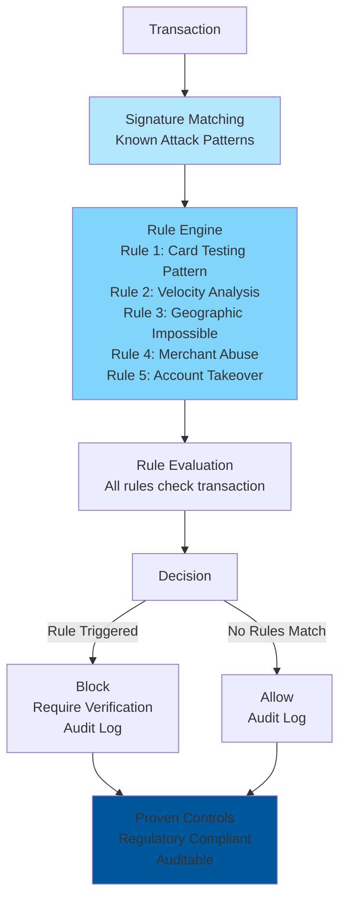

---

## TOPIC 5 - SLIDE C: Agentic Threat Detection

### Narrative

An agentic approach enables the system to detect novel patterns and adapt autonomously. The system:

1. **Learns transaction baselines** - Analyzes thousands of legitimate customer transactions, learns behavior: typical transaction frequency, value ranges, geographies, timing patterns
2. **Detects statistical anomalies** - Identifies transactions that deviate from learned baselines: "This customer never makes transactions before 6am and not on Sundays, but has 12 transactions at 4am Saturday = anomaly"
3. **Recognizes emerging fraud tactics** - Detects the test-small-then-large fraud pattern by analyzing transaction sequences: "This card: $2 transaction, then $3, then $5, then $500. Pattern matches zero-day fraud profile discovered in 200 other cards this week"
4. **Adapts to new threats** - Learns which anomaly patterns predict fraud in real-time and increases detection threshold when new threat signature emerges

**Key advantage:** Detects zero-day fraud that deterministic signatures can't catch. Adapts faster than fraudsters evolve tactics.

**Risk:** Anomaly detection can create false positives ("legitimate customer returning from vacation has unusual pattern"). Harder to verify detection accuracy mathematically.

### Diagram

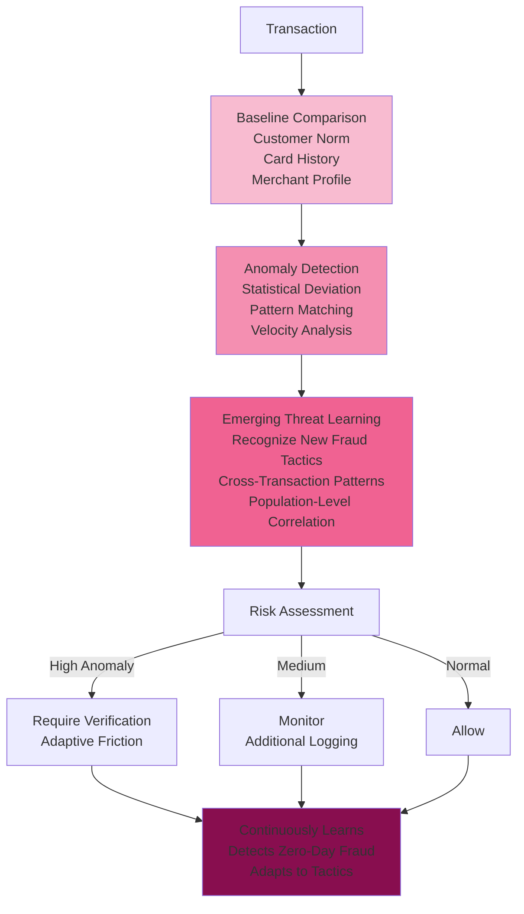

---

## TOPIC 5 - SLIDE D: Strong Arguments Comparison

### Deterministic Arguments (LEFT) | Agentic Arguments (RIGHT)

| **DETERMINISTIC** | **AGENTIC** |
|---|---|
| **Formally Verifiable Security** | **Zero-Day Threat Detection** |
| Fraud detection rules mathematically verifiable. Security auditors can prove: "IF card velocity > 10 tx/hour AND value progression $2→$5→$500 THEN block. Rule prevents card-testing attack." Compliance satisfied. **In use case:** Payment processor audited by PCI-DSS: all fraud blocks traced to explicit rules, all rules documented in threat model, coverage proven for known attack classes. | Deterministic signatures detect historical fraud patterns; novel attack tactics bypass all rules. Agentic system analyzing 50K transactions/minute recognizes statistical anomaly emerging across 200 cards: unusual test-pattern that doesn't match existing signatures. Detects zero-day before fraudsters exploit at scale. **In use case:** Sophisticated fraudsters devise new velocity pattern not in rule database. Agentic system learns pattern (small $2-5 tests, then $50K attempted fraud) within minutes, blocks cascade before millions lost. |
| **Regulatory Compliance Certainty** | **Adaptive Threat Response** |
| Payment networks (PCI DSS) recognize deterministic controls as verifiable compliance mechanism. Auditors review rule set once, certify coverage of known threats, trusts implementation ongoing. **In use case:** Annual PCI audit: "Rule set covers 150 known fraud patterns. Each pattern blocked deterministically. No gaps in known threat model." Compliance verifiable year-over-year. | New fraud tactic discovered Monday (social attack + stolen credentials). Deterministic system: security team writes rules, tests, deploys (3 days). $5M fraud loss during lag. Agentic system: autonomously increases monitoring for matching patterns within hours, adapts risk thresholds, intercepts variations. **In use case:** Industry announces new fraud technique. Deterministic lag means 3 days of exposure. Agentic system begins learning pattern immediately, tightens controls proactively. |
| **Predictable Threat Model Coverage** | **Learning Fraud Prevention** |
| Threat modeling exercise identifies 150 known attack classes (stolen cards, account takeovers, velocity abuse, merchant collusion, etc.). Deterministic rules prevent all 150. Coverage documented and verifiable. **In use case:** $5M annual fraud cost. Threat model covers $4.8M of known attack vectors. Remaining $200K from out-of-model attacks. Clear attack surface understanding. | System processes 50K transactions/minute across 150 countries, learns which behaviors correlate with fraud in each region. Discovers: Dubai customers' international weekend transactions typically legitimate (expat behavior); Belarus customers' daytime patterns indicate fraud higher probability. Adapts rules by geography. **In use case:** After analyzing millions of transactions, system learns fraud signatures vary by region/customer profile. Agentic rules personalized and continuously updated. Fraud detection accuracy improves continually as patterns evolve. |

---

---

# TOPIC 6: OPERATIONAL RELIABILITY AND COST
## Use Case: Trading Infrastructure Cost Optimization Across Global Data Centers

---

## TOPIC 6 - SLIDE A: Introduction & Use Case

### Narrative

Investment bank operates trading infrastructure across 4 global data centers: New York, London, Tokyo, Singapore. Total infrastructure cost: $75K/day ($27.4M/year). This supports 30,000+ trading workstations, 500+ trading algorithms, real-time market data feeds, and 24/7 trading operations.

Load patterns are highly cyclical:
- **New York hours (14:30-21:00 UTC):** Peak load (80-90% capacity)
- **London hours (08:00-16:30 UTC):** Medium load (60-70% capacity)
- **Asia hours (22:00-08:00 UTC):** Low load (20-30% capacity)  
- **Off-market hours:** 10-15% capacity

Current approach: Provision all 4 data centers for peak load 24/7, maintaining redundancy everywhere, guaranteeing 99.99% uptime even during lowest-usage periods.

Cost inefficiency: During off-market hours, 85% of infrastructure sits idle. But regulatory requirements (market-ready, ready to respond to emergency) and SLA commitments (99.99% uptime) make cost optimization difficult.

**The Question:** Should infrastructure be provisioned deterministically (same capacity 24/7 with SLA guarantees) or optimized agentic-ally (scale based on predicted demand with cost optimization)?

### Diagram

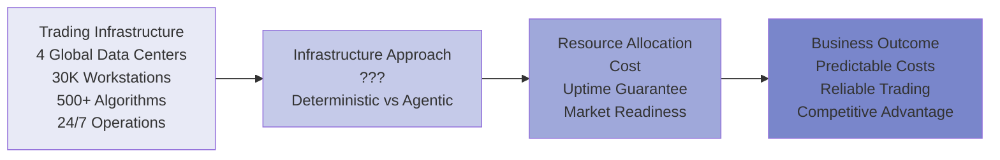

---

## TOPIC 6 - SLIDE B: Deterministic Infrastructure Approach

### Narrative

A deterministic approach provisions infrastructure to handle peak load across all hours with proven, constant architecture. The system:

1. **Calculates peak capacity requirement** - Peak New York trading hours require 1000 TFlops compute, full redundancy across 4 data centers. Provision 1.2 TFlops (20% headroom) globally 24/7.
2. **Implements proven architecture** - Load balancers, failover routing, geographic redundancy, database replication. Same configuration 24 hours a day, 365 days a year.
3. **Guarantees SLA** - With proven infrastructure at constant capacity, can commit: "99.99% uptime guaranteed. Market-ready at all times for regulatory requirements."
4. **Provides predictable cost** - Cost is fixed: $75K/day, $27.4M/year, budgeted and forecasted permanently.

**Key advantage:** Regulatory and compliance teams trust that trading infrastructure can respond to market emergencies (flash crash, regulatory crisis) 24/7. SLAs with clearing partners are contractable. Uptime proven and reliable.

**Risk:** Infrastructure underutilized during off-market hours (85% idle). $20M/year wasted on unused capacity. Competitors who optimize costs undercut on pricing.

### Diagram

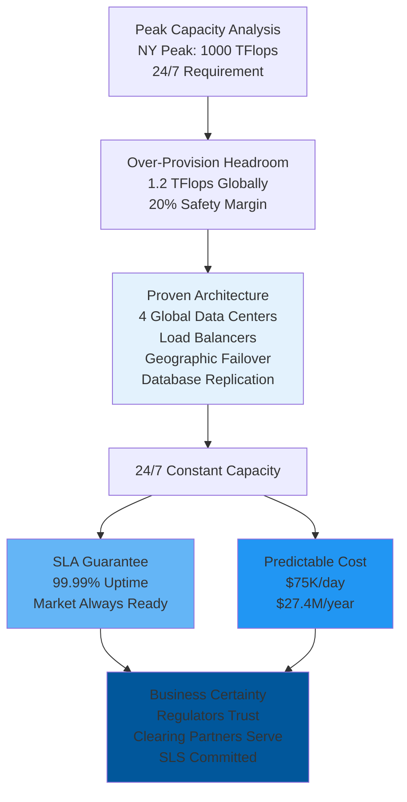

---

## TOPIC 6 - SLIDE C: Agentic Infrastructure Optimization

### Narrative

An agentic approach enables dynamic infrastructure management that optimizes cost while maintaining uptime guarantees. The system:

1. **Monitors real-time demand** - Tracks trading workload per data center, learns demand patterns: NY peak 14:30-21:00, London peaks 08:00-16:30, Asia 22:00-08:00, off-market minimal
2. **Dynamically scales resources** - During off-market hours, scales down to 15% capacity (saves $63.75K/day). During NY peak, scales to 120% to maintain redundancy. During Asia hours, routes through 2 data centers instead of 4.
3. **Predicts demand spikes** - Learns that Fed announcements (known schedule) trigger algorithm activity spikes. Pre-provisions capacity 30 minutes before announcement release.
4. **Self-heals failures** - Data center outage detected: autonomously re-routes trading workload to remaining 3 centers, executes failover within 30 seconds. Maintains operational continuity without human intervention.

**Key advantage:** Cost reduced 25-30% ($6.8-8.2M/year savings) by optimizing for actual demand. 99.99% uptime maintained through intelligent provisioning. Market readiness preserved via predictive capacity.

**Risk:** Dynamic scaling creates operational complexity. If orchestration error occurs, regulatory market-ready requirement might be breached. Auditors harder to verify "adaptive provisioning" than "constant capacity."

### Diagram

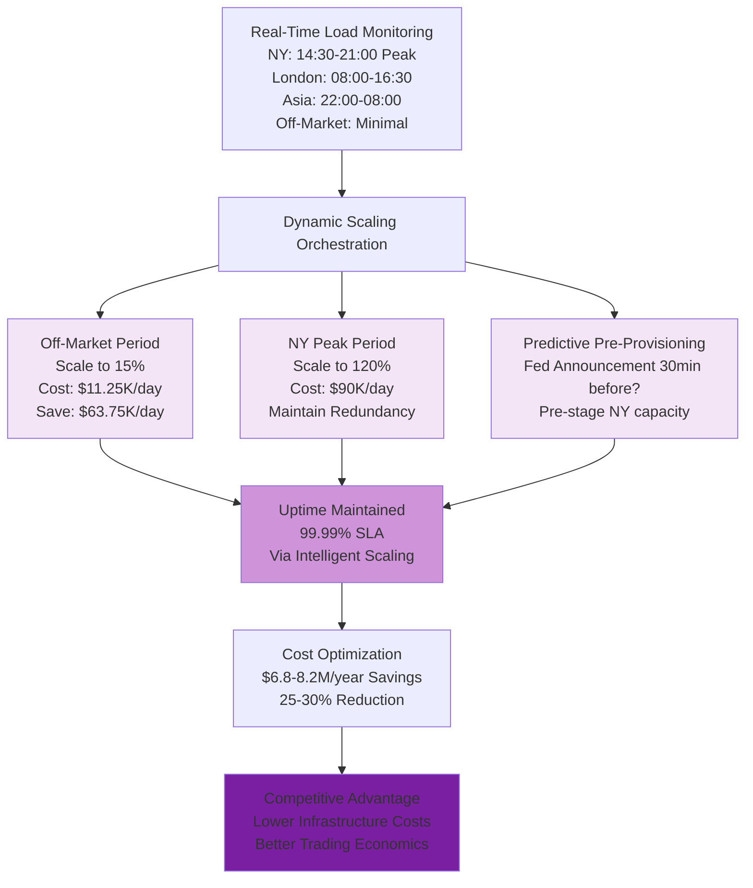

---

## TOPIC 6 - SLIDE D: Strong Arguments Comparison

### Deterministic Arguments (LEFT) | Agentic Arguments (RIGHT)

| **DETERMINISTIC** | **AGENTIC** |
|---|---|
| **Proven Reliability Architecture** | **Economic Optimization** |
| Infrastructure patterns (4-region redundancy, geographic failover, capacity headroom) have 25+ year track record. Flight-tested through 2008 crisis, Black Swan events, flash crashes. Reliability proven. **In use case:** Trading infrastructure operates on battle-tested 4-region architecture. Uptime record: 99.99% across decades. Regulators trust proven pattern. | Every business has peak and off-peak demand. Deterministic: maintains 100% capacity 24/7 when market-open 8 hours/day, off-market uses 15%. Wasted $20M/year. Agentic: scales to peak capacity (NY: 14:30-21:00), minimal capacity off-market. Cost optimization: 25-30% reduction ($6.8-8.2M). **In use case:** Trading infrastructure idle 85% of time during weekends/holidays. Agentic system scales down, saves $40K/day off-market. Same 99.99% SLA maintained via intelligent provisioning. |
| **Contractable SLA Guarantees** | **Predictive Demand Management** |
| Can commit to regulators and counterparties: "99.99% uptime maintained 24/7, market emergency-ready." Fixed capacity infrastructure proves readiness. Regulatory certainty. **In use case:** Clearing partners require 99.99% guaranteed uptime. Bank contractually commits—fixed infrastructure enables this commitment. Regulators audit: capacity always sufficient, failover always ready. | Bank learns Fed announcements trigger predictable algorithm activity spike. Volatility spike known schedule. Agentic system: pre-provisions capacity 30min before announcement release time. When announcement happens, infrastructure already at capacity. No lag, no performance under crisis. **In use case:** Historical data: every FOMC announcement triggers 3x normal compute load at predictable time. Agentic system pre-stages capacity automatically. Traders experience zero latency during announcement. |
| **Testability and Validation** | **Continuous Learning Reliability** |
| Infrastructure fully testable via chaos engineering. Simulate data center failures, verify recovery procedures, prove 99.99% uptime projections. Reproducible testing creates confidence. **In use case:** Bank runs monthly disaster recovery drills: "Simulate NY data center failure → verify automatic failover to London/Singapore/Tokyo → measure total recovery time → validate 99.99% SLA still achievable." Proven procedures breed confidence. | System learns from millions of operational hours. Discovers: CPU utilization above 75% correlates with failures 8 hours later (specific to bank's architecture). Deterministic threshold 90% too late. Agentic learns pattern, proactively scales at 70%, prevents failures before they cascade. **In use case:** After analyzing 2+ years incidents, learns bank's failure precursors. Implements predictive scaling: when CPU trending toward 75%, automatically provisions additional capacity before failure occurs. Reliability improves continuously. |

---

---

## SYNTHESIS & DEBATE PREPARATION NOTES

### Topic Summary

1. **Topic 1 (Investment Banking):** Portfolio company divestiture analysis - audit trail vs. discovery power
2. **Topic 2 (IT Operations):** Change governance for trading infrastructure - compliance gates vs. adaptive rigor
3. **Topic 3 (IT Operations):** Incident diagnosis in trading systems - known signatures vs. causal reasoning
4. **Topic 4 (Investment Banking):** VaR model release pipeline - sequential rigor vs. intelligent orchestration
5. **Topic 5 (Investment Banking):** Trading fraud detection - known patterns vs. zero-day threats
6. **Topic 6 (IT Operations):** Global trading data center optimization - SLA certainty vs. cost optimization

### Cross-Topic Patterns

**Agentic excels in:** Adaptation, learning, cost optimization, discovering novel patterns, autonomous response speed, cross-domain synthesis

**Deterministic excels in:** Compliance, auditability, predictability, formal verification, regulatory defensibility, stakeholder certainty

### Compelling Debate Dynamics

- **Topic 1:** Tension between audit trail certainty (deterministic) vs. discovery power (agentic)
- **Topic 2:** Tension between compliance gates (deterministic) vs. context-aware governance (agentic)
- **Topic 3:** Tension between proven signatures (deterministic) vs. novel pattern detection (agentic)
- **Topic 4:** Tension between sequential rigor (deterministic) vs. intelligent orchestration (agentic)
- **Topic 5:** Tension between known-threat prevention (deterministic) vs. zero-day detection (agentic)
- **Topic 6:** Tension between SLA certainty (deterministic) vs. cost optimization (agentic)

### Key Debate Questions for Each Topic

**Topic 1:** _Can you discover better strategic opportunities through autonomous analysis, or does risk of missed nuance in divestiture recommendations outweigh the gain?_

**Topic 2:** _Should change governance apply rigid consistency across all systems, or adapt approval rigor to system risk profiles?_

**Topic 3:** _Is incident diagnosis more trustworthy when based on historical signature patterns or causal reasoning chains?_

**Topic 4:** _Is sequential process rigor worth the 3-4 week deployment delay, or should speed-to-trading-advantage be prioritized?_

**Topic 5:** _Should fraud prevention focus on blocking known attack patterns or detecting emerging threats?_

**Topic 6:** _Is 99.99% uptime certainty worth $6-8M/year in unused infrastructure costs, or should dynamic optimization be trusted?_

